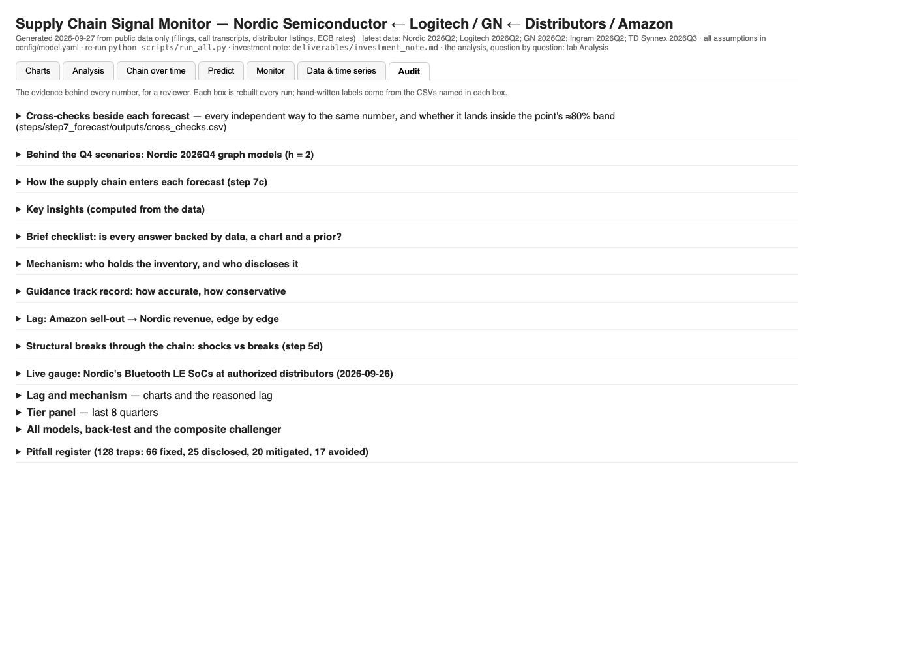

# Supply-chain signal model — Nordic Semiconductor ← Logitech / GN ← Ingram / TD Synnex / Amazon

**Start here:** [Investment note (2 pages)](deliverables/investment_note.md) ·
[Dashboard](deliverables/dashboard.html): one self-contained HTML file. On its GitHub page click **Download raw file**
(the ⬇ icon), then double-click the saved file: it opens in any browser, no install. GitHub cannot display it as a page
([screenshots of every tab](#the-dashboard)) ·
[Source documents](https://drive.google.com/file/d/173NfXBflNvX0W5I2aDe_-ElU-2cQ27Kq/view?usp=sharing) (optional, 413 MB, only to re-check quotes offline)

A runnable model of the wireless-peripherals chain. It ingests public data for the five companies, builds the
tier-by-tier series (sell-out proxy → distributor sell-through → OEM sell-in → Nordic revenue), keeps every lag and
mechanism assumption in one editable YAML file, tests those assumptions out of sample, and forecasts three prints:
Nordic Q3 2026, Logitech Q2 FY27 and GN Q3 2026. Public data only.

## Run it (about 4 minutes, no network)

```bash
git clone <this repo> && cd case_study
./run.sh                      # installs requirements, runs the model from the committed data, runs the tests
python scripts/serve.py       # dashboard with the live sandbox: http://127.0.0.1:8765/dashboard
```

Python 3.10+. `./run.sh` is `pip install -r requirements.txt`, then `python scripts/run_all.py`, then `pytest -q`
(300 tests). The model reads only committed CSVs, so nothing is downloaded: the data collection is done once and its
results are in `pipelines/*/data/`. The source documents behind the quote checks (~1 GB of filings and PDFs) are not
in the repo; each check's result is recorded in `audit/verification_ledger.csv` and shown as "recorded, document not
cached". `./run.sh --refresh-data` re-downloads and re-validates every source (slow the first time).

Then read `deliverables/investment_note.md` (2 pages) and open `deliverables/dashboard.html` (below).
`python scripts/build_note.py` renders the note to `.docx` (not committed).

### Optional: the source documents, for re-checking every quote offline

Not needed to run the model or reproduce any number. The filings, company PDFs and announcements the pipelines
downloaded (the quote checks' source text) are one archive, `case_study_cache.tar.gz` (413 MB; 3,379 files,
1.15 GB unpacked): **[download from Google Drive](https://drive.google.com/file/d/173NfXBflNvX0W5I2aDe_-ElU-2cQ27Kq/view?usp=sharing)**. SHA-256
`e83b9b81cbba81819387e80e674e089edff615d20eef8b051930af8acfa15526`. It holds `pipelines/{A,B,C,D}_*/data/cache/`
and `steps/step2_attribution/cache/`. Download it into the repository root, then:

```bash
shasum -a 256 case_study_cache.tar.gz        # should print the hash above
tar -xzf case_study_cache.tar.gz             # run from the repository root; restores the cache folders in place
./run.sh
```

The quote checks then re-read the source text instead of showing "recorded, document not cached".

## The dashboard

No install needed to look at it: `deliverables/dashboard.html` is one self-contained file (charts embedded). Download it
(Download raw file on its GitHub page) and open it in any browser, or see the screenshots below. The Analysis tab
answers the brief question by question; the investment note gives the forecasts and a short version of each answer. Every number on it is rewritten by each run. To use the **sandbox** in
Predict (edit an assumption, re-run the model, see the six forecasts move), serve it: `python scripts/serve.py`, then
http://127.0.0.1:8765/dashboard. A tab opens directly with its name after `#`, e.g. `dashboard.html#predict`.

| Tab | What it answers |
|---|---|
| **Charts** | The analysis in pictures etc. chain as a graph (route shares from 10-Ks, lags bounded by inventory cover). |
| **Analysis** | The brief question by question (lag, mechanism, attribution, structural breaks, not built, limitations, then the three forecasts), each as reasoning → formula → data used → data support → assumptions and limits → future work → figures. Hand-written. |
| **Chain over time** | The chain quarter by quarter: each tier's growth and inventory on the graph, and how a change reached Nordic. |
| **Predict** | The six forecasts with their ranges, and the assumptions sandbox rerun. |
| **Monitor** | Data to watch. |
| **Data & time series** | Every series with coverage, source and evidence grade (A–D), each company's fiscal calendar. |
| **Audit** | Skipped by default. |

### What each tab looks like

Screenshots of the committed run (`python scripts/screenshot_dashboard.py` retakes them).

**Charts**: the supply graph on top, then the analysis in charts.


**Analysis**: the brief question by question, in the same seven-part layout for every answer.


**Chain over time**: one quarter at a time: stock, flows and the data-dated channel state on the graph.


**Predict**: the six forecasts with what each range is and the channel-state risk; below, the sandbox shows the six forecasts, committed vs scenario.


**Monitor**: indicators by tier with traffic lights (the live lead time among them), then the monitoring plan and the risks.


**Data & time series**: every series with coverage, source and grade.


**Audit**: every piece of evidence as a closed box.



## Change an assumption

All numbers live in `config/model.yaml`; the Python contains none. Edit, re-run `python scripts/run_all.py`, and
every table, chart and forecast regenerates (`--config my_variant.yaml` keeps a variant).

Or in the browser: `python scripts/serve.py` → dashboard tab **Predict** (or the results page's **⚙ Assumptions** tab). Every value in the YAML and every edge lag in
`config/supply_graph.csv` is an input (with its comment / evidence). **Run scenario** copies the repo to
`runs/scenarios/<id>/repo` (git-ignored) and runs the model there (2–3 minutes), then shows the forecasts (table
and range plots) and every output that differs, next to the committed ones. Your config and outputs are never
written; only **Save to config** changes the files.

```yaml
lag_weeks:                          # the reasoned lag per tier (weeks)
  oem_to_odm_build: {low: 6, mid: 8, high: 12}
attribution:
  logitech:
    nordic_socket_share: {low: 0.30, mid: 0.45, high: 0.60}
forecast:
  nordic_2026Q3:
    guide_low: 220
    guide_high: 240
    signal_adjustments_usdm:        # named, arguable line items
      capacity_worry_pull_in: 0.0   # F19: was +1.0; a risk scenario only
```

When a company reports, add one row to its CSV in `pipelines/A_company_financials/data/raw/` (each row cites its
filing) and re-run.

## Evidence rules

- Every source is a row in its pipeline's `data_config.csv` with a validation method and a grade: A audited, B unaudited,
  C verbal (quote-checked against a saved excerpt), D estimate.
- Every judgment call has an id and a reason in its step's `config/decisions.csv`.
- Every trap found is in `audit/pitfalls.csv`; `tests/test_pitfalls.py` keeps the register complete.

The long-form description of each pipeline and step is in `docs/reference.md` and the folder READMEs.
