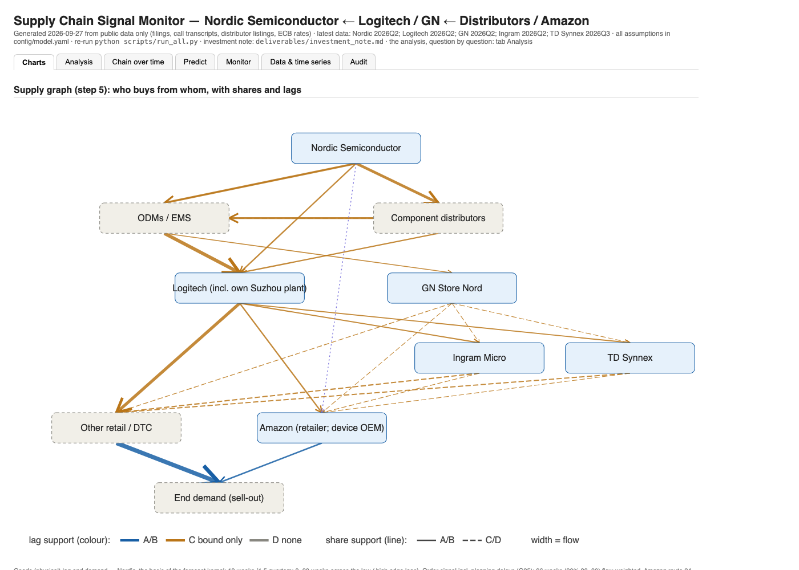
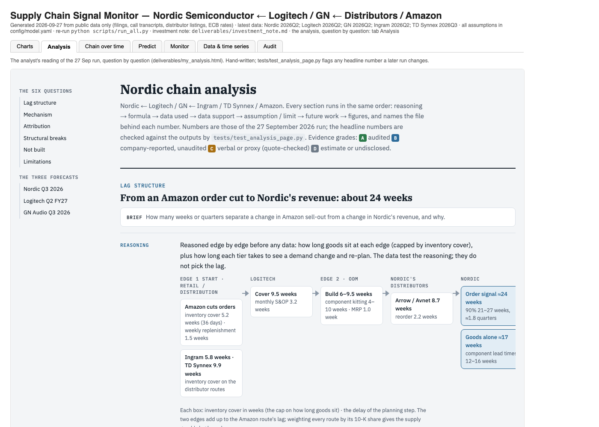
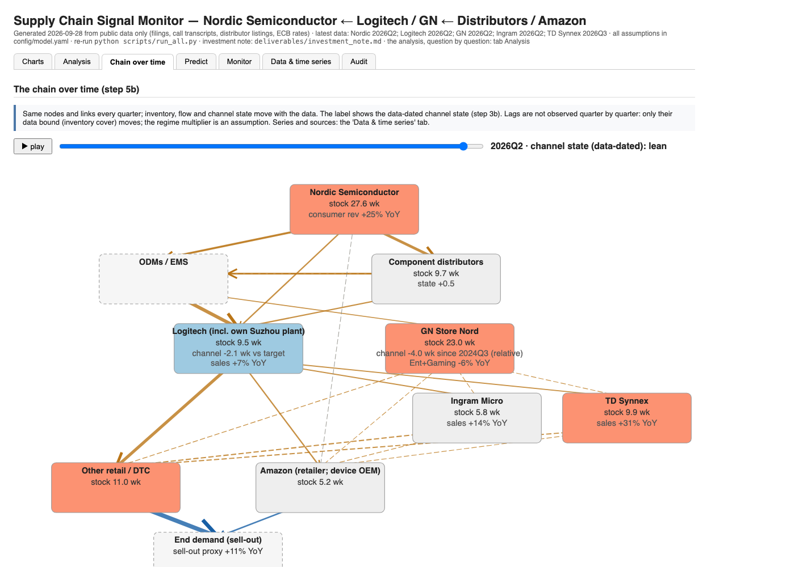
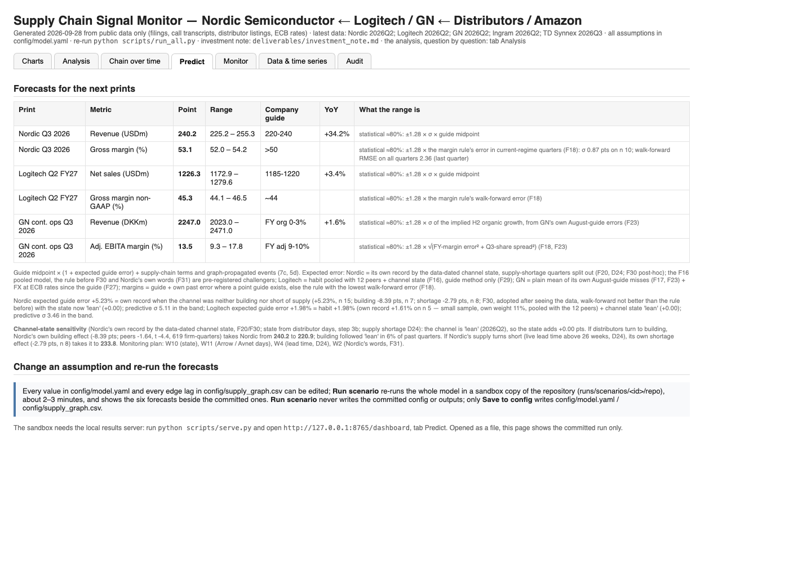
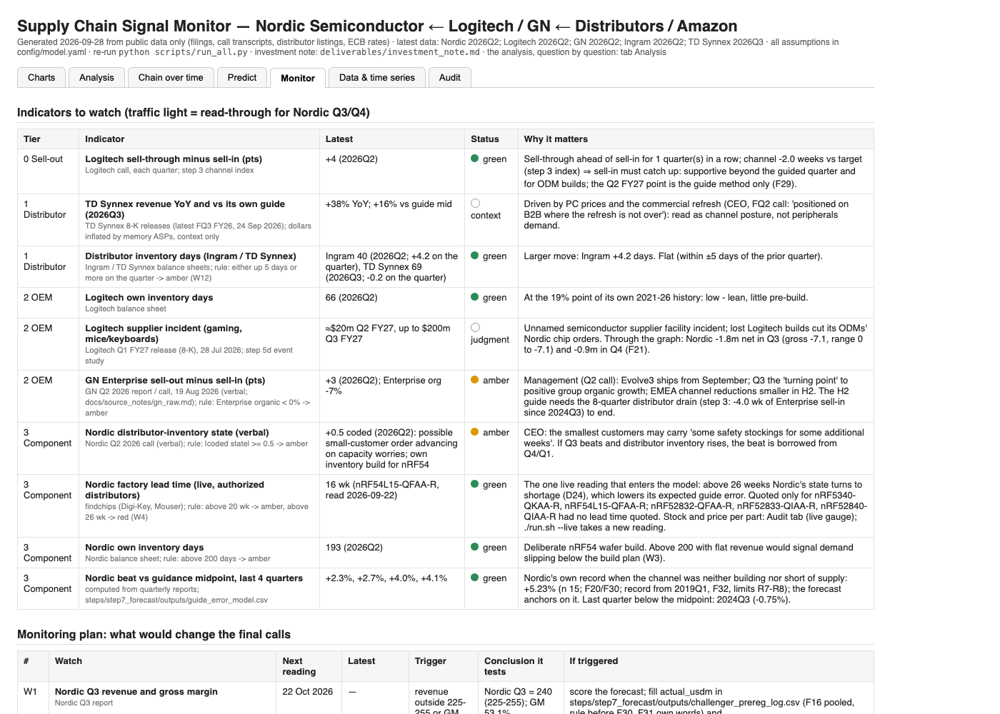
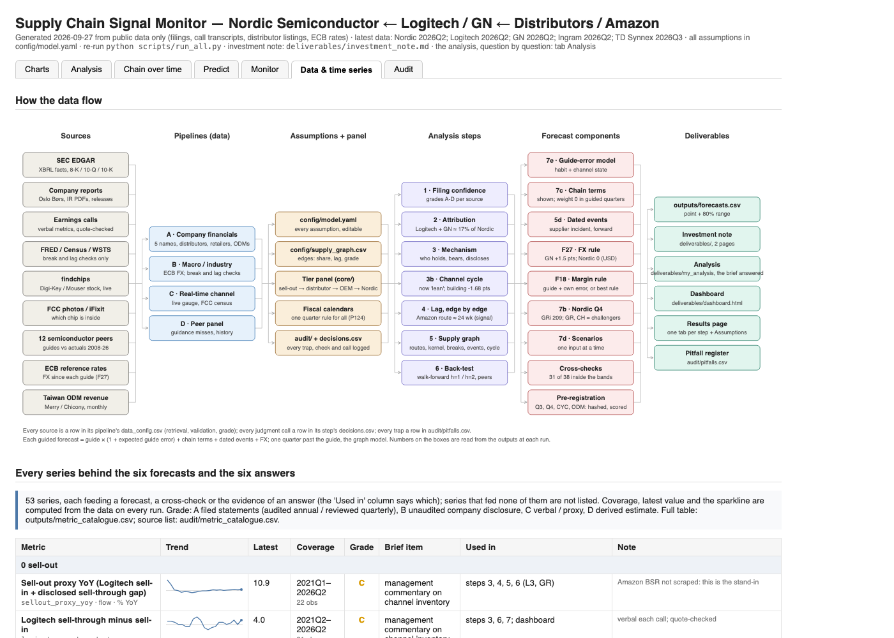

# Supply-chain signal model — Nordic Semiconductor ← Logitech / GN ← Ingram / TD Synnex / Amazon

**[Investment note (2 pages)](deliverables/investment_note.md)** ·
**[Dashboard](https://siqizhu-uk.github.io/case_study_supply_chain/deliverables/dashboard.html)**: opens in the browser ([what each tab shows](#the-dashboard)) ·
**[Source documents](https://drive.google.com/file/d/1sAl9ZGzpMfOYQKcnfl0er8G6ftFhH4kl/view?usp=sharing)** (optional, 521 MB, only to re-check quotes offline)

**The answer in three lines.** Nordic's guide already contains the orders behind the quarter it guides, so the Q3
forecast is the guide adjusted for management's usual guide error; no supply-chain model beat that in back-tests.
The chain matters one quarter later: a change in Amazon sell-out reaches Nordic's revenue after about 24 weeks, so
it drives the Q4 view and the risk skew (a restocking beat in Q3 would be borrowed from Q4). Logitech + GN are
about 16% of Nordic's revenue (13–20%), yet Nordic swings about 3× more than that share implies, because its other
consumer customers ride the same cycle.

A runnable model of the wireless-peripherals chain. It ingests public data for the five companies, builds the
tier-by-tier series (sell-out proxy → distributor sell-through → OEM sell-in → Nordic revenue), keeps every lag and
mechanism assumption in one editable YAML file, tests those assumptions out of sample, and forecasts three prints:
Nordic Q3 2026, Logitech Q2 FY27 and GN Q3 2026. Public data only.


## How this was built

This was my first case study, and I spent more than the brief's 8–10 hours: the extra time went into first
understanding, from the top down, what each tier does and why, before modelling it. The code and first drafts were
written with Claude under my direction, and it proofread the text; the modelling choices and their
reasons are mine and are logged in each step's `config/decisions.csv`. AI output is held to the same checks as
everything else: every input has a source and an evidence grade (A audited to D estimate), filing and transcript
numbers are quote-checked against the source document (`audit/verification_ledger.csv`), judgements are labelled as
judgements, and 301 tests run on every build. The dashboard grew beyond the light monitoring view the brief asks for
because I used it throughout: to inspect the data during development and to follow the AI's tasks.

## Run it (about 5 minutes, no network)

```bash
git clone https://github.com/siqizhu-uk/case_study_supply_chain.git && cd case_study_supply_chain
./run.sh                      # installs requirements, runs the model from the committed data, runs the tests
python scripts/serve.py       # dashboard with the live sandbox: http://127.0.0.1:8765/dashboard
```

Python 3.10+. `./run.sh` is `pip install -r requirements.txt`, then `python scripts/run_all.py`, then `pytest -q`
(301 tests). The model reads only committed CSVs, so nothing is downloaded: the data collection is done once and its
results are in `pipelines/*/data/`. The source documents behind the quote checks (~1 GB of filings and PDFs) are not
in the repo; each check's result is recorded in `audit/verification_ledger.csv` and shown as "recorded, document not
cached". `./run.sh --refresh-data` re-downloads and re-validates every source (slow the first time).

Then read `deliverables/investment_note.md` (2 pages) and open `deliverables/dashboard.html` (below).
`python scripts/build_note.py` renders the note to `.docx` (not committed). The 2-page PDF (not committed; needs a LaTeX install):
`pandoc deliverables/investment_note.md -o deliverables/investment_note.pdf --pdf-engine=xelatex -V documentclass=extarticle -V fontsize=9pt -V geometry:margin=1.2cm -V mainfont="Helvetica Neue" -H scripts/note_pdf.tex`.

### Optional: the source documents, for re-checking every quote offline

Not needed to run the model or reproduce any number. The filings, company PDFs and announcements the pipelines
downloaded (the quote checks' source text) are one archive, `case_study_cache_2026-09-28.tar.gz` (521 MB; 3,417 files,
1.3 GB unpacked; rebuilt 28 Sep 2026 with Nordic's 2017–2020 reports and announcements): **[download from Google Drive](https://drive.google.com/file/d/1sAl9ZGzpMfOYQKcnfl0er8G6ftFhH4kl/view?usp=sharing)**. SHA-256
`0d322c7252647b7bb0a90664e4264ec859547238e66c96d31a39923f106252fb`. It holds `pipelines/{A,B,C,D}_*/data/cache/`
and `steps/step2_attribution/cache/`. Download it into the repository root, then:

```bash
shasum -a 256 case_study_cache_2026-09-28.tar.gz   # should print the hash above
tar -xzf case_study_cache_2026-09-28.tar.gz        # run from the repository root; restores the cache folders in place
./run.sh
```

The quote checks then re-read the source text instead of showing "recorded, document not cached".

## What carries over to a broad coverage list

The supply chain is specific to this case; the way of working is not:

- **One place for everything.** Data with its sources, editable assumptions, forecasts and the AI tasks' progress
  sit in one dashboard.
- **Test before believing.** Each hypothesis is reasoned first, tested out of sample and kept either way; most
  failed (on 12 peers no channel or guidance factor beat a company's own average guide error). Forecasts are logged
  before each print.
- **AI output that can be checked.** 3,417 source documents; every input carries a source and an A–D evidence
  grade, and filing and transcript numbers are quote-checked against the document.

The piece that scales directly: start from the company's own guide and add its usual guide error. The guide carries
most of the information (across 632 peer quarters the beat varies 3.9% against 29% for revenue growth), and the
method needs only each release's guide and actual.


## The dashboard

No install needed to look at it: **[open the dashboard](https://siqizhu-uk.github.io/case_study_supply_chain/deliverables/dashboard.html)** (GitHub Pages serves `deliverables/dashboard.html`, one
self-contained file with every chart embedded), or see the screenshots below. The Analysis tab
answers the brief question by question; the investment note gives the forecasts and a short version of each answer. Every number on it is rewritten by each run. To use the **sandbox** in
Predict (edit an assumption, re-run the model, see the six forecasts move), serve it: `python scripts/serve.py`, then
http://127.0.0.1:8765/dashboard (the hosted page cannot run the model). A tab opens directly with its name after `#`,
e.g. `dashboard.html#predict`.

| Tab | What it answers |
|---|---|
| **Charts** | The supply chain as a graph (who buys from whom, route shares from 10-Ks, lags bounded by inventory cover), then the analysis in charts. |
| **Analysis** | The brief question by question (lag, mechanism, attribution, structural breaks, not built, limitations, then the three forecasts), each as reasoning → formula → data used → data support → assumptions and limits → future work → figures. Hand-written. |
| **Chain over time** | The chain quarter by quarter: each tier's growth and inventory on the graph, and how a change reached Nordic. |
| **Predict** | The six forecasts with their ranges, and the assumptions sandbox rerun. |
| **Monitor** | Data to watch. |
| **Data & time series** | Every series with coverage, source and evidence grade (A–D), each company's fiscal calendar. |
| **Audit** | Skipped by default. |

### What each tab looks like

Screenshots of the committed run (`python scripts/screenshot_dashboard.py` retakes them).

**Charts**: the supply graph on top, then the analysis in charts.



**Analysis**: the brief question by question, in the same seven-part layout for every answer.



**Chain over time**: one quarter at a time: stock, flows and the data-dated channel state on the graph.



**Predict**: the six forecasts with what each range is and the channel-state risk; below, the sandbox (served locally with `python scripts/serve.py`, it re-runs the model on your edits and shows the six forecasts, committed vs scenario).



**Monitor**: indicators by tier with traffic lights (the live lead time among them), then the monitoring plan and the risks.



**Data & time series**: every series with coverage, source and grade.



## Change an assumption

All numbers live in `config/model.yaml`; the Python contains none. Edit, re-run `python scripts/run_all.py`, and
every table, chart and forecast regenerates (`--config my_variant.yaml` keeps a variant).

Or in the browser: `python scripts/serve.py` → dashboard tab **Predict** (or the results page's **⚙ Assumptions** tab). Every value in the YAML and every edge lag in
`config/supply_graph.csv` is an input (with its comment / evidence). **Run scenario** copies the repo to
`runs/scenarios/<id>/repo` (git-ignored) and runs the model there (2–3 minutes), then shows the forecasts (table
and range plots) and every output that differs, next to the committed ones. Your config and outputs are never
written; only **Save to config** changes the files.

```yaml
lag_weeks:                          # the reasoned lag per tier (weeks)
  oem_to_odm_build: {low: 6, mid: 8, high: 12}
attribution:
  logitech:
    nordic_socket_share: {low: 0.30, mid: 0.45, high: 0.60}
forecast:
  nordic_2026Q3:
    guide_low: 220
    guide_high: 240
    signal_adjustments_usdm:        # named, arguable line items
      capacity_worry_pull_in: 0.0   # F19: was +1.0; a risk scenario only
```

When a company reports, add one row to its CSV in `pipelines/A_company_financials/data/raw/` (each row cites its
filing) and re-run.

## Evidence rules

- Every source is a row in its pipeline's `data_config.csv` with a validation method and a grade: A audited, B unaudited,
  C verbal (quote-checked against a saved excerpt), D estimate.
- Every judgment call has an id and a reason in its step's `config/decisions.csv`.
- Every trap found is in `audit/pitfalls.csv`; `tests/test_pitfalls.py` keeps the register complete.

The long-form description of each pipeline and step is in `docs/reference.md` and the folder READMEs.
