## Lag structure
How many weeks or quarters separate a change in Amazon sell-out from a change in Nordic's revenue, and why.

 - reasoning:
    * Reasoned edge by edge before any data: how long goods sit at each edge (capped by inventory cover), plus how long each tier takes to see a demand change and re-plan. The data test the reasoning; they do not pick the lag.
    * Edge 1: Amazon cuts orders to Logitech. Edge 2: Logitech's builds and chip orders reach Nordic (through ODMs and Nordic's distributors). The two edges add up to the Amazon route's lag; weighting every route by its 10-K share gives the supply graph's lag kernel.
    * Conclusion: **the order signal takes about 24 weeks (90% 21–27, about 1.8 quarters); the goods alone about 17**.
    * In the forecast: component lead times are 12–16 weeks, so the demand behind Nordic's Q3 was ordered before the 6 August guide and is already in it. The chain therefore gets weight 0 in the guided quarter; the graph drives the quarter after (Q4, the GRi model: Logitech's sell-in through the Nordic–ODM–Logitech segment, F26).
 - formula:
    * Little's law: time goods sit = stock ÷ flow; cover (weeks) = inventory ÷ (quarterly COGS ÷ 13); each edge's lag ≤ cover × 1.10 (`graph_lag_checks.csv`)
    * Planning delay per planning step = R/2 + (1 − α)/α × R, R = review period (weeks), α = forecast smoothing constant (Brown 1959): weekly replenishment R 1, α 0.5 → 1.5 weeks; Logitech monthly S&OP R 4.33, α 0.8 → 3.2 weeks; ODM MRP R 2, α 1 → 1.0 week; Nordic distributor reorder R 4.33, α 1 → 2.2 weeks (`config/model.yaml` supply_graph.info_delay)
    * Routes: lag L_p = Σ edge lags; weight w_p = brand share × Π edge shares; Nordic's response R(t) = Σ_p w_p · D(t − L_p/13), a fractional quarter split pro rata between the two adjacent quarters (`supply_graph.py`)
    * Uncertainty: each edge's lag and share drawn from a triangular distribution (low / mid / high), ranges widened at least by evidence grade: A ±10%, B ±25%, C ±50%, D ±100%; 300 draws (Monte Carlo)
 - data used:
    * Inventory and COGS by tier (SEC XBRL, A): Amazon 36 days = 5.2 weeks, Ingram 5.8 weeks, TD Synnex 9.9 weeks, Logitech 9.5 weeks, Arrow / Avnet 8.7 weeks
    * Logitech 10-K customer shares FY22–26 (A, each effective from its filing date): Amazon ~18%, Ingram + TD Synnex ~26%
    * Build and planning times (D, industry practice): ODM build 6–9.5 weeks, component kitting 4–10 weeks, the four planning steps above
    * Authorized-distributor lead time 16 weeks (findchips live snapshot, D)
    * For the tests: Logitech radio-category revenue (B), Nordic Consumer revenue (B); end-demand proxy = Logitech sell-in + the sell-through gap disclosed on calls (C; no free Amazon sell-out data)
 - data support:
    * Prior written before any regression: inventory cover summed across tiers 22.4 weeks (14.4–35.5) (`prior_cover_weeks.csv`); step 4's tier-by-tier reasoning 22 weeks
    * Monte Carlo: mean goods lag 16.6–21.0 weeks (90%); kernel 54% at 1 quarter, 46% at 2, mean 1.46 quarters; signal basis across all routes ≈26 weeks (`graph_mean_lag_mc.csv`, `graph_kernel.csv`, `graph_signal_lag_mc.csv`)
    * All 19 edges with an inventory anchor sit within their cover × 1.10 (`graph_lag_checks.csv`)
    * Data test: correlation of Logitech's radio category leading Nordic Consumer, 1 quarter 0.78, 2 quarters 0.90, 3 quarters 0.84, 4 quarters 0.59 (`xcorr_all.csv`): a plateau, not a spike; the near-optimal range of a continuous lag, 19.5–37 weeks (13 quarters, one cycle; `graph_vs_step4_continuous_lag.csv`), contains 24 weeks, so the data do not reject the reasoning
    * Back-test: in the guided quarter lag models err 3.9–5.9× more than guide + mean beat (`walkforward_metrics_h1.csv`); one quarter after the guide the graph model GRi errs 25.4m, 0.54× the guide extrapolation (47.2m), n 9 (`walkforward_metrics_h2.csv`)
 - assumption/limit:
    * Planning delays are not disclosed (D) and may partly sit inside inventory cover (P100): on the Amazon route the signal lag is 19–24 weeks if so; the forecast uses the sturdier goods basis
    * Retail and distributor inventories cover all categories, so cover is only a cap, never the lag itself
    * End demand is proxied by Logitech's sell-through, not Amazon's actual sales; the correlation plateau is mostly the common industry cycle (Nordic lags chip shipments and US electronics retail by as much); one cycle and a ~16% share cannot narrow the lag
    * The lag moves with the cycle: ~4 quarters in the 2021–22 shortage (Nordic's backlog reached 9.9× quarterly revenue), ~2 in the 2023–24 destock; each rests on a single turning point
 - future work:
    * Amazon's actual sales (Keepa, POS data; paid) to test edge 1 directly
    * A lead-time history to update edge 2's cap quarter by quarter
    * More cycles (peers' data for 2008–10 and 2011–19 exist; Nordic's own chain data do not)
 - figures:

   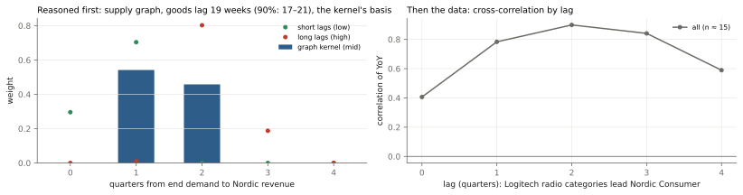

## Mechanism
Where inventory actually sits at each tier, who bears it, and how each company discloses (or hides) it. Distinguish a company's own balance-sheet inventory from the inventory its channel holds.

 - reasoning:
    * Revenue is sell-in (sold into the channel), not end demand (sell-through); the difference is the change in channel inventory. So it is **channel inventory** that moves revenue, not a company's own stock.
    * Own inventory is disclosed by every tier (XBRL / reports); channel inventory almost nobody gives as a number (only Microchip reports distributor days), so it is read indirectly: Logitech's by recursion from its sell-through − sell-in gap, the industry's from Microchip's distributor days.
    * The channel state (building / drawdown / lean / normal) is read from distributor days; "lean" is split further by **supply evidence** (backlog, lead time) into a shortage and caution after a destock (D24). Own inventory was tried as a second signal; at the industry level it cannot separate the two, so it is only supporting evidence.
      In a shortage: orders are placed but cannot be delivered, so the backlog piles up; lead times lengthen; prices rise (Nordic's GM reached 60%).
      In caution: few orders, the backlog falls, lead times are short.
    * In the forecast: one term only, last quarter's state adjusting the expected guide error (F16, F20, F30). No restocking amount is added: management had seen the refill orders when it guided.
      In a shortage revenue is set by supply: Nordic knows how many wafers it will get, so its guide is accurate (+1.9% beat on average).
      In caution revenue is set by demand: rush orders still arrive inside the quarter, so it beats by more (+4.2% on average over the quarters that were neither building nor short).
 - formula:
    * Cover (weeks) = ending inventory ÷ weekly COGS = inventory ÷ (quarterly COGS ÷ 13); inventory days = inventory ÷ quarterly COGS × 91 (`core/tiers.py`, step 3 `inventory_factors.dio`)
    * Channel stock added (Logitech): F(t) = F(t−4) × (1 + sell-through YoY) − gap × sell-in(t−4), gap = sell-through YoY − sell-in YoY; cumulate F, set the level at the quarters management calls "at target", divide by weekly sell-through to get weeks (`channel_index.py`)
    * Amplification = ratio of the standard deviations of adjacent tiers' YoY growth, bootstrap 5–95% band (`bullwhip_links.csv`)
    * States: building = distributor days up ≥ 3 days over two quarters; drawdown = down ≥ 3 days over two quarters from above normal; lean = level z ≤ −1 or still falling from normal / low; Nordic's shortage = lean and (backlog > 2 quarters of revenue or live lead time > 26 weeks) (`config/model.yaml` cycle_state, D22, D24)
    * In the forecast: Nordic's expected error = its mean guide error after quarters that were neither building nor short + this quarter's state effect (`guide_error_model.py`)
 - data used:
    * Inventory and COGS by tier: Amazon, Best Buy, CDW, Ingram, TD Synnex, Arrow, Avnet, Logitech (SEC XBRL, A); Nordic (quarterly reports, B)
    * Logitech sell-through − sell-in gap, 21 quarters (call transcripts, C, quote-checked)
    * Microchip distributor days 2007–2026 (10-Q / 10-K, A)
    * Nordic backlog 2020Q4–2023Q1 (quarterly reports, B; not disclosed after); authorized-distributor lead time (findchips live snapshot, D)
    * 12 peers' guides and actuals 2008–2026 (Pipeline D, A / B)
 - data support:
    * Management confirms it: Logitech's CFO on the FY24 Q4 call said two points of the extra sell-in growth "is simply comparing the channel inventory year-over-year", i.e. this year's destock was smaller than last year's. Saved excerpt: pipelines/A_company_financials/data/manual/logitech_2024Q1.txt
    * The recursion reproduces that quarter: 2024Q1 from the gap alone = +48.0m (looks like stocking up); recursion = −61.5 × 1.0035 + 48.0 = −13.7m (still destocking) (`channel_index_logitech.csv`)
    * The amplification sits at the component tier: Logitech shipments / end demand ×0.99, purchases / shipments ×1.24, Nordic Consumer / Logitech shipments ×2.72 (2021–26, `bullwhip_links.csv`)
    * The 2023 fall was a channel event: Nordic's top-10 customers −3%, the distribution-heavy broad market −46% (Nordic annual reports, `nordic_top10_vs_broad.csv`)
    * The state predicts guide errors: 12 peers, 619 firm-quarters, after a building quarter the guide error is −1.64 pts (t −4.4, firm fixed effects, clustered by quarter) (`guide_error_state_effect.csv`)
    * The two kinds of lean are distinguishable: shortage (2021Q1–22Q3) backlog 5.4–9.9 quarters of revenue, Nordic's own inventory 57–94 days, GM up to 60%; after the destock (2025Q3–26Q2) lead time 16 weeks (one live snapshot, 2026Q2), own inventory 141–193 days, GM 52–53%
    * Nordic's own channel (D25, P128): Microchip's days are a stock; Nordic's wording is a flow. Cumulated into a level, Nordic's wording and Microchip's days correlate negatively at every shift from −3 to +4 quarters (−0.17 to −0.86), so Microchip is used only as a state signal (its turns agree within a quarter: Nordic destocking from 2022Q3, Microchip building from 2022Q4). Size: with the top-10 customers (served direct) as the sell-through proxy, broad-market growth minus top-10 growth = −14.4, −42.7, −3.7 pts (2022–24), about −44m, −164m, −8m: ≈215m drained, ≈29 weeks of 2022 broad-market sales; Arrow / Avnet's all-vendor cover only rose from 7.0 / 9.0 to 9.9 / 14.5 weeks over the same years, so most of the excess sat with small customers (`nordic_channel_size.csv`)
    * Today: Logitech's channel is 1.1–2.1 weeks below target (latest anchor / all anchors; −194m on all anchors), lean; distributor state lean (2026Q2)
 - assumption/limit:
    * The channel **level** is unobservable: Logitech's channel weeks are anchored on "at target" statements, ±0.7 weeks; GN has a gap but no anchor, so direction only; ODM kitting is not disclosed at all (D assumption 2–8 weeks)
    * Retail and distributor inventories cover all categories; peripherals are a small part, so cover is only a cap
    * State thresholds were set after seeing 2020–26 (disclosed, D22), and a building channel is flagged a quarter late
    * The shortage split was decided after seeing the data: Nordic uses the 7 quarters that were neither building nor short (+4.24%) instead of 14 (+3.08%); point 235.3 → 238.0; the walk-forward is no better (5.31 vs 5.20 pts); the rule before it is pre-registered and scored on 22 Oct (F30)
    * One shortage and one destock: every state effect rests on one cycle
 - future work:
    * After 22 Oct, score F30, the rule before it, the F16 pooled model and the own-words rule (F31); keep or drop the shortage split
    * A lead-time history (free data are live snapshots only), to identify shortages quarter by quarter now that the backlog is no longer disclosed
    * Distributors' inventory by vendor (Arrow / Avnet do not disclose Nordic's share) and an anchor for GN's channel
 - figures:

   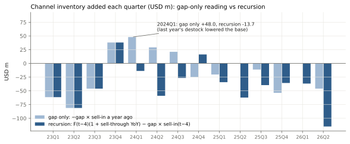

   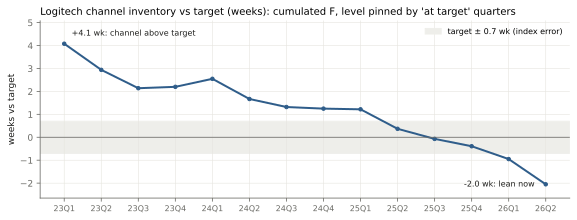
   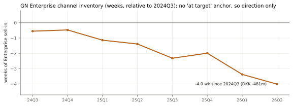
   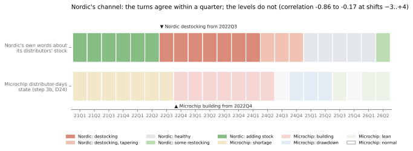

   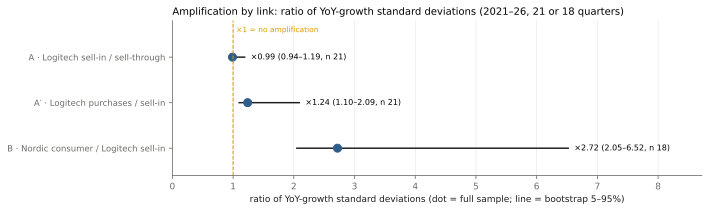

## Attribution
Nordic sells into many end markets beyond these two customers. How much of Nordic's consumer revenue plausibly runs through Logitech and GN, and how did you estimate it?
 - reasoning:
    * Nordic does not disclose revenue by customer, so five independent legs bracket it (A–E), giving a range and a path over time rather than a single number.
    * The result depends on the invoicing route: if Logitech buys Nordic's chips through ODMs (indirect), Nordic's IFRS 8 major-customer ceiling does not bind; if Nordic invoices Logitech directly, it does.
    * Conclusion: **≈27% of Nordic Consumer (22–34%, 80%) and 16% of total revenue (13–20%)** (the quarterly path shows 17% for 2026Q2 because it uses the 2024–26 FCC cohort, a socket share of 81% against 77% for all grants), if Logitech buys through ODMs; ≈11% if Nordic invoices it directly. GN is ≈8m a year (6–10m), ≈1%.
    * In the forecast: the share s sets how much of Nordic the chain speaks for (s = 16.8% in the chain term); the chain gets weight 0 in the guided quarter, so the point does not move whichever end of the range is right.
 - formula:
    * Leg A, bottom-up: Nordic revenue from Logitech = Σ categories (category sales ÷ unit price × radios per unit) × Nordic socket share × chip ASP; Monte Carlo over each input's range (`attribution.py`)
    * Leg B, ceiling: if invoiced directly, Logitech ≤ 10% × Nordic revenue (IFRS 8.34: apart from two distributors (30%, 12%), no customer above 10%)
    * Share = (Logitech + GN) ÷ Nordic's last-four-quarters revenue, rolled quarter by quarter into a path (`attribution_path.py`)
 - data used:
    * Logitech peripheral-category sales, last four quarters 3,286m (10-K / 10-Q, B)
    * FCC internal-photo census: 101 Logitech grants (81 with public photos), 38 read, 33 legible; 30 peripherals: Nordic 23, Telink 5, other 2 → socket share 77% (62–87%) (`fcc_logitech_grants_2023_2026.csv`, B)
    * Nordic IFRS 8 major-customer disclosure: only two customers above 10%, both distributors (30%, 12%) (annual report, A); Nordic last-four-quarters revenue 759.5m (quarterly reports, B)
    * Nordic proprietary 2.4 GHz revenue (technology split, B; not disclosed from 2025); Nordic top-10 customers vs broad market (annual reports, B)
 - data support:
    * Leg A: Nordic content ≈3.6% of Logitech's sales; Logitech ≈115m (median); implies ≈88m Logitech radios a year (75–104m) (`attribution.json`)
    * Leg B: if invoiced directly, Logitech ≤ 76m, share ≈11%
    * Leg C, category prior: PC peripherals ≈17.8% of Nordic (14.5–21.2%)
    * Leg D, floor: proprietary 2.4 GHz revenue peaked at 96.1m in 2022Q2 (13.7% of Nordic), down 66% by 2024Q1 (Logitech moved to BLE / Bolt)
    * Leg E, natural experiment: Nordic Consumer −41% (−202.8m, 2022Q3–2024Q1); Logitech's radio categories −14% (2022Q1–2023Q3, their own peak to trough); if all of it came from Logitech, Nordic content would have to be 51% of Logitech's sales, which is impossible → most of the fall came from other customers
    * Path: 15% (2022Q1) → 21% (2024Q2, the broad market fell faster than Logitech) → 17% (2026Q2, 13–21%) (`attribution_path.csv`)
    * Back-test: one quarter after the guide the reasoned chain's slope is 3.2, i.e. Nordic moves ≈3× what the share implies (its other consumer customers ride the same cycle) (`chain_weight_tests.csv`)
 - assumption/limit:
    * The invoicing route is not disclosed: the gap between 16% and 11% comes from this one assumption
    * FCC census: 38 of 81 public grants read; audio and webcams unread; radios per unit and ASP are range assumptions
    * The share covers only Logitech + GN; it understates Nordic's exposure to this consumer cycle (≈3×)
 - future work:
    * Read the remaining 12 peripheral grants and the audio / webcam grants to narrow the socket share
    * Confirm Logitech's ODM and chip-buying route from US customs records, to settle 16% vs 11%
    * A chip census for GN
 - figures:

   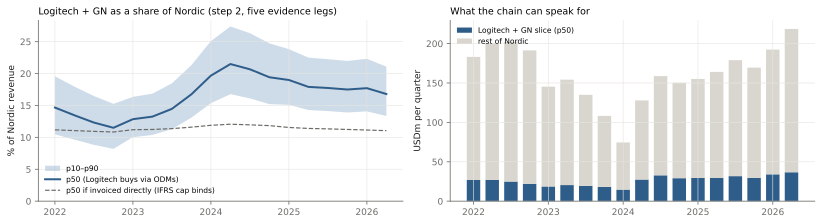

## Structural breaks
Anything in the past four years that changes the relationships and how you handled it.
 - reasoning:
    * The question is not which events happened but which ones changed the relationships the model uses (lags, amplification, shares, who holds the inventory). So each event gets a before / after test, with its date fixed in the config first (the AI / memory breaks were dated with the data in view), and is put into one of six types: relationship break, input moved, one-off shock, proxy failure, forward risk, reporting basis.
    * The cycle state is dated by the data (distributor days + supply evidence), not drawn by hand, and enters the forecast through the guide error (F16, F20, F30).
 - formula:
    * Relationship: Nordic Consumer YoY ~ Logitech sell-through YoY (lag 2 quarters, the graph's lag); Chow test at the event date, HAC-robust (`relationship_breaks.py`, G22, G28)
    * Proxy failure: change in correlation, Fisher z; change in mean, Welch t
    * One-off shock: event study, the shock runs forward along the graph from its date (lead time × Nordic content), minus the part already in the guide (`event_study.py`, G23)
 - data used:
    * Chain series: Nordic Consumer (B), Logitech sell-in and the sell-through gap (B / C)
    * Event evidence: call quotes (C, quote-checked), Nordic backlog (B), inventory by tier (XBRL, A), WSTS and TD Synnex revenue (A / B)
    * Outputs: `event_breaks.csv`, `relationship_breaks.csv`, `event_study_supplier_incident.csv`
 - data support:
    * 2021–22 chip shortage (relationship break): backlog reached 9.9× quarterly revenue; the chain link breaks once, at the end of the shortage (2022Q4), Chow p 0.04 → excluded from the lag fits; Nordic's guide habit keeps these quarters apart as shortage (D24, F30)
    * 2022Q4–24Q2 build and destock (relationship break): 2023 top-10 customers −3.2%, broad market −45.9%; after a building quarter the peers' guide error is −1.64 pts (t −4.4), Nordic's −7.4 → the channel state enters the forecast
    * Post-COVID demand normalisation (input moved): 2023 Nordic Consumer −38%, of which Logitech + GN only −3.2 pts and the rest −34 pts; the chain is the same before and after 2024Q2 (Chow p 0.77, slope +1.66 → +1.07) → demand enters through the driver; no break added
    * 2025 US tariffs (relationship break, price): call: "price was a lift of 150 basis points" (GM) → price increases ≈2.8% of sales; Americas shipments −4.9% / −3.6%; only 3 quarters since, so no change can be detected (Chow p 0.78 / 0.91) → the unit basis strips the price step; the effect on the chain term is well under 1m
    * 2025Q1 pre-tariff buying (one-off shock): Logitech inventory 81 days (71 a year earlier), back to 69 in 2025Q2 → lags unchanged
    * AI / memory cycle (proxy failure, unproven): WSTS +129% vs Nordic +33%; correlation +0.76 → +0.27 (Fisher z p 0.28), Chow p 0.57; TD Synnex − Logitech growth gap Welch p 0.15; Microchip distributor days (28, 26, 25) unaffected → WSTS and distributor dollars are context only, never in the model; the state signal stays
    * 2026 supplier incident (one-off shock): event study, gross −7.1m on Nordic's Q3, 75% assumed in the guide → net −1.8m; Q4 −0.9m → enters the forecast as an event term
    * Nordic capacity tightness (forward risk): CEO: "running at its almost maximum pace"; lead time 16 weeks → monitored (W4: lead time above 26 weeks switches the state to shortage)
    * Reporting basis (config switches): GN restructuring (SteelSeries in 2022, Hearing divested in 2026), SYNNEX + Tech Data merger (2021)
    * Stable: Logitech's 10-K customer shares (Amazon 17–19%, Ingram 13–15%, TD Synnex 12–15%); lag-kernel weight at 1 quarter 0.54 → the graph uses them point in time
 - assumption/limit:
    * Four years hold one full cycle, so most tests have low power (3 quarters since the tariffs)
    * State thresholds were set after seeing 2020–26 (D22); a build-up is flagged a quarter late; the shortage split was decided after seeing the data and the back-test does not support it (5.31 vs 5.20)
    * 75% of the supplier incident assumed in the guide is a D judgment; range 0 to −7.1m
 - future work:
    * More quarters after the tariffs, to re-test the price break
    * Watch capacity (W4): if lead times lengthen, the shortage state switches on by rule
    * More cycles: peers' data go back to 2008; Nordic's own chain data do not
 - figures:

   

   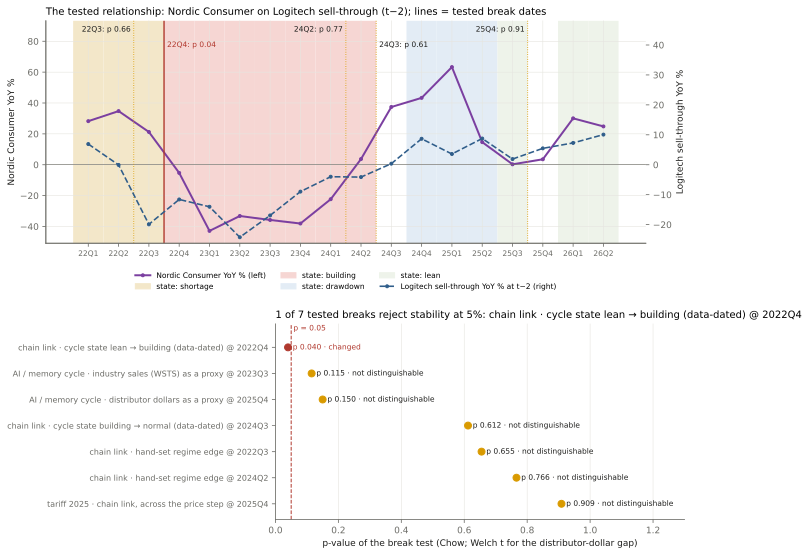

## What we chose not to build
Note where you used an existing library, API or dataset rather than writing your own, and where you deliberately stopped.
 - reasoning:
    * The value is in the reasoning and the tests, not in infrastructure: data fetching, statistical tests and charts use existing APIs and libraries.
    * The rule for stopping: going further would not change any forecast number, or would only "work" by chance on one cycle.
 - formula:
    * None (this section is about trade-offs)
 - data used:
    * Existing data and APIs: SEC EDGAR XBRL and filings, Oslo Børs NewsWeb, company PDFs (pdfplumber), FRED / Census / WSTS, ECB FX rates, findchips (Digi-Key and Mouser stock and lead times), fccid.io exhibits and the iFixit API
    * Existing libraries: pandas, numpy, scipy, matplotlib; no database, scheduler or machine-learning framework
 - data support:
    * Skipped, with a tested reason: Amazon Best Sellers Rank (the free archive carries the rank in 2 of 14 monthly captures; Keepa is paid); price and promotion history, Idealo / Geizhals, brand promo pages (no history to back-test); GN sell-out data (paid, and mostly an invisible channel)
    * Stopped on purpose: the FCC photo census at 38 grants (enough to bound the socket share); the factor search after about a dozen candidates (one more would "work" by chance); the ODM production-lead test after one pass; route-level propagation (tested, no gain); a state-dependent chain amplitude (one destock to estimate and score it on, and no live number would move); forecasts beyond the quarter after the guide (no public end demand to feed the graph further out); Logitech's post-guide FX term is computed but not applied (fails its walk-forward test, F27)
    * Beyond scope but kept: the 12-peer panel, which showed the beat is management's forecast error (K1)
 - assumption/limit:
    * Without those sources, end demand can only be proxied by Logitech's sell-through (see Lag)
 - future work:
    * With a budget: Keepa (Amazon rank and price history), POS data, distributors' inventory by vendor
    * Full list with reasons: `docs/not_built.md`
 - figures:

## Model limitations
Does it work, where and why, and where it doesn't.
 - reasoning:
    * **Conclusion: it helps where the orders have not yet shown up, and adds almost nothing where they have.** For the guided quarter management already sees the chain's information in its orders, so the guide wins; one quarter out, the model timed by the graph's lags beats the guide extrapolation.
    * The beat is management's forecast error, not demand: across 632 peer quarters revenue YoY has sd 29% but the beat only 3.9% (correlation 0.23); in the 20 quarters where revenue fell 30% or more the mean beat was −0.2% and 95% stayed within ±5%. Management writes the cycle into the guide.
 - formula:
    * Walk-forward back-test: each quarter is fitted only on the data before it, then forecast, in the information set of its forecast date; models are compared by RMSE on the same quarters
 - data used:
    * Nordic and Logitech guides and actuals; 12 peers 2008–2026 (Pipeline D)
    * `walkforward_metrics_h1.csv`, `walkforward_metrics_h2.csv`, `guide_error_walkforward_nordic.csv`, `key_insights.csv`, `composite_risks.csv`
 - data support:
    * Guided quarter (h=1), Nordic revenue: guide × beat errs 7.4m (best); lag models 3.9–5.9× worse; chain weight 0 → the guide holds the order book
    * Nordic guide error (h=1): pooled with peers 5.05 pts (best); rule in use 5.31, before the shortage split 5.20, past-4 beat 5.41, guide midpoint 5.55, Nordic's own words as the state (F31) 5.66 → the rule in use is not the best out of sample: the shortage split was decided after seeing the data, and its habit rests on 7 quarters
    * The quarter after the guide (h=2): GRi 25.4m, 0.54× the guide extrapolation (n 9; post-hoc against GR 28.0m); reasoned chain 39.4m → where the chain earns its place
    * Nowcast of Logitech's unreported quarter: persistence 4.96 pts (best); proxy composite 5.60 (n 13); TD Synnex alone 4.49 vs 4.22 (n 8) → not adopted
    * No guide-setting factor predicts the misses: 671 peer firm-quarters, relative optimism t 0.3, out-of-sample R² −0.005
    * The channel factor adds little one quarter after the guide: 479 peer firm-quarters, out-of-sample R² +1.6% (t 1.4), 102% of the gain from 2023Q3, 2023Q4 and 2025Q4
 - assumption/limit:
    * Risks the tests cannot rule out (flags of the composite channel factor, a challenger not in the point): R1 the gain comes from one cycle turn; R2 factors chosen after seeing the data; R3 the composite and its ridge variant disagree this quarter; R4 very few independent observations; R5 the mechanism fails external validation on 12 peers; R6 it rests on one cycle turn
    * Weakest links: the channel level (no company discloses weeks on hand in numbers); the invoicing route behind attribution; ~4 independent observations behind any Nordic-only estimate; the channel state flags a build-up a quarter late, with thresholds set after seeing 2020–26
    * The chain does not help GN: read-across correlation −0.17 / +0.21 against a 0.5 bar; GN is ≈1% of Nordic
 - future work:
    * Score after the prints: Nordic Q3 (22 Oct) against three pre-registered challengers and the channel composite; Logitech Q2 (≈27 Oct) against the supply-side ODM nowcast (1,220m); Nordic Q4 (Feb 2027) GRi against GR and the reasoned chain (`challenger_prereg_log.csv`, `logitech_odm_prereg_log.csv`, `q4_prereg_log.csv`)
 - figures:

   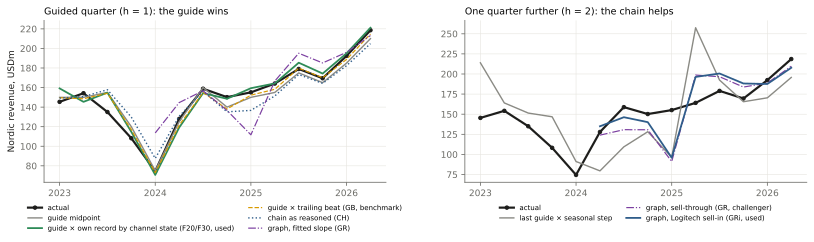

## Nordic Semiconductor Q3 2026 revenue and gross margin (reports late October)
 - reasoning:
    * In a guided quarter the guide already holds the orders Nordic can see, so the forecast is how far management will be off this time. No chain or lag model beat the guide in the back-test (see Lag).
    * The expected error uses Nordic's **own** record (+4.2% against the peers' +2.0%, only t 1.4, so using its own record is a judgment; F20), split by last quarter's channel state: only the quarters that were neither building nor short (F30). The state now is lean (lead time 16 weeks, not a shortage), so no building or shortage effect is added.
    * Not in the guide: Logitech's 25 June supplier incident, pushed through the supply graph to Nordic's shipments, 75% assumed already in the 6 August guide; the chain term has weight 0 (the encompassing test finds no information beyond the guide).
    * Gross margin: only a floor is guided (> 50%), no point, so the simple rule with the lowest walk-forward error is used (F18).
    * **Conclusion: revenue 238.0m (224.6–251.3, ≈80%), +32.9% YoY; gross margin 53.1% (51.9–54.3%).**
 - formula:
    * Revenue = 230 × (1 + 4.24%) − 1.78 + 0 = 238.0; range = ± 1.2816 × σ × 230, σ = √(s² + s²/n) = √(4.23² + 4.23²/7) = 4.52% → ± 13.3
    * Expected error e = Nordic's mean guide error (actual ÷ guide midpoint − 1) after quarters that were neither building nor short = +4.24% (n 7); after a building quarter add −7.39 pts (n 7), after a shortage quarter −2.32 pts (n 7)
    * Supplier incident, net = event-study gross effect −7.1m × (1 − 75% already in the guide) = −1.78m
    * Gross margin = last quarter's GM ex one-offs = 53.1%; range = ± 1.2816 × 0.92, the rule's error over the 9 quarters of the current, hand-dated "normal" regime (2.06 over all quarters)
 - data used:
    * Q3 guide 220–240m, GM > 50% (Nordic Q2 2026 report, 6 Aug, B)
    * 21 quarters of guides and actuals, 2021Q2–2026Q2 (quarterly reports, B)
    * Channel state: Microchip distributor days (A), Nordic backlog 2020Q4–2023Q1 (B), live lead time 16 weeks (findchips, D)
    * Supplier incident: Logitech call (C; ≈20m in Q2 FY27, up to 200m in Oct–Dec); supply-graph lead time 14 weeks and Nordic content 3.63% (step 5d)
    * GM 2021–2026 (quarterly reports, B); one-offs in 2024Q2 (write-down) and 2025Q4 (A)
 - data support:
    * Cross-checks: 10 of 13 independent methods, challengers and scenarios land inside the range (`cross_checks.csv`); outside: distributors turn to building 221.0, restock to step 3's high 252.6, reasoned chain CH 224.5
    * Pre-registered challengers (scored on 22 Oct): the rule before the shortage split 235.3, pooled with peers 232.6, Nordic's own words as the state (F31) 237.0, channel composite 239.8, composite + graph 238.6 (`challenger_prereg_log.csv`, `composite_prereg_log.csv`)
    * GM rules by walk-forward RMSE (pts): last quarter 2.06, guide + last 4 errors 2.08, guide + all errors 2.31, 4-quarter mean 2.63, same quarter last year 4.33; channel-excess term not adopted (peers −0.25 pts, t −1.18; Nordic back-test 2.35 vs 2.34, F25); the > 50% floor was met in 77% of quarters
 - assumption/limit:
    * The shortage split was decided after seeing the data (F30): walk-forward over 14 quarters 5.31 pts, against 5.20 before the split and 5.05 for the pooled model (best); the new habit rests on 7 quarters
    * 75% of the incident already in the guide is a D judgment: all of it in the guide 239.8, none 232.7
    * A turn to building: Nordic's own building effect comes from 7 quarters of one cycle; if it happens, revenue 221.0
    * The GM range covers GM ex one-offs only; 2 of the last 9 quarters had one-offs, so a reported figure can land outside the range (P117)
 - future work:
    * After the 22 Oct print: fill in the actual, score the new and old rules and every challenger, keep or drop the shortage split
    * Before the print: distributor-inventory wording (W2) and lead time (W4) as signals
 - figures:

   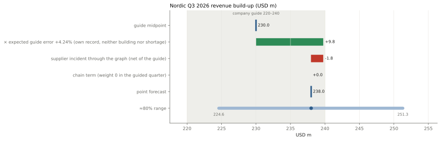

## Logitech Q2 FY2027 (September quarter) revenue and gross margin (reports late October)
 - reasoning:
    * As for Nordic, the guided quarter is a forecast of how far management will be off. Logitech has guided quarterly only since 2025Q2 (5 guides), so its habit is partially pooled with 12 peers' (F16); the weight follows its sample size and noise.
    * The channel state is lean, so the peers' building effect (−1.64 pts, t −4.4) does not apply now.
    * The chain (tier identity: sell-in = sell-through + change in channel inventory, with channel weeks held flat) is shown, not used (F29): the sell-through it reads was known when Logitech guided, and its back-test error is 23m against 13m for the guide method (5 quarters).
    * Gross margin: Logitech gave a point GM guide on its call (≈44%), so the rule is guide + its mean past error on that guide (F18).
    * **Conclusion: net sales 1,226.3m (1,172.9–1,279.6), +3.4% YoY, just above the 1,220m top of the guide; non-GAAP GM 45.3% (44.1–46.5%).**
 - formula:
    * Net sales = 1,202.5 × (1 + 1.98%) + 0 × chain = 1,226.3; range = ± 1.2816 × 3.46% × 1,202.5 = ± 53.4
    * Partial pooling: own weight w = τ² ÷ (τ² + s²/n) = 0.300 ÷ (0.300 + 3.42²/5) = 0.114; e = 0.114 × own +1.61% + 0.886 × peers' μ +2.02% = +1.98% (DerSimonian–Laird estimates of μ, τ²)
    * Chain (shown only) = same quarter last year 1,186.1 × (1 + sell-through YoY 10.9%) = 1,315.7
    * Gross margin = 44% + mean past error +1.3 pts = 45.3%; range = ± 1.2816 × 0.93 (the rule's walk-forward error)
 - data used:
    * Q2 FY27 guide 1,185–1,220m (Q1 FY27 release, 28 Jul, B); GM guide ≈44% (call, C)
    * 5 quarterly guides and actuals (8-K, B); 12 peers' guides and actuals 2008–2026 (Pipeline D, A / B)
    * Sell-through YoY and gap (calls, C); channel state (Microchip distributor days, A)
    * The last 4 GM guides and actuals (calls and 8-K)
 - data support:
    * Cross-checks: 5 of 6 inside the range; outside: the tier-identity chain 1,315.7 (+89 over the point) (`cross_checks.csv`)
    * Pre-registered challenger: supply-side ODM nowcast 1,220.4m, from Merry + Chicony Jul–Aug revenue −13.2% YoY (F28, `logitech_odm_prereg_log.csv`)
    * Scenarios: the chain at its back-test weight 0.23 → 1,248.2 (+22); adding the implied guides of 2023–25, weight 0.48 → 1,271.2 (+45)
    * FX: the post-guide FX change is worth only +1.4m and makes the back-test worse (28.0m vs 23.3m, n 4), so it is not applied (F27)
    * GM: all 4 past quarters came in above the guide (+0.6, +2.3, +1.0, +1.3); rules by RMSE (pts): guide + mean error 0.93, 4-quarter mean 1.11, last quarter 1.29
 - assumption/limit:
    * Only 5 quarterly guides: own weight 11%, the habit is mostly borrowed from the peers
    * At the 2023–25 turns actual sales beat the implied quarterly outlook by up to 11% (`logitech_implied_quarter_guides.csv`); upside risk from the chain (+89m), downside from the ODM signal (1,220)
    * The supplier incident (≈20m in Q2) is assumed to be in the guide
    * GM guided only 4 times, so the mean past error is noisy
 - future work:
    * After the ≈27 Oct print: score the ODM challenger (W16) and add the quarter to the guide record
    * ≈10 Oct: update the challenger with the ODMs' September revenue
 - figures:

   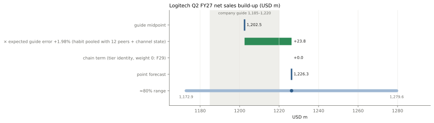

## GN Audio Q3 2026 revenue and EBITA margin (reports early November)
 - reasoning:
    * GN gives only full-year guidance (set in February, revised through the year), with no quarterly guide and no comparable peer group, so the full-year number from the August statement is corrected by **its own** mean August-guide error (F17, F23); H1 is reported, so H2 is backed out and Q3 taken from it.
    * FX is added separately: the organic guide excludes it, so it is computed from ECB rates and GN's currency mix (F27).
    * The margin follows the same logic: full-year margin guide + August margin error → full-year EBITA − H1 reported = H2 → Q3 at its share of H2.
    * **Conclusion: revenue 2,247 DKKm (2,023–2,471), +1.6% YoY; adj. EBITA margin 13.5% (9.3–17.8%).**
 - formula:
    * Full-year organic = guide midpoint 1.5% + mean August error −3.3 pts = −1.8%
    * H2 organic = (FY × (H1b + H2b) − H1 × H1b) ÷ H2b = +0.15%, H1 = −3.92% (reported), b = 2025 half-year revenue weights
    * Q3 revenue = 2025 Q3 2,211 × (1 + 0.15%) × (1 + 1.47%) = 2,247; range = ± 1.2816 × H2 σ 7.79 pts × base
    * FX = Σ currency exposure × (this Q3's average rate ÷ last Q3's − 1): USD exposure 0.43 × +1.63% YoY = +0.69 pts; APAC basket 0.20 × +3.89% = +0.78 pts; total +1.47 pts
    * EBITA: full-year margin 9.5% − 0.94 = 8.56% × full-year revenue 9,331 = 799; − H1 117 = H2 682; × Q3 share 44.7% = 304; ÷ 2,247 = 13.5%; range = ± 1.2816 × √(2.61² + 2.02²) = ± 1.2816 × 3.30
 - data used:
    * Full-year guide: organic 0–3%, adj. EBITA margin 9–10% (19 Aug, B)
    * August guides and actuals 2021–25 (173 statements quote-checked, B): organic revenue errors −3.0, −9.5, 0, −3.0, −1.0 pts; EBITA-margin errors +0.2, −3.4, −0.4, −0.5, −0.6 pts
    * 2025 Q3 continuing-ops revenue 2,211 (Enterprise 1,624 + Gaming 587); H1 organic −3.92%, H1 EBITA 117 (interim report, B)
    * ECB reference rates (63 days of Q3 so far, A); GN's disclosed FX effects (5 quarters, to fit the currency exposure, B)
    * Q3 share of H2 EBITA: 2021 50.7%, 2022 58.0%, 2023 43.5%, 2025 44.7%
 - data support:
    * FX fit: USD exposure 0.43 errs 0.6 pts over 5 quarters (2.3 carrying the last quarter forward); North America check −7.3% vs −7.0% disclosed
    * Cross-checks: 3 of 4 inside the range; **the point is below all three alternatives**: division view 2,348, guide as given 2,389, error pooled with the semiconductor peers 2,476 (outside) → a bet that GN's August guide is too high again (4 of 5 years)
    * EBITA cross-checks: bridged from Q2 11.6% (Q2 EBITA 111 + incremental revenue contribution 40 + savings 50 + tariff refund 60), 8.9% without the one-off refund (the rule's 13.5% is 10.9% without it); with Q3's share at its 2021–25 mean, 49.2%, 14.9%
 - assumption/limit:
    * August errors cover 5 years only, on changing perimeters: 2022's −9.5 pts dominates the mean; revenue errors are GN Audio in 2021–22 and the group in 2023–25, margin errors Audio in 2021–23 and the group in 2024–25
    * The margin depends most on assumptions: the rule's 13.5% and the Q2 bridge's 11.6% are 1.9 pts apart, so the full-year guide needs H2 profit to be back-loaded; only 2025 is on the continuing-ops basis for Q3's share (43.5–58% across years, sd 6.6 pts)
    * The chain does not help GN (read-across correlation −0.17 / +0.21, below the 0.5 bar); GN is ≈1% of Nordic
 - future work:
    * Score the Q3 point after the 5 Nov print; add FY2026's August-guide error once the full year is reported (Feb 2027), the rule's 6th observation
    * An anchor for GN's channel (it never says "at target"); a chip census for GN
 - figures:

   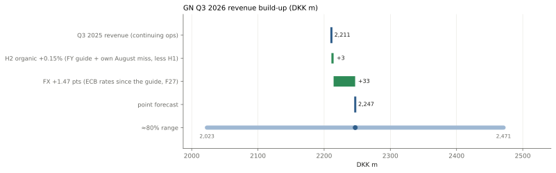
