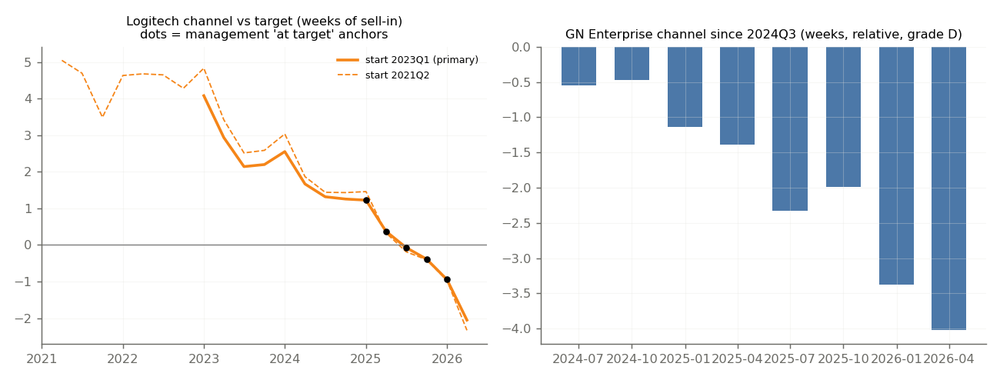
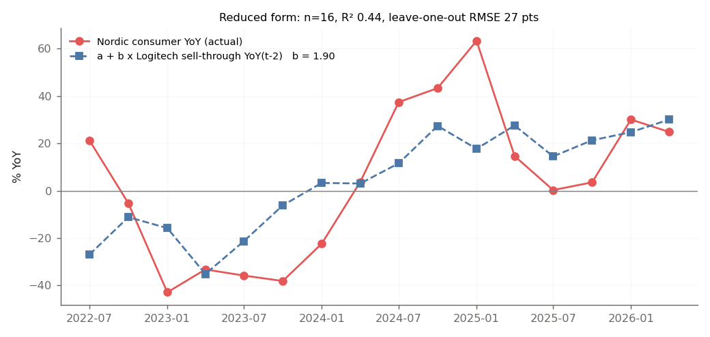

# Step 3 — Inventory mechanism (bullwhip) — generated 2026-09-22

**Question.** Where does inventory sit between end demand and Nordic's revenue, who holds it, how much does each link amplify, and what does the channel position say about the October prints? Formulas, reasons and data checks are all below; each judgment call has an id (D1-D21) in `config/decisions.csv`.

## 1. The call (what an analyst would say on 22 Oct / 27 Oct / 5 Nov)

- **Nordic — Q3 2026 revenue.** distribution restocking from a lean base (coded state +0.5); component distributors lean: Avnet 75 d, Arrow 61 d, Microchip distributor days 25 (31% of the way up its 10-year range). Direction: small Q3 upside (mostly in the guide); the same amount is a payback risk in H1 2027. **Watch flag:** receivables are rising faster than revenue while the channel fills. Channel adjustment +0 / +4 / +15 USDm (low/mid/high; extra distributor weeks (0.0, 0.5, 1.5) x USD 17.7m/wk x distribution share (0.42, 0.47, 0.55)). Forecast line `forecast.nordic_2026Q3.signal_adjustments_usdm.capacity_worry_pull_in` = +0 → inside step 3's range. Questions: Distributor weeks on hand and sell-through vs revenue in Q3? Split of the USD 217m inventory into wafers / WIP / finished goods? Why did receivables grow 2x revenue (timing, terms, or distributor mix)?
- **Logitech — Q2 FY27 net sales (Jul-Sep 2026).** lean: channel -2.1 wk vs target (all anchors) / -1.1 wk (latest anchor 2026Q1); sell-through ran +4 pts above sell-in in 2026Q2. Direction: refill tailwind to sell-in, capped by the late-June supplier incident. Channel adjustment +5 / +36 / +162 USDm (low/mid/high; deficit wk 1.1/1.6/2.3 x USD 92m/wk x refill (0.25, 0.5, 0.75) x supply (0.2, 0.5, 1.0)). Forecast line `forecast.logitech_2026Q3.signal_adjustments_usdm (sum of hand-set lines)` = +0 → OUTSIDE step 3's range. Questions: Weeks on hand at end-September vs target? How much of the refill was blocked by the supplier incident, and when does supply normalise?
- **GN — Q3 2026 Enterprise revenue (continuing ops).** distributors draining for 8 quarters: cumulative -481 DKKm = -4.0 wk of Enterprise sell-in since 2024Q3 (no anchor: relative, grade D). Direction: H2 'positive organic' needs the drain to END more than sell-out to accelerate. Channel adjustment -114 / -49 / +16 DKKm (low/mid/high; Enterprise organic = sell-out (-2.0, 0.0, 2.0) - gap (3.0, 1.0, -1.0) = [-5.0, -1.0, 3.0] vs forecast mid +2% on base DKK 1624m). Forecast line `forecast.gn_2026Q3.enterprise_org_pct.mid` = +2 → inside step 3's range. Questions: Enterprise sell-out vs sell-in in Q3 and distributor weeks on hand by region (EMEA)? Is the North America reduction finished?

Where step 3 disagrees with the forecast config: Logitech's refill mid (+36 USDm) is well above the hand-set channel lines (+0; removed by step-7 decision F5 in favour of step 7c's data-weighted chain term); the gap is the supply-availability assumption after the late-June incident. GN: the channel view puts Enterprise organic growth at -1% (mid) against the forecast's +2%. Step 3 does not overwrite the config (D15).

## 2. Inventory factors — the formulas

| factor | formula | reads as |
|---|---|---|
| DIO | inventory_t / COGS_t × 91.25 | days of trailing cost of sales on hand |
| forward DIO | inventory_t / (guided revenue_{t+1} × (1 − margin)) × 91.25 | days of NEXT quarter's cost of sales — a build ahead of guided growth is not an overhang (D17) |
| inventory–sales spread | YoY%(inventory) − YoY%(revenue) | Bernard & Noel (1991), Thomas & Zhang (2002): inventory outgrowing sales predicts weaker sales and margins |
| stage spread | YoY%(stage) − YoY%(revenue) | finished goods outgrowing sales = demand shortfall; raw materials / WIP outgrowing sales = planned build |
| FG share, FG weeks | FG / inventory; FG / COGS × 13 | OEM finished-goods cover |
| DSO | receivables_t / revenue_t × 91.25 | channel-stuffing tell: sell-in pushed on extended terms shows up in DSO first |
| purchases | COGS_t + inventory_t − inventory_{t−1} | what the company bought from its suppliers = the order signal the next tier sees |
| channel fill (exact) | F_t = F_{t−4}(1+g_out) − gap_t × S_{t−4} | see §4 |
| distributor days | Arrow / Avnet DIO; Microchip 'our distributors maintained NN days' | component-channel cover |

Latest quarter:

|                    |   2026Q2 |
|:-------------------|---------:|
| nordic_dio         |    193.4 |
| nordic_fwd_dio     |    183.8 |
| nordic_inv_spread  |     26.7 |
| nordic_dso         |     48.3 |
| nordic_dso_yoy_chg |     11.5 |
| logi_dio           |     72.4 |
| logi_fg_share      |      0.9 |
| logi_fg_weeks      |      9.1 |
| logi_fg_spread     |    -11.4 |
| logi_dso           |     49.7 |
| logi_dso_yoy_chg   |     -0.9 |
| logi_purchases_yoy |     -6.6 |
| arrow_dio          |     61.1 |
| avnet_dio          |     74.5 |
| mchp_disti_days    |     25   |
| it_dist_dio_avg    |     55   |

Nordic inventory by stage at each year end (AR note; raw materials = wafers at sub-contractors):

|   year |   raw_materials_usdm |   work_in_progress_usdm |   finished_goods_usdm |   total_usdm |   raw_materials_share |   finished_goods_share |   finished_goods_spread_pts |   raw_materials_spread_pts |   finished_goods_weeks_on_q4_cogs |
|-------:|---------------------:|------------------------:|----------------------:|-------------:|----------------------:|-----------------------:|----------------------------:|---------------------------:|----------------------------------:|
|   2021 |                9.704 |                  18.44  |                26.799 |       54.943 |                 0.177 |                  0.488 |                     nan     |                    nan     |                             4.951 |
|   2022 |               34.356 |                  25.38  |                42.355 |      102.091 |                 0.337 |                  0.415 |                      30.807 |                    226.8   |                             6.082 |
|   2023 |               95.043 |                   9.907 |                58.139 |      163.089 |                 0.583 |                  0.356 |                      67.39  |                    206.765 |                            14.553 |
|   2024 |               89.615 |                  35.435 |                46.857 |      171.907 |                 0.521 |                  0.273 |                     -13.62  |                      0.074 |                             7.968 |
|   2025 |               57.722 |                  45.537 |                51.736 |      154.995 |                 0.372 |                  0.334 |                     -20.151 |                    -66.152 |                             8.267 |

Reading: the 2023 destock shows as finished goods outgrowing revenue by +67 pts and FG cover rising to 15 weeks of Q4 COGS; 2025 is the unwind (FG spread -20 pts, wafers drawn down). The 2026 build (USD 155m → 217m) has no stage split until AR2026 — a blind spot (D3).

## 3. Data added for this step and how each number was validated

| source | grade | retrieval | validation |
|---|---|---|---|
| Logitech XBRL: raw materials, finished goods, receivables | B/A | SEC company-facts API | RM + FG = total inventory (26 quarters); total = hand-typed inventory |
| Arrow, Avnet XBRL: revenue, COGS, inventory, receivables | B/A | SEC company-facts API; 52/53-week closes mapped to calendar quarters | revenue > COGS > 0, margins in 10-13% (Q4 derived as FY − 9M) |
| Microchip distributor days | B (10-Q) / A (10-K) | EDGAR primary documents, regex on the sentence | verbatim quote stored; each 'compared to MM days at <date>' equals the filing for that date |
| Nordic receivables + inventory, quarterly | B | cached NewsWeb reports, script-read balance sheet | year-ago column in report t = current column in report t−4; inventory = hand-typed |
| Nordic inventory by stage, annual | A | cached annual reports, note 'Cost of materials / inventory' | stages sum to reported inventory; prior-year column chains |
| Nordic top-10 / broad-market Bluetooth revenue | B (2024: C) | hand-typed with quote fragments | every fragment found in the cited report; 276 + 208 = 2023 short-range revenue |
| Logitech 'channel at target' anchors | C | saved transcript excerpts | fragment found in excerpt at run time |

| check                                                                                                                              |   n |   max_abs_diff_pct | passed   |
|:-----------------------------------------------------------------------------------------------------------------------------------|----:|-------------------:|:---------|
| logitech RM + FG == InventoryNet                                                                                                   |  26 |              0.044 | True     |
| logitech XBRL InventoryNet == hand-typed inventory_usdm                                                                            |  26 |              0     | True     |
| arrow revenue > COGS > 0, inventory > 0; GM 10.8-13.3%                                                                             |  26 |            nan     | True     |
| avnet revenue > COGS > 0, inventory > 0; GM 10.4-12.5%                                                                             |  26 |            nan     | True     |
| amazon revenue > cost of sales > 0, inventory > 0; GM 36.9-52.3% within 30-60%                                                     |  26 |            nan     | True     |
| bestbuy revenue > cost of sales > 0, inventory > 0; GM 20.0-23.7% within 15-30%                                                    |  21 |            nan     | True     |
| walmart revenue > cost of sales > 0, inventory > 0; GM 22.9-25.4% within 18-30%                                                    |  26 |            nan     | True     |
| target revenue > cost of sales > 0, inventory > 0; GM 22.6-33.7% within 20-35%                                                     |  19 |            nan     | True     |
| cdw revenue > cost of sales > 0, inventory > 0; GM 16.4-23.0% within 15-28%                                                        |  26 |            nan     | True     |
| microchip sentence found in >= 80% of 10-Q/10-K since 2010 (65 of 65; unparsed listed in data/processed/mchp_unparsed_filings.csv) |  65 |            nan     | True     |
| microchip chain: 'compared to MM days' == prior filing's NN (documented filing errors: config/known_filing_issues.csv)             |  61 |            nan     | True     |
| microchip long history (2008+): chain check                                                                                        |  73 |            nan     | True     |
| microchip: no quarter missing between the first and last parsed quarter (a gap blanks the change on both sides)                    |  65 |            nan     | True     |

| check                                                      |   n | passed   |
|:-----------------------------------------------------------|----:|:---------|
| nordic AR + inventory line found in every quarterly report |  23 | True     |
| nordic chain: year-ago column (t) == current column (t-4)  |  28 | True     |
| nordic extracted inventory == hand-typed (max diff 0.08%)  |  22 | True     |
| nordic AR-note stages: sum and prior-year chain            |   9 | True     |
| nordic customer-concentration quotes found in cited report |   7 | True     |

Anchor check (run time):

| company   | quarter   | statement                                                                       | verified   | check                             |
|:----------|:----------|:--------------------------------------------------------------------------------|:-----------|:----------------------------------|
| logitech  | 2025Q1    | Channel inventory ended within our operating targets                            | True       | fragment found in saved excerpt   |
| logitech  | 2025Q2    | the weeks on hand are still in a very healthy, normal operating range           | True       | fragment found in saved excerpt   |
| logitech  | 2025Q3    | weeks-on-hand at targeted levels (Q2 FY26 call)                                 | True       | verbal_metrics row verified=found |
| logitech  | 2025Q4    | really healthy channel inventory levels as we exit the holiday season           | True       | fragment found in saved excerpt   |
| logitech  | 2026Q1    | The weeks on hand across the channel globally is exactly where we want it to be | True       | fragment found in saved excerpt   |

## 4. Channel-inventory index (Logitech, GN)

Flow identity I_t − I_{t−1} = S_t − T_t = F_t. Both companies disclose gap = g_out − g_in (YoY points). With S_t = S_{t−4}(1+g_in) and T_t = T_{t−4}(1+g_out):

    F_t = F_{t−4}(1 + g_out) − gap_t × S_{t−4}        (exact; F = 0 before the start, D5)

The naive −gap × S_{t−4} forgets that the year-ago quarter may itself have been a drain: in 2024Q1 it reads +48m (a build) where the exact recursion reads -14m — Logitech's CFO on the Q4 FY24 call: '2 points of that is simply comparing the channel inventory year-over-year'. The level is pinned by five management 'at target' statements (D7); their spread is the error bar.

Logitech: start 2023Q1 (anchor rms 0.73 wk) preferred to start 2021Q2 (rms 0.82 wk). Anchor readings (weeks): {'2025Q1': 1.22, '2025Q2': 0.37, '2025Q3': -0.07, '2025Q4': -0.39, '2026Q1': -0.95}; rms 0.73 wk. 2026Q2: -2.1 wk (all anchors), -1.1 wk (latest anchor). The anchors drift down by ~2 weeks from 2025Q1 to 2026Q1 although management called the channel 'at target' each time: either the weeks-on-hand target is being lowered or the coded gaps run ~0.5 pt a quarter high. Both make the latest-anchor reading the least biased, so it is the low end of the deficit and half of the mid (D21).

| quarter   |   sell_in |   g_in_pct |   gap_pts |   g_out_pct |   fill_naive |   fill_exact |   excess_usd |   excess_weeks |
|:----------|----------:|-----------:|----------:|------------:|-------------:|-------------:|-------------:|---------------:|
| 2023Q1    |     960.1 |      -21.9 |         5 |       -16.9 |        -61.5 |        -61.5 |        301.2 |            4.1 |
| 2023Q2    |     974.5 |      -16   |         7 |        -9   |        -81.2 |        -81.2 |        220   |            2.9 |
| 2023Q3    |    1057   |       -8   |         4 |        -4   |        -46   |        -46   |        174.1 |            2.1 |
| 2023Q4    |    1255.5 |       -1.1 |        -3 |        -4.1 |         38.1 |         38.1 |        212.2 |            2.2 |
| 2024Q1    |    1011.5 |        5.4 |        -5 |         0.4 |         48   |        -13.7 |        198.5 |            2.6 |
| 2024Q2    |    1088.2 |       11.7 |        -3 |         8.7 |         29.2 |        -59   |        139.5 |            1.7 |
| 2024Q3    |    1116   |        5.6 |        -2 |         3.6 |         21.1 |        -26.5 |        113   |            1.3 |
| 2024Q4    |    1340.3 |        6.8 |         2 |         8.8 |        -25.1 |         16.3 |        129.3 |            1.3 |
| 2025Q1    |    1010.4 |       -0.1 |         2 |         1.9 |        -20.2 |        -34.2 |         95.1 |            1.2 |
| 2025Q2    |    1147.7 |        5.5 |         0 |         5.5 |         -0   |        -62.2 |         32.9 |            0.4 |
| 2025Q3    |    1186.1 |        6.3 |         1 |         7.3 |        -11.2 |        -39.6 |         -6.7 |           -0.1 |
| 2025Q4    |    1421.5 |        6.1 |         4 |        10.1 |        -53.6 |        -35.6 |        -42.3 |           -0.4 |
| 2026Q1    |    1085.5 |        7.4 |         0 |         7.4 |         -0   |        -36.7 |        -79   |           -0.9 |
| 2026Q2    |    1227.2 |        6.9 |         4 |        10.9 |        -45.9 |       -114.9 |       -194   |           -2.1 |

GN Enterprise (no anchor; relative to 2023Q3-2024Q2; grade D): cumulative -481 DKKm = -4.0 weeks of sell-in drained since 2024Q3.

## 5. Bullwhip, link by link

Variance ratio VR = Var(orders upstream) / Var(demand received), on YoY growth (removes seasonality), moving-block bootstrap 90% interval (D14):

| window   | link   | label                                    |   n |   variance_ratio |   vr_p5 |   vr_p95 |   sd_ratio |   sd_ratio_p5 |   sd_ratio_p95 |
|:---------|:-------|:-----------------------------------------|----:|-----------------:|--------:|---------:|-----------:|--------------:|---------------:|
| all      | A      | Logitech sell-in / Logitech sell-through |  21 |             0.97 |    0.89 |     1.42 |       0.99 |          0.94 |           1.19 |
| all      | A'     | Logitech purchases / Logitech sell-in    |  21 |             1.55 |    1.2  |     4.36 |       1.24 |          1.1  |           2.09 |
| all      | B      | Nordic consumer / Logitech sell-in       |  18 |             7.38 |    4.21 |    42.51 |       2.72 |          2.05 |           6.52 |
| all      | C      | Nordic consumer / Logitech sell-through  |  18 |             7.79 |    4.43 |    45.87 |       2.79 |          2.1  |           6.77 |
| destock  | A      | Logitech sell-in / Logitech sell-through |   7 |             1.45 |    0.44 |     6    |       1.2  |          0.66 |           2.45 |
| destock  | A'     | Logitech purchases / Logitech sell-in    |   7 |             2.38 |    1.92 |     3.62 |       1.54 |          1.39 |           1.9  |
| destock  | B      | Nordic consumer / Logitech sell-in       |   7 |             4.9  |    0.18 |    33.71 |       2.21 |          0.42 |           5.81 |
| destock  | C      | Nordic consumer / Logitech sell-through  |   7 |             7.1  |    0.48 |    25    |       2.66 |          0.7  |           5    |
| normal   | A      | Logitech sell-in / Logitech sell-through |   9 |             1.03 |    0.14 |     1.72 |       1.01 |          0.38 |           1.31 |
| normal   | A'     | Logitech purchases / Logitech sell-in    |   9 |            17.09 |    2.74 |    45.32 |       4.13 |          1.66 |           6.73 |
| normal   | B      | Nordic consumer / Logitech sell-in       |   9 |            49.52 |   29.56 |   297.3  |       7.04 |          5.44 |          17.24 |
| normal   | C      | Nordic consumer / Logitech sell-through  |   9 |            50.98 |   43.07 |    86.77 |       7.14 |          6.56 |           9.32 |

- **Link A (Logitech's retail + distribution channel) does not amplify**: VR 0.97. Logitech runs the channel to target; the gap moves sell-in by a few points, not multiples.
- **Link A' (Logitech's own stock) amplifies ~1.2× in sd terms**: purchases fell -24% in 2023 against sell-in -12% (Logitech cut DIO from 119 days in 2022Q2 to 56 in 2023Q4).
- **Link B (Nordic consumer vs Logitech sell-in) is the big one — 2.7× sd**, but the normal-regime ratio (50× VR) is a small-denominator artefact: Logitech growth barely moved in 2024-26. The '5.5× in the recovery' is the same artefact plus Nordic share / content gains (the trend a in §6), not bullwhip.

### Whose revenue swung: top-10 customers vs the broad market (Nordic's own disclosure)

|   year |   bt_revenue_usdm |   top10_usdm |   broad_usdm | top10_basis             |   top10_yoy_pct |   broad_yoy_pct |   logi_sellin_yoy_pct |   logi_sellthrough_yoy_pct |   logi_purchases_yoy_pct |
|-------:|------------------:|-------------:|-------------:|:------------------------|----------------:|----------------:|----------------------:|---------------------------:|-------------------------:|
|   2021 |             503.1 |        201.2 |        301.9 | 40% x Bluetooth revenue |           nan   |           nan   |                  30.8 |                      nan   |                    nan   |
|   2022 |             669.1 |        285   |        384.1 | USD disclosed           |            41.6 |            27.2 |                 -16.9 |                      -17.9 |                    -20.8 |
|   2023 |             483.9 |        276   |        207.9 | USD disclosed           |            -3.2 |           -45.9 |                 -11.7 |                       -8.5 |                    -23.8 |
|   2024 |             449.6 |        260.8 |        188.8 | 58% x Bluetooth revenue |            -5.5 |            -9.2 |                   7.3 |                        5.5 |                     18.8 |

In 2023 Nordic's top-10 Bluetooth customers moved -3% and the broad market -46%, while Logitech's sell-in moved -12%, sell-through -8% and purchases -24%. The destock was a broad-market (distribution-channel) event. Logitech is a top-10 customer on step 2's estimate, so the whole-company amplitude must not be applied to the Logitech slice (D9). Tension to state openly: Logitech's purchases fell far more than the top-10 bucket, so either other top-10 customers grew (health, wearables) or Logitech's radio buying held up better than its total purchases — the data cannot say which.

| slice                | in_top10_evidence                                                                             |   mult_low |   mult_mid |   mult_high | basis                                                                                                                                         |
|:---------------------|:----------------------------------------------------------------------------------------------|-----------:|-----------:|------------:|:----------------------------------------------------------------------------------------------------------------------------------------------|
| logitech             | step-2 attribution p10 USD 62m/yr > top-10 average USD 27.6m -> top-10 customer               |       0.27 |       1    |        1.24 | low = top-10 Bluetooth YoY / Logitech sell-in YoY (2023); mid = pass-through of Logitech builds; high = Logitech purchases sd ratio (link A') |
| gn                   | step-2 p50 USD 9m/yr < top-10 average USD 27.6m -> likely broad market or a small key account |       1    |       2.46 |        3.92 | low = pass-through (key account); high = broad-market Bluetooth YoY / Logitech sell-in YoY (2023); mid = equal odds of the two                |
| nordic_whole_company | n/a                                                                                           |       2.05 |       2.72 |        6.52 | link B sd ratio, all quarters: the number the regime amplitude_multiplier describes                                                           |

## 6. Why the chain amplifies — the regression and its intuition

**Ordering rule** (Sterman 1989; stock adjustment, Metzler 1941 / Blinder & Maccini 1991): O_t = E[D_t] + (I*_t − I*_{t−1}) + α(I*_t − I_t), with target stock I* = c × trailing-twelve-month demand. In YoY growth:

    g^O_t ≈ g_t + c·(g_t − g_{t−4}) − α'·gap_t

- term 1 **pass-through**: orders grow with demand;
- term 2 **accelerator**: a tier holding c years of cover orders c × the *change* in demand growth on top — orders LEAD demand; c × 52 = weeks of cover. (The one-quarter version g_t − g_{t−1} does not cancel Logitech's ~25% Q4→Q1 seasonality, D19.)
- term 3 **stock-gap correction**: when demand falls, stock piles up involuntarily (distributor days are counter-cyclical: Avnet, Arrow, Microchip correlate −0.6 with same-quarter growth), then is cut — orders LAG demand.

**Prior, stated before fitting (D10)** — cover at each stocking point:

| point                                                         | tier_test        | source                                                                     |   low |   mid |   high |
|:--------------------------------------------------------------|:-----------------|:---------------------------------------------------------------------------|------:|------:|-------:|
| retail + distribution channel (Logitech products)             | logitech_channel | assumption: 'weeks on hand' never disclosed numerically                    |   4   |   6   |    8   |
| Logitech own stock (RM + FG)                                  | logitech_own     | measured: DIO / 7 (range over sample)                                      |   7.3 |  10.5 |   16.2 |
| of which finished goods                                       |                  | measured: XBRL FG / COGS x 13                                              |   6.5 |   9.2 |   12   |
| ODM / EMS component stock                                     |                  | assumption (unobservable)                                                  |   2   |   4   |    8   |
| component distributors (Nordic parts)                         |                  | measured proxy: Microchip distributor days / 7 x Nordic distribution share |   1.1 |   1.9 |    3.4 |
| TOTAL end demand -> Nordic (prior for the Nordic-tier c x 52) | nordic           | sum                                                                        |  14.4 |  22.4 |   35.5 |

**Tests** — y = a + b·g_{t−L} [+ c·(g_{t−L} − g_{t−L−4})] [+ γ·gap_{t−K}], OLS, Newey-West s.e., leave-one-out RMSE:

| tier             | spec                                                             |   lag |   n |     a |   b_demand |   b_se |   c_accel |   c_se |   implied_cover_wk | prior_cover_wk   |   gamma_gap |   gamma_se |   r2 |   rmse_loo |
|:-----------------|:-----------------------------------------------------------------|------:|----:|------:|-----------:|-------:|----------:|-------:|-------------------:|:-----------------|------------:|-----------:|-----:|-----------:|
| logitech_channel | A demand                                                         |     0 |  17 | -0.72 |       0.99 |   0.08 |    nan    | nan    |             nan    | 4-8 (mid 6)      |      nan    |     nan    | 0.91 |       3.67 |
| logitech_channel | B + accelerator                                                  |     0 |  17 | -0.72 |       0.99 |   0.1  |     -0    |   0.04 |              -0.03 | 4-8 (mid 6)      |      nan    |     nan    | 0.91 |       3.87 |
| logitech_own     | A demand                                                         |     0 |  20 | -0.8  |       1.44 |   0.23 |    nan    | nan    |             nan    | 7-16 (mid 10)    |      nan    |     nan    | 0.78 |       9.32 |
| logitech_own     | B + accelerator                                                  |     0 |  18 | -0.78 |       1.56 |   0.25 |     -0.05 |   0.04 |              -2.81 | 7-16 (mid 10)    |      nan    |     nan    | 0.79 |      10.95 |
| nordic           | A demand                                                         |     2 |  16 | 10.9  |       1.9  |   0.57 |    nan    | nan    |             nan    | 14-36 (mid 22)   |      nan    |     nan    | 0.44 |      26.8  |
| nordic           | B + accelerator                                                  |     2 |  15 |  9.09 |       2.51 |   0.4  |     -0.07 |   0.16 |              -3.56 | 14-36 (mid 22)   |      nan    |     nan    | 0.62 |      25.73 |
| nordic           | C + stock gap (component distributor days vs normal, 1q earlier) |     2 |  16 | 16.31 |       2.15 |   0.5  |    nan    | nan    |             nan    | 14-36 (mid 22)   |       -0.77 |       0.79 | 0.47 |      28.02 |
| nordic           | B + accelerator, lag 1                                           |     1 |  16 |  8.59 |       2.86 |   0.56 |     -0.56 |   0.13 |             -28.92 | 14-36 (mid 22)   |      nan    |     nan    | 0.66 |      20.52 |
| nordic           | B + accelerator, lag 3                                           |     3 |  14 | 11.36 |       1.99 |   0.45 |      0.47 |   0.19 |              24.34 | 14-36 (mid 22)   |      nan    |     nan    | 0.72 |      23.17 |

What the data say:

1. **Pass-through is identified everywhere**: channel b = 0.99, Logitech purchases b = 1.44, Nordic consumer b = 1.90 (90% bootstrap 1.2-3.4) on Logitech end demand two quarters earlier. Amplification shows up as an elasticity above one, not as a separate inventory term.
2. **The accelerator is absent where it is well identified**: at the two same-quarter tiers c ≈ 0 (-0.00 ± 0.04; -0.05 ± 0.04) against a prior of 4-16 weeks (c ≈ 0.08-0.31). At Nordic its implied cover flips sign with the lag (-29 / -4 / +24 weeks for lags 1/2/3): with 16 quarters and one cycle, the accelerator and the lag cannot be separated. A negative 'cover' is the phase-lag signature of term 3.
3. **The stock-gap proxy adds nothing measurable**: γ = -0.77 ± 0.79, leave-one-out RMSE 28.0 vs 26.8 for demand only.
4. **Links multiply to the direct estimate** (a consistency check on the three links):

| link                                                     |   elasticity | ci90      |
|:---------------------------------------------------------|-------------:|:----------|
| channel: Logitech sell-in on sell-through (lag 0)        |         0.99 |           |
| Logitech own: purchases on sell-in (lag 0)               |         1.56 |           |
| Nordic consumer on Logitech purchases (lag 1)            |         1.28 |           |
| PRODUCT of the three links                               |         1.97 |           |
| DIRECT: Nordic consumer on Logitech sell-through (lag 2) |         1.9  | 1.16-3.36 |

**Decision (D11):** the reduced form kept is the demand elasticity b with lag 2. Inventory information enters the forecast as *state* (the channel call in §1), not as a regression coefficient, because no inventory term is identified with the data available. Implied Nordic consumer YoY for 2026Q3 from Logitech end demand in 2026Q1 (+7.4%): 10.9 + 14.1 = **+25%**, leave-one-out RMSE 27 pts — a sanity check only; far too wide to move a forecast.

## 7. When this works and when it does not

- Works: normal and destock regimes, for the *direction* of the next quarter's channel move and for the size of Logitech's channel gap.
- Fails: supply-constrained regimes (2021-22: revenue = wafers, excluded, D13); after a supply shock at the OEM (the late-June Logitech supplier incident caps the refill — the Logitech range is wide for that reason).
- Weakest link: the channel LEVEL. The Logitech index has a ±0.7-week error bar from management's own statements; GN has no anchor at all; Nordic's distribution channel is known only as a coded state plus the Microchip / Arrow / Avnet proxies.
- Cannot tell: Nordic's revenue from Logitech specifically (no disclosure); the 2026 stage split of Nordic's inventory; channel weeks-on-hand anywhere in this chain in numbers.

## 8. Decisions (full text in `config/decisions.csv`)

| id   | topic                                                                                    | decision                                                                                                                                                                                                                                                                                                                                                                                                                                                                                                                     | reason                                                                                                                                                                                                                                                                                                                                                                                                                                                                                                                                                                                                                                                                                                     |
|:-----|:-----------------------------------------------------------------------------------------|:-----------------------------------------------------------------------------------------------------------------------------------------------------------------------------------------------------------------------------------------------------------------------------------------------------------------------------------------------------------------------------------------------------------------------------------------------------------------------------------------------------------------------------|:-----------------------------------------------------------------------------------------------------------------------------------------------------------------------------------------------------------------------------------------------------------------------------------------------------------------------------------------------------------------------------------------------------------------------------------------------------------------------------------------------------------------------------------------------------------------------------------------------------------------------------------------------------------------------------------------------------------|
| D1   | new data: component distributors                                                         | Add Arrow and Avnet (SEC XBRL: revenue, COGS, inventory, receivables) as the Nordic-side distributor tier                                                                                                                                                                                                                                                                                                                                                                                                                    | Arrow and Avnet are Nordic's franchised distributors; Ingram / TD Synnex sit on the Logitech side and peripherals are 1-2% of their sales, so their inventory says nothing about Nordic parts                                                                                                                                                                                                                                                                                                                                                                                                                                                                                                              |
| D2   | new data: channel days                                                                   | Use Microchip's 10-Q/10-K sentence 'our distributors maintained NN days of inventory' as the numeric MCU-channel series (2020Q2-2026Q2)                                                                                                                                                                                                                                                                                                                                                                                      | It is the only recurring numeric distribution-inventory disclosure in an audited/reviewed filing we found. Silicon Labs was checked and discloses only its OWN days of inventory, so the earlier claim that it gives channel weeks was wrong and is withdrawn                                                                                                                                                                                                                                                                                                                                                                                                                                              |
| D3   | inventory by stage                                                                       | Logitech: quarterly raw materials / finished goods from XBRL. Nordic: year-end raw materials (wafers) / WIP / finished goods from the annual-report note                                                                                                                                                                                                                                                                                                                                                                     | Nordic does not split inventory in quarterly reports; an estimate would be a number without evidence. The 2026 build (USD 155m -> 217m) therefore has no stage split until AR2026 - a stated blind spot and a question for the 22 Oct call                                                                                                                                                                                                                                                                                                                                                                                                                                                                 |
| D4   | GN balance sheet                                                                         | Do not compute GN DIO / DSO / stage factors; GN enters step 3 only through the Enterprise sell-out minus sell-in gap                                                                                                                                                                                                                                                                                                                                                                                                         | GN's group balance sheet mixes Hearing (~45% of revenue, sold to Amplifon end-2026, reclassified held-for-sale in 2026: inventory 2,314 -> 1,551 DKKm in one quarter). A group ratio would measure the divestment, not the Enterprise channel                                                                                                                                                                                                                                                                                                                                                                                                                                                              |
| D5   | channel index formula                                                                    | Exact flow recursion F_t = F_{t-4}(1+g_out) - gap_t x S_{t-4}                                                                                                                                                                                                                                                                                                                                                                                                                                                                | The naive reading assumes the year-ago quarter was balanced; after a drain it books the lapping as a build (2024Q1: naive +48m, exact -14m). Logitech's CFO made the same point: '2 points of that is simply comparing the channel inventory year-over-year'                                                                                                                                                                                                                                                                                                                                                                                                                                               |
| D6   | missing gap                                                                              | A quarter with no disclosed gap (after the series starts) is treated as gap = 0                                                                                                                                                                                                                                                                                                                                                                                                                                              | Logitech and GN quantify the gap when it is material; silence is weak evidence of 'about zero'. Interpolation would invent a number                                                                                                                                                                                                                                                                                                                                                                                                                                                                                                                                                                        |
| D7   | anchoring the level                                                                      | Pin the level so the five quarters in which Logitech management said the channel was at target average zero; report the anchor spread (rms) as the index's error bar, and a latest-anchor variant                                                                                                                                                                                                                                                                                                                            | The recursion gives changes, not levels. Management's own 'at target' statements are the only public level information; their mutual disagreement is an honest error bar                                                                                                                                                                                                                                                                                                                                                                                                                                                                                                                                   |
| D8   | index start                                                                              | Primary start = the start (2021Q2 or 2023Q1) whose anchor readings agree better (smaller rms); the other is reported                                                                                                                                                                                                                                                                                                                                                                                                         | 2021Q2-2022Q4 gaps are grade D (uncited); letting management's anchors arbitrate is a rule stated before seeing which start wins                                                                                                                                                                                                                                                                                                                                                                                                                                                                                                                                                                           |
| D9   | slice multiplier                                                                         | Do not apply the whole-company amplitude (2.5x destock / 5.5x recovery) to the Logitech or GN slice of Nordic revenue. Logitech slice: 0.27 / 1.0 / 1.24x its own sell-in; GN slice: 1.0 / 2.5 / 3.9x                                                                                                                                                                                                                                                                                                                        | Nordic's Q4 2023 report: top-10 Bluetooth customers -3% in 2023 vs broad market -46%. Logitech is a top-10 customer on step 2's p10 estimate (USD 62m/yr vs top-10 average 27.6m). GN (p50 USD 9m) may be broad market -> wide range                                                                                                                                                                                                                                                                                                                                                                                                                                                                       |
| D10  | prior before regression                                                                  | State the cover at every stocking point before fitting: measured from filings where possible (Logitech DIO / FG weeks, Microchip distributor days x distribution share), assumptions where not (retail channel 4-8 wk, ODM stock 2-8 wk)                                                                                                                                                                                                                                                                                     | Judgment checklist item 1: the data validate or reject a stated prior                                                                                                                                                                                                                                                                                                                                                                                                                                                                                                                                                                                                                                      |
| D11  | regression specification                                                                 | Reduced form kept = demand elasticity only (y = a + b g_{t-L}). The accelerator term c(g - g_{t-4}) and the stock-gap term gamma x (distributor days - normal) are estimated and reported, not kept                                                                                                                                                                                                                                                                                                                          | Accelerator: c = 0.00 +/- 0.04 at the Logitech channel and ~0 at Logitech's own stock (both same-quarter, well identified); at Nordic its sign flips with the lag (-29 / -4 / +24 weeks for lags 1/2/3) = not identified. Stock gap: |t| < 1 and leave-one-out error rises. Inventory information therefore enters as STATE in the channel call, not as a coefficient                                                                                                                                                                                                                                                                                                                                      |
| D12  | end-demand driver                                                                        | Driver = Logitech sell-through YoY = total net sales YoY + disclosed gap                                                                                                                                                                                                                                                                                                                                                                                                                                                     | The gap is disclosed for the total company; adding a company-level gap to a category-level sell-in would mix bases. Step 6 keeps the radio-category driver; the two are compared in the report                                                                                                                                                                                                                                                                                                                                                                                                                                                                                                             |
| D13  | sample                                                                                   | Nordic-tier regressions use 2022Q3-2026Q2; the supply-constrained regime (2020Q3-2022Q2) is excluded                                                                                                                                                                                                                                                                                                                                                                                                                         | In 2021-22 Nordic revenue was set by wafer supply (backlog > USD 1bn), not by orders: the ordering rule does not apply. A dummy would spend one of 16 degrees of freedom to average over it                                                                                                                                                                                                                                                                                                                                                                                                                                                                                                                |
| D14  | bullwhip measure                                                                         | Variance ratio of YoY growth per link and regime, with a moving-block bootstrap 90% interval; normal-regime ratios flagged as ill-conditioned                                                                                                                                                                                                                                                                                                                                                                                | The variance ratio is the literature's measure (Lee et al. 1997; Cachon et al. 2007); YoY removes seasonality. In a calm window the denominator hardly moves, so the ratio explodes (link B normal: 49x) - the same artefact behind the '5.5x recovery'                                                                                                                                                                                                                                                                                                                                                                                                                                                    |
| D15  | forecast wiring                                                                          | Step 3's channel adjustments are cross-checks printed next to the forecast lines they correspond to; they do not overwrite config/model.yaml                                                                                                                                                                                                                                                                                                                                                                                 | config/model.yaml is the single place for assumptions (CLAUDE.md). Where step 3 disagrees the report says so and the analyst decides                                                                                                                                                                                                                                                                                                                                                                                                                                                                                                                                                                       |
| D16  | Nordic DSO break                                                                         | No YoY DSO comparison across 2024Q4                                                                                                                                                                                                                                                                                                                                                                                                                                                                                          | Nordic: receivables fell to USD 66m at end-2024 'reflecting improved collection' - a policy change, not a demand signal                                                                                                                                                                                                                                                                                                                                                                                                                                                                                                                                                                                    |
| D17  | forward DIO                                                                              | Forward DIO on the NEXT quarter's guidance (Nordic: revenue guide x trailing margin because the GM guide is a floor); an ex-post version is labelled diagnostic                                                                                                                                                                                                                                                                                                                                                              | Realised COGS is not known at the balance-sheet date - using it is look-ahead                                                                                                                                                                                                                                                                                                                                                                                                                                                                                                                                                                                                                              |
| D18  | 2024 top-10 share                                                                        | Read Nordic's 2024 'top-10 Bluetooth customers accounted for 58% of revenue' as a share of Bluetooth revenue                                                                                                                                                                                                                                                                                                                                                                                                                 | The 2023 figure (57%) reconciles only to Bluetooth revenue (276/484); consistency. Graded C because the 2024 sentence is ambiguous                                                                                                                                                                                                                                                                                                                                                                                                                                                                                                                                                                         |
| D19  | seasonality                                                                              | YoY growth everywhere; the accelerator is derived for a target on trailing-twelve-month demand                                                                                                                                                                                                                                                                                                                                                                                                                               | With Logitech's Q4 -> Q1 drop (~25%) the one-quarter version does not cancel seasonality (the term is g_t - r g_{t-1} with r the seasonal ratio); the TTM target is also how planners set weeks-of-cover                                                                                                                                                                                                                                                                                                                                                                                                                                                                                                   |
| D20  | what was NOT built                                                                       | No Amazon sell-out scrape, no weekly Digi-Key/Mouser tracker, no Avnet book-to-bill series, no GN DSO                                                                                                                                                                                                                                                                                                                                                                                                                        | Each costs more than its information: Amazon BSR is a rank not units; distributor stock snapshots exist in Pipeline C already; book-to-bill is verbal; GN group balance sheet is contaminated (D4). The highest-uncertainty node is the channel LEVEL, which none of these would fix                                                                                                                                                                                                                                                                                                                                                                                                                       |
| D21  | anchor drift                                                                             | Logitech deficit range: low = latest-anchor reading (-1.1 wk), mid = mean of latest-anchor and all-anchor readings, high = the most negative reading                                                                                                                                                                                                                                                                                                                                                                         | The five 'at target' anchors drift from +1.2 to -1.0 wk over 2025Q1-2026Q1 while management kept saying 'at target': either Logitech is lowering its weeks-on-hand target or the coded gaps run ~0.5 pt/quarter high. Both argue for the latest anchor as the least-biased level; the all-anchor and alternative-start readings are nearly the same calculation, so a median would double-count them                                                                                                                                                                                                                                                                                                       |
| D22  | cycle state from the mechanism data (step 3b)                                            | Classify every quarter's channel-cycle phase (building / drawdown / lean / normal) from Microchip's distributor days (2007-2026), point in time (expanding median / IQR); measure what each phase means as the 12 peers' and Nordic's guidance miss grouped by the phase of t-1 (known at the forecast date: Microchip's 10-Q for t-1 comes after most guides for t, before the actual), errors clustered by quarter; report the transition matrix and the latest phase. Rule in config cycle_state                          | Analyst request 2026-09-27: the regime was typed in, not read from data; the cycle is the mechanism question's own output (distributor inventory). Rule revised once after seeing the first classification and the beats by state: a fall in days counts as drawdown only from an above-normal level (only excess can be worked down); a fall from a low level is tightening (2020Q4-2021Q3 shortage) and counts as lean. Disclosed as a researcher degree of freedom                                                                                                                                                                                                                                      |
| D23  | disclosure table (who holds, who bears, who discloses)                                   | One table per tier and company: holder, the inventory risk it bears, what it discloses about its own and its channel's inventory (numeric / verbal / nothing), what stays hidden, and the model series that stand in for it                                                                                                                                                                                                                                                                                                  | The brief asks how each company discloses or hides inventory; the facts were spread over step 3's report, the metric catalogue and data_config                                                                                                                                                                                                                                                                                                                                                                                                                                                                                                                                                             |
| D24  | supply shortage split from a lean channel (Nordic)                                       | A quarter the industry state reads 'lean' is a SHORTAGE for Nordic when its own supply data show unmet demand: order backlog above two quarters of revenue (disclosed 2020Q4-2023Q1) or an authorized-distributor lead time above 26 weeks (live, findchips). Column state_nordic in cycle_state.csv; the industry state (peers, Logitech, gamma) stays four-way                                                                                                                                                             | Distributor days alone cannot tell 'wanted but could not get' from 'did not want' - both read lean, so the 2020Q4-2022Q3 shortage and the 2025-26 post-destock caution were one state. (a) flags no quarter, not even 2021: industry own inventory stayed above its median (WIP piles up while finished goods run short; the level rose for 15 years). (b) separates the two episodes (57-94 days vs 141-193) but starts in 2021Q1, so it cannot be read point in time for the shortage. (c) contradicts the data-dated state (D22). Backlog and lead time are the direct measures of unmet demand; the thresholds follow from normal lead times (12-16 weeks ~ one quarter of backlog), not from the data |
| D25  | Nordic's own channel: size from its top-10 vs broad market, direction from its own words | Nordic's channel is read from Nordic's own disclosures, not from the Microchip proxy: yearly size = (broad-market growth - top-10 growth) x last year's broad-market revenue (top-10 customers, served mostly direct, stand in for sell-through; the broad market is mostly distribution); quarterly direction = Nordic's coded wording about its distributors' stock. Microchip's distributor days stay the state signal (their turns match Nordic's words within one quarter) and are never used as Nordic's channel level | The brief asks where inventory sits and who discloses it; Nordic discloses its channel only in words and in the annual top-10 / broad-market split, so those are its own channel data                                                                                                                                                                                                                                                                                                                                                                                                                                                                                                                      |
