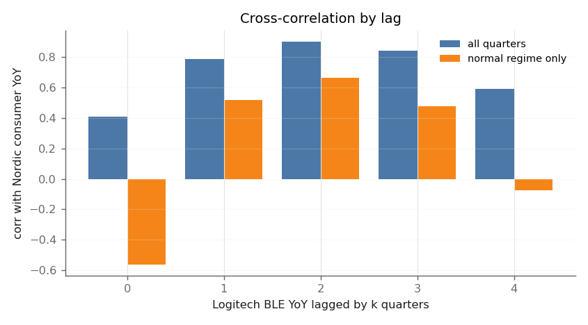

# Step 4 — Revenue propagation (lag structure)

## 1. Reasoned lag (stated before any data; the documented prior, decision L1)

Sell-out → Nordic revenue: **15 / 22 / 32 weeks** (≈ 1.15 / 1.69 / 2.46 quarters). Per tier (weeks, mid): sell_out_to_distributor 3, distributor_to_oem 4, oem_to_odm_build 8, odm_to_component 7.

## 2. Nordic consumer revenue vs the downstream / industry cycle: timing

**How to read it (decision L2).**

- (a) **Driver = Logitech sell-in.** `logi_ble_yoy` is Logitech's reported revenue in its radio categories, i.e. what Logitech sells into its channel, not what consumers buy.
- (b) **Target = all consumer customers.** Nordic Consumer revenue covers every consumer customer; Logitech + GN are ≈16% of Nordic revenue (80% range 13–20%), ≈27% of Nordic Consumer (step 2). Most of what the correlation sees is not Logitech's orders.
- (c) **Common-cycle controls give the same timing: US electronics & appliance store sales YoY and world semiconductor billings YoY** (step 5, decision G21, `graph_vs_step4_continuous_lag.csv`). On a continuous lag Nordic lags Logitech sell-in by 31 weeks (n 13 from 2023Q2); drivers outside the chain: TD Synnex net sales YoY 13 weeks (n 11; minus the Logitech driver on the same 11 quarters -7, 90% CI -39 to -6: different); US electronics & appliance store sales YoY 18 weeks (n 18; minus the Logitech driver on the same 13 quarters +1, 90% CI -10 to +23: cannot be told apart); world semiconductor billings YoY 26 weeks (n 18; minus the Logitech driver on the same 13 quarters -3, 90% CI -8 to +9: cannot be told apart). Where the difference cannot be told from zero, the '2-quarter' timing is the consumer-electronics / semiconductor cycle at Nordic, not a Logitech -> Nordic order lag.
- (d) **The data do not pin the lag.** One down-up cycle (13 quarters from 2023Q2): every lag from 20 to 37 weeks fits within 0.03 of the best correlation (90% bootstrap CI 19–36 weeks). The integer '2 quarters' below had no band at all.
- (e) **The reasoned lag stays the documented prior** (decision L1); step 5's supply graph is its flow-weighted refinement (≈19 weeks sell-out -> Nordic). No lag in `config/model.yaml` is set from this correlation, and no two-factor regression (Logitech + cycle) is fitted (decision L3).

Integer-lag correlation of Nordic consumer YoY with Logitech sell-in YoY peaks at **2q** (r = 0.90, n = 15): a timing statistic, not the chain lag (read with (a)-(e) above).

|   lag_q |   corr |   n | regime   |
|--------:|-------:|----:|:---------|
|       0 |   0.41 |  17 | all      |
|       1 |   0.78 |  16 | all      |
|       2 |   0.9  |  15 | all      |
|       3 |   0.84 |  14 | all      |
|       4 |   0.59 |  13 | all      |

By regime:

|   lag_q |   corr |   n | regime             |
|--------:|-------:|----:|:-------------------|
|       0 | nan    |   1 | supply_constrained |
|       1 | nan    |   0 | supply_constrained |
|       2 | nan    |   0 | supply_constrained |
|       3 | nan    |   0 | supply_constrained |
|       4 | nan    |   0 | supply_constrained |
|       0 |  -0.22 |   7 | destock            |
|       1 |   0.36 |   7 | destock            |
|       2 |   0.63 |   6 | destock            |
|       3 | nan    |   5 | destock            |
|       4 | nan    |   4 | destock            |
|       0 |  -0.56 |   9 | normal             |
|       1 |   0.52 |   9 | normal             |
|       2 |   0.66 |   9 | normal             |
|       3 |   0.48 |   9 | normal             |
|       4 |  -0.07 |   9 | normal             |

Turning points (peak / trough of YoY growth, sign changes):

|                 | peak   |   peak_val | trough   |   trough_val | sign_changes                             |
|:----------------|:-------|-----------:|:---------|-------------:|:-----------------------------------------|
| sellout_proxy   | 2021Q1 |      116.6 | 2022Q4   |        -24.2 | ['2021Q4', '2024Q1']                     |
| logitech_ble    | 2024Q2 |       14.3 | 2022Q4   |        -16   | ['2023Q4']                               |
| gn_periph       | 2024Q2 |       12.6 | 2023Q2   |        -18.1 | ['2024Q1', '2024Q3', '2024Q4', '2025Q1'] |
| nordic_consumer | 2025Q1 |       63.3 | 2023Q1   |        -42.9 | ['2022Q4', '2024Q2']                     |
| nordic_total    | 2025Q1 |      108.2 | 2024Q1   |        -48.8 | ['2023Q1', '2024Q3']                     |

Amplitude (Nordic consumer swing ÷ Logitech radio swing, peak-to-trough): destock 2.6×, recovery 5.1× — step 3 shows the recovery figure is a small-denominator artefact and that the whole-company amplitude does not apply to the Logitech slice.

Out of sample (step 6 walk-forward): the Logitech-driven lag models are informative for the quarter AFTER the guided one, not for the guided quarter - as a proxy for the common consumer cycle, not for the Logitech / GN slice.



## 3. Lag, edge by edge: Amazon / Ingram / TD Synnex -> Logitech / GN -> Nordic

```
    Amazon / Ingram Micro / TD Synnex --edge 1--> Logitech / GN --edge 2--> Nordic
    edge 1 = customers' sell-out -> their orders to the brand (= brand sell-in)
    edge 2 = brand sell-in -> build / component orders -> Nordic revenue (ODM / EMS and Nordic's distributors folded in)
```

### 3a. Reasoning first: the prior per edge (decisions L4, L5)

- Edge 1: retailers / distributors reorder weekly against a weeks-on-hand target: a sell-out change reaches the brand's sell-in within one reorder cycle plus the cover correction; the physical part is bounded above by each customer's inventory cover (Little's law: Amazon 5.2 wk, Ingram 5.8 wk, CDW 2.4 wk), the weekly review and forecast smoothing add ~1.5 wk per ordering tier (G25, grade D).
- Edge 2: a sell-in change moves the brand's build plan (monthly S&OP: ~3 wk information delay, G25; finished-goods buffer ~9.5 wk at Logitech), then the ODM's component call-offs (MRP ~1 wk; from distributor stock 0-2 wk, or direct orders inside the nRF54 lead time of 16 wk); Nordic books revenue when the ODM, the brand's own plant or a distributor restocks (distributors' monthly reorder ~2 wk).
- Numbers: step 5's graph (`config/supply_graph.csv`), flow-weighted over paths and cut at the brand node; low / high = every edge at its grade-widened low / high lag (grade C = at least ±50%), read as a 90% range.
- Basis (signal, G25): the brief asks when a demand change reaches Nordic's revenue, which is an order-signal lag = physical dwell (inventory cover, Little's-law capped) + the information delay of each buyer's planning decision (review period / 2 + mean age of the smoothed forecast; config `supply_graph.info_delay`, grade D, so its low end is zero). The physical dwell alone is the next column.

| edge   | brand    | route                      |   share of brand flow | prior wk mid (low–high), order signal   | physical dwell only   | grade   | edges                           | evidence                                                                                                                                                                                                                                                                                                                                                                                                        |
|:-------|:---------|:---------------------------|----------------------:|:----------------------------------------|:----------------------|:--------|:--------------------------------|:----------------------------------------------------------------------------------------------------------------------------------------------------------------------------------------------------------------------------------------------------------------------------------------------------------------------------------------------------------------------------------------------------------------|
| edge 1 | logitech | all routes (flow-weighted) |                  1    | 7.0 (2.1–12.4)                          | 4.6 (2.1–7.4)         | C       | E11 E12 E15 E16 E13 E17 E18 E14 | E11 amazon_weeks: bounded: Amazon inventory 36 d = 5.2 wk; E12 ingram_weeks: Ingram inventory 40.5 d; E15 reseller_weeks: bounded: CDW inventory 17 d = 2.4 wk; E13 tdsynnex_weeks: TD Synnex inventory 69.5 d; E14 retail_weeks: bounded: Best Buy inventory 77 d = 11 wk                                                                                                                                      |
| edge 1 | logitech | Amazon direct              |                  0.18 | 4.5 (1.5–7.5)                           | 3.0 (1.5–4.5)         | C       | E11                             | E11 amazon_weeks: bounded: Amazon inventory 36 d = 5.2 wk                                                                                                                                                                                                                                                                                                                                                       |
| edge 1 | logitech | via Ingram / TD Synnex     |                  0.26 | 9.1 (3.0–14.9)                          | 6.1 (3.0–8.9)         | C       | E12 E15 E16 E13 E17 E18         | E12 ingram_weeks: Ingram inventory 40.5 d; E15 reseller_weeks: bounded: CDW inventory 17 d = 2.4 wk; E16 amazon_weeks: bounded: Amazon inventory 36 d = 5.2 wk; E13 tdsynnex_weeks: TD Synnex inventory 69.5 d                                                                                                                                                                                                  |
| edge 2 | logitech | all routes (flow-weighted) |                  1    | 19.6 (7.0–31.3)                         | 14.3 (7.0–20.7)       | C       | E01 E04 E08 E05 E02 E03         | E01 arrow_avnet_weeks: Arrow 61 d / Avnet 75 d inventory; E04 findchips_stock: authorized-distributor stock on nRF52 deep; E08 logi_inv_weeks: Logitech inventory 66 d; E05 logi_stock_inhouse_weeks: bounded: distributor stock 0-2 wk + Logitech inventory cover 9.5 wk; E02 nrf54_leadtime_weeks: nRF54 / nRF5340 factory lead time 16 weeks; E03 logi_inhouse_weeks: bounded: nRF54 factory lead time 16 wk |
| edge 1 | gn       | all routes (flow-weighted) |                  1    | 6.1 (2.0–10.1)                          | 4.1 (2.0–6.0)         | C       | E19 E20 E15 E16 E21 E17 E18 E22 | E19 amazon_weeks: bounded: Amazon inventory 36 d = 5.2 wk; E20 ingram_weeks: as E12; E15 reseller_weeks: bounded: CDW inventory 17 d = 2.4 wk; E21 tdsynnex_weeks: as E13; E22 retail_weeks: bounded: Best Buy inventory 77 d = 11 wk                                                                                                                                                                           |
| edge 1 | gn       | Amazon direct              |                  0.1  | 4.5 (1.5–7.5)                           | 3.0 (1.5–4.5)         | C       | E19                             | E19 amazon_weeks: bounded: Amazon inventory 36 d = 5.2 wk                                                                                                                                                                                                                                                                                                                                                       |
| edge 1 | gn       | via Ingram / TD Synnex     |                  0.35 | 9.1 (3.0–14.9)                          | 6.1 (3.0–8.9)         | C       | E20 E15 E16 E21 E17 E18         | E20 ingram_weeks: as E12; E15 reseller_weeks: bounded: CDW inventory 17 d = 2.4 wk; E16 amazon_weeks: bounded: Amazon inventory 36 d = 5.2 wk; E21 tdsynnex_weeks: as E13                                                                                                                                                                                                                                       |
| edge 2 | gn       | all routes (flow-weighted) |                  1    | 20.3 (7.3–33.3)                         | 15.0 (7.3–22.7)       | C       | E01 E07 E10 E06                 | E01 arrow_avnet_weeks: Arrow 61 d / Avnet 75 d inventory; E07 findchips_stock: as E04; E10 gn_inv_weeks: bounded: GN continuing-ops inventory ~161 d = 23 wk; E06 nrf54_leadtime_weeks: as E02                                                                                                                                                                                                                  |

### 3b. Edge 1 regression: channel-inventory partial adjustment (decision L6)

d_t = a + c·t + rho·d_(t-1) + e_t on step 3's Logitech channel index (weeks vs target); mean lag T = -13 / ln(rho) weeks (continuous replenishment sampled at quarter ends; Koyck rho / (1 - rho) quarters shown). Andrews (1993) median-unbiased rho is the estimate; OLS with a block bootstrap and the no-trend fit are shown for comparison.

| brand    | spec                                     |   n | rho (90%)         | mean lag wk, continuous (90%)   |   Koyck wk | interval                                      |
|:---------|:-----------------------------------------|----:|:------------------|:--------------------------------|-----------:|:----------------------------------------------|
| logitech | AR(1) + trend, median-unbiased (primary) |  13 | 0.62 (-0.01–1.00) | 27.6 (0.0–∞)                    |       21.6 | Andrews (1993) exact 90% (Gaussian AR(1))     |
| logitech | AR(1) + trend, OLS                       |  13 | 0.28 (-0.27–0.52) | 10.1 (0.0–19.9)                 |        5   | moving-block bootstrap 90% (bias not removed) |
| logitech | AR(1), no trend, OLS (drift left in)     |  13 | 0.99              | 933.6                           |      927.1 | none: the drift reads as persistence          |

GN: 8 quarters of channel index (no anchor, grade D), below the 12 needed: prior only.

### 3c. Edge 2 regression: attribution-constrained, common cycle controlled (decision L7)

y_t = alpha + s·m·x(t - tau) + beta·w(t - kappa) + e_t; y = Nordic consumer YoY, x = the brand's sell-in YoY, w = wsts_yoy at its own peak kappa; s (step 2) and m (step 3) fixed: Logitech s = 0.254 (0.201–0.319), m = 1.00 (0.27–1.24); GN s = 0.018, m = 2.46. Sample: destock, normal quarters on one fixed axis; tau on a 0.05-quarter grid.

| brand    | fit                                                       |   n | first_quarter   |   slope | slope_kind   |   control lag wk | tau wk (bootstrap 90%)   | 90% profile / near-optimal set, wk   |   share of 0-52 wk covered |
|:---------|:----------------------------------------------------------|----:|:----------------|--------:|:-------------|-----------------:|:-------------------------|:-------------------------------------|---------------------------:|
| logitech | primary                                                   |  16 | 2022Q3          |    0.25 | fixed s x m  |            26    | 13.0 (13.0–52.0)         | 0–52                                 |                       1    |
| logitech | attribution low (step 2 p10)                              |  16 | 2022Q3          |    0.2  | fixed s x m  |            26    | 13.0 (13.0–52.0)         | 0–52                                 |                       1    |
| logitech | attribution high (step 2 p90)                             |  16 | 2022Q3          |    0.32 | fixed s x m  |            26    | 13.0 (13.0–52.0)         | 0–52                                 |                       1    |
| logitech | slice multiplier low (step 3)                             |  16 | 2022Q3          |    0.07 | fixed s x m  |            26    | 13.0 (9.8–52.0)          | 0–52                                 |                       1    |
| logitech | slice multiplier high (step 3)                            |  16 | 2022Q3          |    0.32 | fixed s x m  |            26    | 13.0 (13.0–52.0)         | 0–52                                 |                       1    |
| logitech | control: RSEAS instead of WSTS                            |  16 | 2022Q3          |    0.25 | fixed s x m  |            20.15 | 39.0 (13.0–52.0)         | 0–52                                 |                       1    |
| logitech | driver: radio categories (logi_ble_yoy)                   |  13 | 2023Q2          |    0.25 | fixed s x m  |            28.6  | 26.0 (13.0–39.0)         | 0–52                                 |                       1    |
| logitech | regime: destock intercept                                 |  16 | 2022Q3          |    0.25 | fixed s x m  |            26    | 39.0 (13.0–52.0)         | 0–52                                 |                       1    |
| logitech | regime: normal only                                       |   9 | 2024Q2          |    0.25 | fixed s x m  |            29.25 | 38.4 (13.0–39.0)         | 0–52                                 |                       1    |
| gn       | primary                                                   |   9 | 2024Q2          |    0.04 | fixed s x m  |            29.25 | 13.0 (13.0–39.0)         | 0–52                                 |                       1    |
| logitech | unconstrained (slope free)                                |  16 | 2022Q3          |    1.4  | fitted b     |            26    | 35.1                     | 1–46                                 |                       0.88 |
| logitech | step 5 end-to-end correlation (no constraint, no control) |  13 | 2023Q2          |  nan    | correlation  |           nan    | 31.2 (18.9–36.4)         | 20–37                                |                     nan    |

### 3d. Prior + data -> posterior (decision L8)

| edge   | brand    | route                      | prior           | estimate         | posterior       |   moved by wk | reading                                                                                                          |
|:-------|:---------|:---------------------------|:----------------|:-----------------|:----------------|--------------:|:-----------------------------------------------------------------------------------------------------------------|
| edge 1 | logitech | all routes (flow-weighted) | 7.0 (2.1–12.4)  | 27.6 (0.0–∞)     | 7.0 (2.1–12.4)  |             0 | data did not move it: the 90% interval is unbounded                                                              |
| edge 1 | logitech | Amazon direct              | 4.5 (1.5–7.5)   | 27.6 (0.0–∞)     | 4.5 (1.5–7.5)   |             0 | data did not move it: the 90% interval is unbounded (route: shifted with its cell; the data cannot split routes) |
| edge 1 | logitech | via Ingram / TD Synnex     | 9.1 (3.0–14.9)  | 27.6 (0.0–∞)     | 9.1 (3.0–14.9)  |             0 | data did not move it: the 90% interval is unbounded (route: shifted with its cell; the data cannot split routes) |
| edge 2 | logitech | all routes (flow-weighted) | 19.6 (7.0–31.3) | 13.0 (13.0–52.0) | 19.6 (7.0–31.3) |             0 | data did not move it: the 90% interval covers 100% of the searched range                                         |
| edge 1 | gn       | all routes (flow-weighted) | 6.1 (2.0–10.1)  | –                | 6.1 (2.0–10.1)  |             0 | prior only: no estimate for this edge                                                                            |
| edge 1 | gn       | Amazon direct              | 4.5 (1.5–7.5)   | –                | 4.5 (1.5–7.5)   |             0 | prior only: no estimate for this edge (route: shifted with its cell; the data cannot split routes)               |
| edge 1 | gn       | via Ingram / TD Synnex     | 9.1 (3.0–14.9)  | –                | 9.1 (3.0–14.9)  |             0 | prior only: no estimate for this edge (route: shifted with its cell; the data cannot split routes)               |
| edge 2 | gn       | all routes (flow-weighted) | 20.3 (7.3–33.3) | 13.0 (13.0–39.0) | 20.3 (7.3–33.3) |             0 | data did not move it: the 90% interval covers 100% of the searched range                                         |

### 3e. Totals along each route (decision L9)

| route                                    |   edge 1 wk |   edge 2 wk |   total wk |   quarters | 90% range, edges independent   | range if edges move together   |   physical dwell only, wk |
|:-----------------------------------------|------------:|------------:|-----------:|-----------:|:-------------------------------|:-------------------------------|--------------------------:|
| Amazon -> Logitech -> Nordic             |         4.5 |        19.6 |       24.1 |        1.9 | 12–37                          | 8–39                           |                      17.3 |
| Ingram / TD Synnex -> Logitech -> Nordic |         9.1 |        19.6 |       28.7 |        2.2 | 15–42                          | 10–46                          |                      20.4 |
| all Logitech routes (flow-weighted)      |         7   |        19.6 |       26.5 |        2   | 13–40                          | 9–44                           |                      18.9 |
| Amazon -> GN -> Nordic                   |         4.5 |        20.3 |       24.8 |        1.9 | 11–38                          | 9–41                           |                      18   |
| Ingram / TD Synnex -> GN -> Nordic       |         9.1 |        20.3 |       29.4 |        2.3 | 15–43                          | 10–48                          |                      21.1 |
| all GN routes (flow-weighted)            |         6.1 |        20.3 |       26.4 |        2   | 13–40                          | 9–43                           |                      19.1 |

### 3f. What it says

- **Edge 1 is short by structure; the quarterly data cannot confirm it.** The prior 7.0 (2.1–12.4) wk comes from the customers' inventory cover (evidence above). The channel index's reversion gives a median-unbiased mean lag of 27.6 (0.0–∞) wk (rho 0.62, 90% -0.01–1.00, n 13); the interval runs from full correction within the quarter to no reversion, so the posterior is the prior. The plain OLS reading, 10 wk (bootstrap 0–20), would look like a confirmation only because OLS rho on ~13 quarters is biased towards zero (P90). A lag under one quarter is below what quarterly data resolve, except through this reversion speed.
- **Edge 2 is sized by attribution and timed by structure.** With Logitech's slice fixed at s × m = 0.25 (share of Nordic consumer 25% × slice multiplier 1.00), every lag from 0 to 52 wk is inside the 90% profile set; across the 9 constrained fits the 90% interval covers 100% of 0–52 wk. The data fail to contradict the prior and cannot confirm it: posterior 19.6 (7.0–31.3) wk (= the prior). Left free, the slope is 1.40, 5.5× the slice: what a free fit times is the common cycle, not Logitech's orders (P77, P91).
- **Amazon sell-out → Nordic revenue ≈ 24 weeks (1.9 quarters)**: edge 1 4.5 + edge 2 19.6 wk; 90% range 12–37 wk with the edges independent, 8–39 if they stretch together. Through Ingram / TD Synnex 29 wk; flow-weighted over Logitech's routes 27 wk (GN 26 wk). These are order-signal lags; the physical dwell alone is 17 / 20 / 19 wk: the rest is the buyers' planning (review period + forecast smoothing, grade D, G25).
- **Regime dependence.** The fits use the destock and normal quarters only: in 2020Q3–2022Q2 Nordic revenue was wafer supply, and config stretches the lag ×2 there. Normal quarters alone (n 9) cover 100% of the range; a destock intercept gives tau 39 wk with 100% covered - no regime pins edge 2. Edge 1's persistence (median-unbiased 28 wk) comes from a sample that starts in the destock (channel +4.1 wk vs target in 2023Q1, +1.7 wk by 2024Q2): if real, it is a drain of the channel target, not the reorder lag of a normal channel, so the normal-channel prior stands.

Outputs: `edge_lags.csv`, `edge_lags_total.csv`, `edge_lags_edge1_fits.csv`, `edge_lags_edge2_fits.csv`. Decisions L4–L10 (L10: signal basis); pitfalls P90, P91.

Decisions: `config/decisions.csv` (L1–L9).
