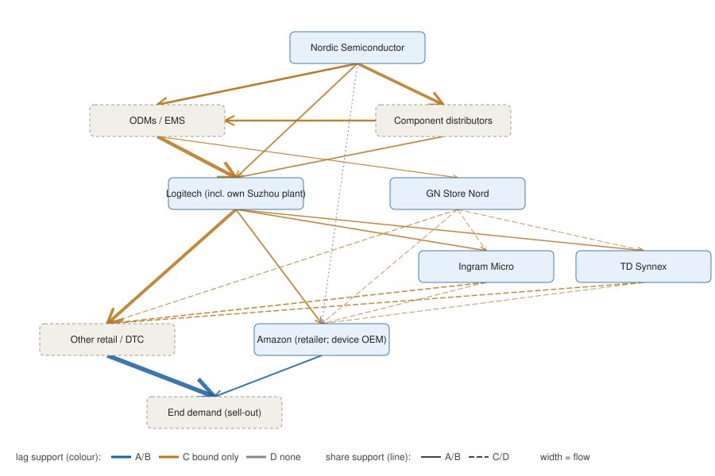
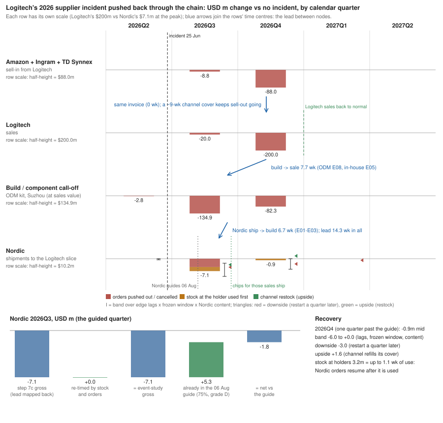

# Step 5 — Supply-chain structure as a graph

Edges: `config/supply_graph.csv` (share formula, reorder lag in weeks, who holds the inventory, disclosed or not, evidence). Logitech's customer shares change by fiscal year and are read from each 10-K (`config/supply_graph_weights.csv`, with the sentence and filing date); `graph_asof(date)` uses only 10-Ks filed by that date. Named shares: `config/model.yaml` → `supply_graph`.

## Paths and lag

36 paths from Nordic to end demand. Weighted mean lag (physical dwell; the order-signal lag is in its own section below): **19 weeks (1.46 quarters)** with the mid lags; 9 weeks (low) to 28 weeks (high). The single-chain lag (step 4) assumed every unit crossed a distributor; in the graph most of Logitech's flow goes to Amazon, other retail or its own site directly, which is why the mean is shorter.

By route (Logitech / GN → first customer):

| brand    | route        |   weight |   lag_weeks |
|:---------|:-------------|---------:|------------:|
| gn       | amazon       |    0.007 |        18   |
| gn       | ingram       |    0.011 |        21.1 |
| gn       | other_retail |    0.036 |        18   |
| gn       | tdsynnex     |    0.011 |        21.1 |
| logitech | amazon       |    0.168 |        17.3 |
| logitech | ingram       |    0.131 |        20.4 |
| logitech | other_retail |    0.524 |        18.8 |
| logitech | tdsynnex     |    0.112 |        20.4 |

Lag kernel (weight on each quarterly lag):

|   lag_quarters |   low |   mid |   high |
|---------------:|------:|------:|-------:|
|              0 | 0.296 | 0     |  0     |
|              1 | 0.704 | 0.542 |  0.01  |
|              2 | 0     | 0.458 |  0.803 |
|              3 | 0     | 0     |  0.188 |
|              4 | 0     | 0     |  0     |

Kernel with the graph known at each 10-K filing date (point in time):

|            |   0 |     1 |     2 |   3 |   4 |
|:-----------|----:|------:|------:|----:|----:|
| 2022-05-18 |   0 | 0.537 | 0.463 |   0 |   0 |
| 2023-05-17 |   0 | 0.541 | 0.459 |   0 |   0 |
| 2024-05-16 |   0 | 0.541 | 0.459 |   0 |   0 |
| 2025-05-23 |   0 | 0.543 | 0.457 |   0 |   0 |
| 2026-05-21 |   0 | 0.542 | 0.458 |   0 |   0 |

## How reliable is each link? (grades A-D for share and lag separately)

A = audited filing measuring the edge; B = filing floor or disclosure combined with an estimate; C = indirect (proxy on a broader base, verbal, one snapshot); D = assumption — either not public or not yet collected. An edge is as reliable as the weaker of its share and its lag; a path as its weakest edge.

Share of the flow crossing each tier, by grade:

| tier                       |   share_A |   share_B |   share_C |   share_D |   lag_A |   lag_B |   lag_C |   lag_D |
|:---------------------------|----------:|----------:|----------:|----------:|--------:|--------:|--------:|--------:|
| Nordic → buyer / own plant |      0    |         1 |      0    |         0 |       0 |       0 |       1 |       0 |
| buyer → brand              |      0.97 |         0 |      0.03 |         0 |       0 |       0 |       1 |       0 |
| brand → channel            |      0.94 |         0 |      0.06 |         0 |       0 |       0 |       1 |       0 |
| distributor → retail       |      0    |         0 |      0    |         1 |       0 |       0 |       1 |       0 |
| retail → end demand        |      1    |         0 |      0    |         0 |       1 |       0 |       0 |       0 |

Paths graded A-C end to end: 73% of the flow. Every route ends at the retail tier, where weeks-on-hand are not public (other retailers) or not collected (Amazon), so no path is data-backed end to end.

Lag ranges checked against inventory cover (Little's law: a tier's reorder lag cannot reasonably exceed the time a unit sits in its stock):

| edge_id   | anchor                   |   anchor_weeks |   lag_high_weeks | check   | lag_grade   |
|:----------|:-------------------------|---------------:|-----------------:|:--------|:------------|
| E01       | arrow_avnet_weeks        |            8.7 |              8   | ok      | C           |
| E02       | nrf54_leadtime_weeks     |           16   |             10   | ok      | C           |
| E03       | logi_inhouse_weeks       |           25.5 |             19.5 | ok      | C           |
| E05       | logi_stock_inhouse_weeks |           11.5 |             11.5 | ok      | C           |
| E06       | nrf54_leadtime_weeks     |           16   |             10   | ok      | C           |
| E08       | logi_inv_weeks           |            9.5 |              9.5 | ok      | C           |
| E10       | gn_inv_weeks             |           23   |             12   | ok      | C           |
| E11       | amazon_weeks             |            5.2 |              4   | ok      | C           |
| E12       | ingram_weeks             |            5.8 |              5.8 | ok      | C           |
| E13       | tdsynnex_weeks           |            9.9 |              6   | ok      | C           |
| E14       | retail_weeks             |           11   |              4   | ok      | C           |
| E15       | reseller_weeks           |            2.4 |              2.5 | ok      | C           |
| E16       | amazon_weeks             |            5.2 |              4   | ok      | C           |
| E17       | reseller_weeks           |            2.4 |              2.5 | ok      | C           |
| E18       | amazon_weeks             |            5.2 |              4   | ok      | C           |
| E19       | amazon_weeks             |            5.2 |              4   | ok      | C           |
| E20       | ingram_weeks             |            5.8 |              5.8 | ok      | C           |
| E21       | tdsynnex_weeks           |            9.9 |              6   | ok      | C           |
| E22       | retail_weeks             |           11   |              4   | ok      | C           |

Monte Carlo (300 draws, every share and lag triangular low/mid/high): weighted mean lag 16.6-21.0 weeks (90%), median 18.8.

Kernel band (weight per quarterly lag, 5th / 50th / 95th percentile):

|   lag_quarters |    p5 |   p50 |   p95 |
|---------------:|------:|------:|------:|
|              0 | 0     |  0    | 0.005 |
|              1 | 0.387 |  0.55 | 0.72  |
|              2 | 0.279 |  0.45 | 0.611 |
|              3 | 0     |  0    | 0     |
|              4 | 0     |  0    | 0     |

Which inputs move the lag most (swing low → high, everything else at mid):

| input                                 | grade   |   low_weeks |   high_weeks |   swing_weeks |   base_weeks |
|:--------------------------------------|:--------|------------:|-------------:|--------------:|-------------:|
| lag: E08 odm→logitech                 | C       |       16.52 |        20.42 |          3.9  |        18.96 |
| lag: E14 logitech→other_retail        | C       |       17.58 |        20.59 |          3.01 |        18.96 |
| lag: E01 nordic→nordic_distributors   | C       |       17.55 |        20.37 |          2.82 |        18.96 |
| lag: E02 nordic→odm                   | C       |       17.83 |        20.08 |          2.25 |        18.96 |
| lag: E03 nordic→logitech              | C       |       17.83 |        20.08 |          2.25 |        18.96 |
| lag: E05 nordic_distributors→logitech | C       |       18.42 |        19.65 |          1.23 |        18.96 |
| share: logi_residual_via_dist         | D       |       18.56 |        19.35 |          0.79 |        18.96 |
| lag: E04 nordic_distributors→odm      | C       |       18.67 |        19.24 |          0.57 |        18.96 |

Data gaps (D-graded shares and lags):

| edge_id   | edge                    | what   | availability   |   flow | why                                                                                                                                                                       |
|:----------|:------------------------|:-------|:---------------|-------:|:--------------------------------------------------------------------------------------------------------------------------------------------------------------------------|
| E15       | ingram → other_retail   | share  | not_public     |  0.128 | Ingram and TD Synnex report no customer above 10%; Amazon does not name suppliers                                                                                         |
| E17       | tdsynnex → other_retail | share  | not_public     |  0.111 | as E15                                                                                                                                                                    |
| E16       | ingram → amazon         | share  | not_public     |  0.014 | not public: Ingram and TD Synnex each state no customer above 10% of net sales (Amazon < 10% of their total, which does not bound peripherals); Amazon names no suppliers |
| E18       | tdsynnex → amazon       | share  | not_public     |  0.012 | as E16                                                                                                                                                                    |
| E25       | nordic → amazon         | lag    | not_public     |  0     | no demand series for Amazon's devices                                                                                                                                     |

## Logitech's unnamed 10-K residual: how much goes through distributors? (G20)

The 10-K names Amazon (18%), Ingram Micro (14%) and TD Synnex (12%) of gross sales; the other 56% is not split by customer type. Treating it all as direct retail (the old setting, p = 0) made the graph's lag too short (P80). The graph has no entity for 'other distributors', so the residual edge E14 carries a mixed lag: (1 − p) × direct-retail lag + p × the Ingram / TD Synnex downstream lag. p = `supply_graph.params.logi_residual_via_dist` = 0.25 / 0.5 / 0.75.

**Evidence** (each quote checked against its saved document; `config/logi_residual_evidence.csv`):

| id   | source                                                              | grade   | quote                                                                                                                                                | implies                                                                                                                                                                                               | used_for                        | quote_check   |
|:-----|:--------------------------------------------------------------------|:--------|:-----------------------------------------------------------------------------------------------------------------------------------------------------|:------------------------------------------------------------------------------------------------------------------------------------------------------------------------------------------------------|:--------------------------------|:--------------|
| R1   | Logitech 10-K FY26 (Business: customers)                            | A       | No other customer individually accounted for more than 10% of our gross sales                                                                        | Amazon 18%, Ingram 14%, TD Synnex 12% named; the other 56% of gross sales is split among customers each below 10%, so smaller distributors are invisible in the filing                                | size of the residual (56%)      | found         |
| R2   | Logitech 10-K FY26 (Business: sales and distribution)               | A       | We sell our products primarily to a variety of distributors, retailers and e-tailers                                                                 | distribution is one of the primary channels                                                                                                                                                           | p > 0                           | found         |
| R3   | Logitech 10-K FY26 (Business: sales and distribution)               | A       | Our distributor customers typically resell products to retailers, value-added resellers, systems integrators and other distributors                  | distributors add a tier (and sometimes two) before the shelf                                                                                                                                          | lag of the distributor route    | found         |
| R4   | Logitech 10-K FY26 (Risk factors)                                   | A       | We are dependent on our distributors to distribute and sell our products to indirect sales channel partners who will ultimately resell to businesses | B2B demand reaches Logitech mainly through distributors                                                                                                                                               | floor of p (with R8)            | found         |
| R5   | Logitech 10-K FY26 (Business: sales and distribution)               | A       | Logitech's products can be purchased in a number of major retail chains, where we typically have access to significant shelf space                   | direct supply to large retail chains is material                                                                                                                                                      | cap of p (< 1)                  | found         |
| R6   | Logitech 10-K FY26 (Business: sales and distribution)               | A       | Logitech products are also carried by B2B direct market resellers                                                                                    | some B2B goes to resellers (CDW, Insight) that may buy direct, not through distributors                                                                                                               | why the floor is conditional    | found         |
| R7   | Logitech GRI report 2013 (2.7 Markets Served)                       | B       | We also sell to many regional distributors such as Actebis GmbH in Germany and Copaco Dc B.V. in the Netherlands                                     | named distributors beyond Ingram / Tech Data / Synnex (D&H, Gem, Actebis, Copaco, Digital China, Daiwabo): the residual contains distributors; dated 2013                                             | p > 0                           | found         |
| R8   | JPMorgan investor session, CEO Hanneke Faber (Yahoo Finance report) | C       | B2B is about 40% of revenue and growing faster than consumer                                                                                         | B2B ~40% of sales > Ingram + TD Synnex 26%: at least 14 of the 56 residual points are B2B; if they go through distributors (R4), p >= 14/56 = 0.25. Verbal, secondary source (primary transcript 403) | floor of p = 0.25 (conditional) | found         |

**How the range is set:**

- **Floor 0.25 (conditional, from C-grade evidence):** B2B is about 40% of revenue (R8) while Ingram + TD Synnex are 26% of gross sales (R1). Even if all of the 26% were B2B, at least 14 of the 56 residual points are B2B, and the 10-K says B2B demand reaches Logitech mainly through distributors (R4): p >= 14 / 56 = 0.25. Condition: that residual B2B goes through distributors, not direct to resellers such as CDW or Insight (R6).
- **Cap 0.75 (judgment):** the 10-K sells directly to major retail chains with significant shelf space (R5; Best Buy, Walmart, Target, MediaMarkt named in R7), plus Logitech.com and direct resellers, so the residual cannot be nearly all distribution.
- **Mid 0.5 (judgment):** rough split of the 56%: direct retail chains ~15-24%, Logitech.com ~2-4%, direct resellers ~3-6%, other distributors (D&H, ALSO / Actebis, Esprinet, Exertis, Copaco, Daiwabo, Digital China: R7) the rest, ~22-36%, i.e. p ~0.4-0.65. EMEA and Asia-Pacific (59% of Logitech's sales over 2025Q3-2026Q2) lean on two-tier distribution; the Americas lean on direct big-box retail.
- **Not found:** no filing (SEC full-text search 2001-2026), cached call transcript or reachable conference transcript gives a distributor share of sales. The May 2025 and March 2026 conference transcripts on s1.q4cdn.com return 403.
- **Grade D.** The value is not public. The project rule for D would be 0-1; the floor rests on the R8 arithmetic and the cap on R5 / R7, both stated here, so the range is narrower than the rule by design.

**What p does to the lag** (mid lags, weeks):

| p                                           |   E14_lag_weeks |   graph_mean_lag_weeks |
|:--------------------------------------------|----------------:|-----------------------:|
| 0 (old setting: residual all direct retail) |            3    |                  18.17 |
| low 0.25                                    |            3.75 |                  18.56 |
| mid 0.5                                     |            4.5  |                  18.96 |
| high 0.75                                   |            5.25 |                  19.35 |
| 1 (residual all distributors)               |            6    |                  19.74 |

p moves the graph's mean lag by 1.6 weeks from 0 to 1 and by 0.8 across the configured range: the correction matters for honesty about the route (p = 0 is ruled out by R2 / R7), not for the forecasts (h = 2 is insensitive to sub-quarter lags, P74).

## Consistency with step 4 (check only, decision G19)

Step 4 reasoned the lag tier by tier (config `lag_weeks`); the graph sets its own edge lags (`config/supply_graph.csv`). Nothing ties them in code, so this compares them. Weeks; the graph side is flow-weighted over all paths.

| measure                                                              |   step4_low |   step4_mid |   step4_high |   graph_mid |   graph_mc_p5 |   graph_mc_p95 |   gap_mid_weeks | graph_inside_step4_range   |
|:---------------------------------------------------------------------|------------:|------------:|-------------:|------------:|--------------:|---------------:|----------------:|:---------------------------|
| total lag, sell-out -> Nordic revenue                                |          15 |          22 |           32 |        19   |          16.6 |             21 |            -3   | True                       |
| upstream: Nordic -> finished device at the brand                     |          10 |          15 |           22 |        14.3 |         nan   |            nan |            -0.7 | True                       |
| downstream: brand -> consumer                                        |           5 |           7 |           10 |         4.6 |         nan   |            nan |            -2.4 | False                      |
| downstream, routes through Ingram / TD Synnex only                   |           5 |           7 |           10 |         6.1 |         nan   |            nan |            -0.9 | True                       |
| total, if the whole 10-K residual went through a distributor (p = 1) |          15 |          22 |           32 |        19.9 |         nan   |            nan |            -2.1 | True                       |

**Where the gap comes from.** Graph 19.0 weeks vs step 4 22 (-3.0); the graph's whole Monte Carlo band (16.6-21.0) sits below step 4's mid but inside its low-high range. Upstream agrees (14.3 vs 15). The gap is downstream: step 4 sends every unit brand -> distributor -> retailer (7 weeks); the graph sends 73% of the flow past Ingram / TD Synnex (4.6 weeks on average), because Amazon is supplied directly and only part of the unnamed 10-K residual (56% of the flow) goes through smaller distributors (p, section above; the old setting p = 0 treated it all as direct retail). If all of it went through a distributor, the graph total would be 19.9 weeks (-2.1 vs step 4). On the Ingram / TD Synnex routes alone the graph has 6.1 weeks, close to step 4's 7.

**Against the data.** Lag with the highest correlation with Nordic consumer YoY (quarters; correlations at lags 0-4):

| driver                                             | sample                |   best_lag_q |   best_lag_weeks |   corr |   runner_up_corr |   n | corr_by_lag                      |
|:---------------------------------------------------|:----------------------|-------------:|-----------------:|-------:|-----------------:|----:|:---------------------------------|
| step 4 driver (logi_ble_yoy)                       | all quarters          |            2 |               26 |   0.9  |             0.84 |  15 | 0.41 / 0.78 / 0.90 / 0.84 / 0.59 |
| step 4 driver (logi_ble_yoy)                       | ex supply-constrained |            2 |               26 |   0.9  |             0.84 |  15 | 0.46 / 0.78 / 0.90 / 0.84 / 0.59 |
| graph driver (Logitech sell-in + sell-through gap) | all quarters          |            2 |               26 |   0.67 |             0.56 |  18 | 0.29 / 0.56 / 0.67 / 0.54 / 0.54 |
| graph driver (Logitech sell-in + sell-through gap) | ex supply-constrained |            3 |               39 |   0.76 |             0.73 |  16 | 0.48 / 0.73 / 0.66 / 0.76 / 0.68 |

The measured peak depends on the driver and the sample, and the runner-up is close in every row: the data place the lag at 1-3 quarters (13-39 weeks) without separating them (the same point as the fit table below). Step 4's 2-quarter peak (r 0.90) uses its own driver (its supply-constrained quarters have no driver data, so both samples are the same 15 quarters). The graph's ~1.4 quarters is at the short end of what the data allow; no row puts the peak below 2 quarters, so the data lean towards step 4, but with n 15-18 and runner-ups within 0.03-0.11 this is a lean, not a contradiction.

### Why the measured lag is longer: gap by route, like with like, continuous lag (check only, decision G21)

**The gap by route group** (`graph_vs_step4_decomposition.csv`). Each row is flow x (graph weeks - reference weeks):

| group                                                                                 | nature                                                                          |   flow_share |   graph_weeks |   reference_weeks | reference                             |   contribution_weeks |
|:--------------------------------------------------------------------------------------|:--------------------------------------------------------------------------------|-------------:|--------------:|------------------:|:--------------------------------------|---------------------:|
| Logitech -> Amazon direct                                                             | structure: Amazon buys from Logitech directly (10-K customer share, A)          |        0.168 |         3     |                 7 | step 4 downstream mid                 |               -0.673 |
| Logitech in-house (Suzhou) routes: Nordic -> Logitech without an ODM                  | structure: ~35% built in-house (10-K, A)                                        |        0.327 |        13     |                15 | step 4 upstream mid                   |               -0.655 |
| Logitech ODM routes (upstream)                                                        | agrees with step 4                                                              |        0.608 |        15     |                15 | step 4 upstream mid                   |                0     |
| distributor route itself (Ingram / TD Synnex + distributor part of the 10-K residual) | data bound: reseller inventory cover caps the distributor -> retail edges (P69) |        0.767 |         6.032 |                 7 | step 4 downstream mid                 |               -0.742 |
| direct-retail part of Logitech's 10-K residual                                        | judgment: p = share of the residual via distributors (G20, grade D)             |        0.262 |         3     |                 6 | graph distributor route (as at p = 1) |               -0.785 |
| GN routes                                                                             | GN (upstream + downstream)                                                      |        0.065 |        19.085 |                22 | step 4 total mid                      |               -0.189 |
| total (graph - step 4 mid)                                                            | check: graph total - step 4 mid = -3.04                                         |        1     |        18.955 |                22 | step 4 total mid                      |               -3.045 |

The -3.04-week gap: structure read from A-graded 10-K facts (Amazon bought direct, in-house Suzhou builds skip the ODM) -1.33; the inventory-cover bound on the distributor route -0.74; the judgment p = 0.50 on Logitech's 10-K residual -0.79 (zero at p = 1); GN -0.19. Upstream and downstream rows cover the same flow, so the flow shares do not add to 1; the contributions add to the gap.

**Like with like.** Step 4's driver (`logi_ble_yoy`) is Logitech's reported revenue, i.e. sell-in. A chip order that follows Logitech's sell-in crosses only the upstream part of the chain, so its lag compares with the graph's upstream 14.3 weeks (step 4's own upstream 15), not with the totals 19.0 / 22. Against that, step 4's integer peak (26 weeks) is 12 weeks longer than the chain it measures, not 7. Only the graph's driver (sell-in + disclosed sell-through gap, a sell-out proxy) compares with the total.

**Continuous lag** (`graph_vs_step4_continuous_lag.csv`). Integer quarters of YoY growth cannot resolve weeks. tau runs 0-4 quarters in steps of 0.05, the driver interpolated linearly between neighbouring quarters; tau maximises the correlation with Nordic consumer YoY on one fixed sample per driver (the quarters where every tau is defined, so the peak cannot come from quarters entering the sample); 90% CI from a moving-block bootstrap (2000 draws, blocks of 4 quarters, seed 21). Controls are differenced from the step 4 driver on the quarters both have, with the same draws.

| driver                                                                                                                | sample                | n (from)    |   tau, weeks |   corr | 90% CI, weeks   | near-optimal tau, weeks   | like-with-like graph lag in CI   | graph upstream in CI   | graph total in CI   | step 4 total in CI   | minus step 4 driver, weeks (90% CI; n)   |
|:----------------------------------------------------------------------------------------------------------------------|:----------------------|:------------|-------------:|-------:|:----------------|:--------------------------|:---------------------------------|:-----------------------|:--------------------|:---------------------|:-----------------------------------------|
| step 4 driver (logi_ble_yoy): Logitech radio-core revenue                                                             | all quarters          | 13 (2023Q2) |         31.2 |   0.91 | 18.8-36.4       | 19.5-37.1                 | 14.3: no                         | no                     | yes                 | yes                  |                                          |
| graph driver: Logitech sell-in + sell-through gap                                                                     | all quarters          | 17 (2022Q2) |         35.8 |   0.78 | 13.0-46.8       | 31.8-42.2                 | 19.0: yes                        | yes                    | yes                 | yes                  |                                          |
| control: TD Synnex net sales YoY (broad IT distribution)                                                              | all quarters          | 11 (2023Q4) |         13   |   0.65 | 0.0-13.0        | 7.8-15.0                  |                                  | no                     | no                  | no                   | -7.2 (-39.0 to -5.8; 11)                 |
| control: US electronics & appliance store sales YoY (FRED RSEAS, Pipeline B)                                          | all quarters          | 18 (2022Q1) |         18.2 |   0.51 | 13.0-33.8       | 13.6-23.4                 |                                  | yes                    | yes                 | yes                  | +1.3 (-9.8 to +22.7; 13)                 |
| control: world semiconductor billings YoY (WSTS, Pipeline B; Nordic's own tier, no order chain: a pure cycle control) | all quarters          | 18 (2022Q1) |         26   |   0.85 | 19.5-28.0       | 23.4-29.9                 |                                  | no                     | no                  | yes                  | -2.6 (-8.4 to +9.1; 13)                  |
| step 4 driver (logi_ble_yoy): Logitech radio-core revenue                                                             | ex supply-constrained | 13 (2023Q2) |         31.2 |   0.91 | 18.8-36.4       | 19.5-37.1                 | 14.3: no                         | no                     | yes                 | yes                  |                                          |
| graph driver: Logitech sell-in + sell-through gap                                                                     | ex supply-constrained | 16 (2022Q3) |         43.6 |   0.79 | 13.0-46.8       | 32.5-47.4                 | 19.0: yes                        | yes                    | yes                 | yes                  |                                          |
| control: TD Synnex net sales YoY (broad IT distribution)                                                              | ex supply-constrained | 11 (2023Q4) |         13   |   0.65 | 0.0-13.0        | 7.8-15.0                  |                                  | no                     | no                  | no                   | -7.2 (-39.0 to -5.8; 11)                 |
| control: US electronics & appliance store sales YoY (FRED RSEAS, Pipeline B)                                          | ex supply-constrained | 16 (2022Q3) |         20.2 |   0.69 | 18.8-35.1       | 18.2-22.1                 |                                  | no                     | yes                 | yes                  | +1.3 (-9.8 to +22.7; 13)                 |
| control: world semiconductor billings YoY (WSTS, Pipeline B; Nordic's own tier, no order chain: a pure cycle control) | ex supply-constrained | 16 (2022Q3) |         26   |   0.84 | 20.2-29.9       | 23.4-29.9                 |                                  | no                     | no                  | yes                  | -2.6 (-8.4 to +9.1; 13)                  |

- **Sell-in (step 4's driver):** tau 31 weeks, CI 19-36 (all quarters), 19-36 (ex supply-constrained). The graph's upstream 14.3 weeks is outside the 90% CI in every sample; step 4's upstream 15 is outside the 90% CI in every sample.
- **Sell-out proxy (the graph's driver):** tau 36-44 weeks, CI 13-47 (all quarters), 13-47 (ex supply-constrained): the graph's total 19.0 is inside the 90% CI in every sample and step 4's 22 inside the 90% CI in every sample - this driver cannot tell the lags apart.
- **Flat surface: the data do not pin the lag.** Every tau whose correlation is within 0.03 of the maximum (the near-optimal set, column above): sell-in 20-37 (all quarters), 20-37 (ex supply-constrained) weeks, on 13 quarters of one down-up cycle. The point estimate must not be quoted as a lag: between two integer lags the interpolated driver is a 2-tap moving average, and a smoother regressor correlates more with a smooth YoY target, so fractional taus are favoured (interpolation smoothing bias). Step 4's integer '2 quarters' had no band at all; the set and the CI are the honest reading.
- **Common cycle** (drivers outside the Logitech -> Nordic chain):
  - TD Synnex net sales YoY (n 11 from 2023Q4): Nordic lags it by 13 weeks (CI 0-13 (all quarters), 0-13 (ex supply-constrained)); minus the step 4 driver's tau on the same 11 quarters: -7 weeks, zero inside the 90% CI in 0 of 2 samples.
  - US electronics & appliance store sales YoY (n 16-18 from 2022Q1): Nordic lags it by 18-20 weeks (CI 13-34 (all quarters), 19-35 (ex supply-constrained)); minus the step 4 driver's tau on the same 13 quarters: +1 weeks, zero inside the 90% CI in 2 of 2 samples.
  - world semiconductor billings YoY (n 16-18 from 2022Q1): Nordic lags it by 26 weeks (CI 20-28 (all quarters), 20-30 (ex supply-constrained)); minus the step 4 driver's tau on the same 13 quarters: -3 weeks, zero inside the 90% CI in 2 of 2 samples.
- **The cover itself moved.** Logitech's inventory cover, which caps the ODM -> Logitech edge (E08), was 120 days (17 weeks) in 2022Q2 against 66 days (9.5 weeks) in 2026Q2, the level the graph uses: in the cycle turn that carries the correlation the physical dwell time was itself longer than the graph's.
- **Reading.** The sell-in peak is longer than the physical chain it measures, and Nordic lags US electronics & appliance store sales YoY and world semiconductor billings YoY - which carry no or almost no Logitech orders - by a lag that cannot be told from it. So the ~2-quarter peak cannot be read as the Logitech -> Nordic order lag: it is consistent with the timing of the consumer-electronics / semiconductor cycle at Nordic (Logitech + GN are a small slice of Nordic, step 2), plus order-signal delay (below). It is not evidence against the graph's edge lags, and 11-18 quarters cannot test those edge lags either.

**Physical dwell time vs order signal (known limitation, not fixed).** The graph's edge lags are capped by inventory cover (Little's law: the mean time a unit sits in stock). The order signal that moves Nordic's revenue travels with delays that hold no stock: demand forecasts smoothed over several periods, monthly S&OP and quarterly build plans, order batching, and the chip lead time between order and shipment. Under order-up-to replenishment with exponentially smoothed forecasts (the bullwhip literature: Lee, Padmanabhan & Whang 1997; Chen, Drezner, Ryan & Simchi-Levi 2000) orders respond to demand late by about the forecast's mean age, and amplified. A lag measured on revenue correlations should therefore exceed the dwell-time lag. Nothing is changed (G21): the graph's edge lags stay physical, step 4's `lag_weeks` stays the documented prior, and the 2-quarter correlation peak is read as an envelope that mixes order delay, cover that was higher at the turn, and the common cycle - not as the chain's lag.

## What the data can and cannot tell

| kernel            |   corr_with_nordic_consumer_yoy |   n |
|:------------------|--------------------------------:|----:|
| graph (low lags)  |                           0.673 |  16 |
| graph (mid lags)  |                           0.721 |  16 |
| graph (high lags) |                           0.707 |  16 |
| single lag 0q     |                           0.479 |  16 |
| single lag 1q     |                           0.728 |  16 |
| single lag 2q     |                           0.66  |  16 |
| single lag 3q     |                           0.758 |  16 |

Every kernel correlates about equally with Nordic's consumer revenue (0.48–0.76): 16 autocorrelated quarters cannot separate a 1-, 2- or 3-quarter lag, so the lag comes from the structure and the data only check it is consistent. In the walk-forward back-test (step 6, model GR) the graph kernel equals the single lag-2 model at h=2 (both collapse onto the latest known quarter) and adds nothing at h=1. The graph's value is structural: where the lag comes from, which routes carry the flow, and scenarios.
## Physical dwell vs order-signal lag (decision G25; pitfalls P86, P100)

The edge lags above are **physical dwell** times (how long a unit sits in each stock; Little's-law capped by inventory cover). A demand change travels upstream as an **order signal**: on every edge the buyer's planning decision adds a delay that holds no stock. Textbook periodic review with an exponentially smoothed forecast: delay = R/2 (wait for the next review) + (1 − α)/α × R (mean age of the smoothed forecast), R in weeks. Planners and which edge carries which: `config/model.yaml` → `supply_graph.info_delay`, `config/supply_graph.csv` → `info_delay_planner`. No company discloses its cadence: grade D, so each planner's range is ±100% of its mid (low end = no delay) and it is never capped by inventory cover.

| planner              |   review_weeks_mid |   alpha_mid |   formula_low |   formula_mid |   formula_high |   range_low |   range_high | grade   |   smoothing_only_mid |
|:---------------------|-------------------:|------------:|--------------:|--------------:|---------------:|------------:|-------------:|:--------|---------------------:|
| weekly_replenishment |               1    |         0.5 |          0.99 |          1.5  |           2.53 |           0 |         3    | D       |                 1    |
| oem_sop              |               4.33 |         0.8 |          2.16 |          3.25 |           5.05 |           0 |         6.49 | D       |                 1.08 |
| odm_mrp              |               2    |         1   |          0.5  |          1    |           1    |           0 |         2    | D       |                 0    |
| nordic_dist_reorder  |               4.33 |         1   |          1    |          2.16 |           3.25 |           0 |         4.33 | D       |                 0    |

Per edge (effective ranges; E14 mixes the residual's distributor routes, G20):

| edge                               | brand    | buyer's planning decision   | physical wk mid (low–high)   | info delay wk mid (low–high)   | signal wk mid (low–high)   |
|:-----------------------------------|:---------|:----------------------------|:-----------------------------|:-------------------------------|:---------------------------|
| E01 nordic → nordic_distributors   | all      | nordic_dist_reorder         | 6.0 (3.0–9.0)                | 2.2 (0.0–4.3)                  | 8.2 (3.0–13.3)             |
| E02 nordic → odm                   | logitech | odm_mrp                     | 7.0 (3.5–10.5)               | 1.0 (0.0–2.0)                  | 8.0 (3.5–12.5)             |
| E03 nordic → logitech              | logitech | oem_sop+odm_mrp             | 13.0 (6.5–19.5)              | 4.2 (0.0–8.5)                  | 17.2 (6.5–28.0)            |
| E04 nordic_distributors → odm      | logitech | odm_mrp                     | 1.0 (0.0–2.0)                | 1.0 (0.0–2.0)                  | 2.0 (0.0–4.0)              |
| E05 nordic_distributors → logitech | logitech | oem_sop+odm_mrp             | 7.0 (3.5–11.5)               | 4.2 (0.0–8.5)                  | 11.2 (3.5–20.0)            |
| E06 nordic → odm                   | gn       | odm_mrp                     | 7.0 (3.5–10.5)               | 1.0 (0.0–2.0)                  | 8.0 (3.5–12.5)             |
| E07 nordic_distributors → odm      | gn       | odm_mrp                     | 1.0 (0.0–2.0)                | 1.0 (0.0–2.0)                  | 2.0 (0.0–4.0)              |
| E08 odm → logitech                 | logitech | oem_sop                     | 8.0 (4.0–10.4)               | 3.2 (0.0–6.5)                  | 11.2 (4.0–16.9)            |
| E10 odm → gn                       | gn       | oem_sop                     | 8.0 (4.0–12.0)               | 3.2 (0.0–6.5)                  | 11.2 (4.0–18.5)            |
| E11 logitech → amazon              | logitech | weekly_replenishment        | 3.0 (1.5–4.5)                | 1.5 (0.0–3.0)                  | 4.5 (1.5–7.5)              |
| E12 logitech → ingram              | logitech | weekly_replenishment        | 4.0 (2.0–6.0)                | 1.5 (0.0–3.0)                  | 5.5 (2.0–9.0)              |
| E13 logitech → tdsynnex            | logitech | weekly_replenishment        | 4.0 (2.0–6.0)                | 1.5 (0.0–3.0)                  | 5.5 (2.0–9.0)              |
| E14 logitech → other_retail        | logitech | weekly_replenishment        | 4.5 (1.9–7.6)                | 2.2 (0.0–5.2)                  | 6.8 (1.9–12.9)             |
| E15 ingram → other_retail          | all      | weekly_replenishment        | 2.0 (1.0–2.7)                | 1.5 (0.0–3.0)                  | 3.5 (1.0–5.7)              |
| E16 ingram → amazon                | all      | weekly_replenishment        | 3.0 (1.5–4.5)                | 1.5 (0.0–3.0)                  | 4.5 (1.5–7.5)              |
| E17 tdsynnex → other_retail        | all      | weekly_replenishment        | 2.0 (1.0–2.7)                | 1.5 (0.0–3.0)                  | 3.5 (1.0–5.7)              |
| E18 tdsynnex → amazon              | all      | weekly_replenishment        | 3.0 (1.5–4.5)                | 1.5 (0.0–3.0)                  | 4.5 (1.5–7.5)              |
| E19 gn → amazon                    | gn       | weekly_replenishment        | 3.0 (1.5–4.5)                | 1.5 (0.0–3.0)                  | 4.5 (1.5–7.5)              |
| E20 gn → ingram                    | gn       | weekly_replenishment        | 4.0 (2.0–6.0)                | 1.5 (0.0–3.0)                  | 5.5 (2.0–9.0)              |
| E21 gn → tdsynnex                  | gn       | weekly_replenishment        | 4.0 (2.0–6.0)                | 1.5 (0.0–3.0)                  | 5.5 (2.0–9.0)              |
| E22 gn → other_retail              | gn       | weekly_replenishment        | 3.0 (1.5–4.5)                | 1.5 (0.0–3.0)                  | 4.5 (1.5–7.5)              |
| E23 amazon → consumers             | all      | none (sell-out)             | 0.0 (0.0–0.0)                | 0.0 (0.0–0.0)                  | 0.0 (0.0–0.0)              |
| E24 other_retail → consumers       | all      | none (sell-out)             | 0.0 (0.0–0.0)                | 0.0 (0.0–0.0)                  | 0.0 (0.0–0.0)              |

**Per route** (scenario = every edge and planner at its low / mid / high; Monte Carlo 300 paired draws, each planner drawn once per draw so one S&OP moves all its edges together):

| route                      | physical wk mid (low–high)   | physical MC 90%   | signal wk mid (low–high)   | signal MC 90%   | info delay add-on, MC p50 (90%)   |   signal, smoothing only (R/2 dropped) |
|:---------------------------|:-----------------------------|:------------------|:---------------------------|:----------------|:----------------------------------|---------------------------------------:|
| Amazon direct              | 17.3 (8.6–25.4)              | 14.6–19.4         | 24.1 (8.6–39.4)            | 20.8–27.3       | 7.0 (4.3–9.4)                     |                                   19.4 |
| via Ingram / TD Synnex     | 20.5 (10.1–30.1)             | 17.9–22.3         | 28.7 (10.1–47.2)           | 24.5–32.5       | 8.4 (5.2–11.4)                    |                                   23.5 |
| other retail direct        | 18.7 (8.9–28.3)              | 16.2–21.1         | 26.2 (8.9–44.6)            | 22.4–30.1       | 7.7 (4.8–10.4)                    |                                   21.3 |
| all routes (flow-weighted) | 19.0 (9.2–28.3)              | 16.3–21.0         | 26.5 (9.2–44.4)            | 22.7–29.9       | 7.8 (4.8–10.5)                    |                                   21.6 |

Flow-weighted, the order signal takes **26.5 weeks** against 19.0 weeks of physical dwell. The smoothing-only column drops R/2 (the cycle stock of a periodic review may already sit in the cover, P100): the lower end of what the information delay adds.

**Consistency check, not a fit** (like with like, P86: a sell-in driver measures the upstream segment only):

| comparison                                                                             | reference wk   |   physical wk | physical is   |   signal wk | signal is   |
|:---------------------------------------------------------------------------------------|:---------------|--------------:|:--------------|------------:|:------------|
| total vs step 4 reasoned (config lag_weeks)                                            | 22 (15–32)     |          19   | inside        |        26.5 | inside      |
| upstream (Nordic → brand) vs data: sell-in driver's near-optimal set (n 13, one cycle) | 19.5–37.1      |          14.3 | below         |        19.6 | inside      |
| total vs data: sell-out proxy driver's near-optimal set (n 16, one cycle)              | 32.5–47.4      |          19   | below         |        26.5 | below       |

Which inputs move the signal lag most (flow-weighted; swing low → high, all else at mid; share swings in the table above):

| input                                        | grade   |   low_weeks |   high_weeks |   base_weeks |   swing_weeks |
|:---------------------------------------------|:--------|------------:|-------------:|-------------:|--------------:|
| info delay: oem_sop (4 edges)                | D       |       23.26 |        29.76 |        26.51 |          6.5  |
| info delay: weekly_replenishment (12 edges)  | D       |       24.22 |        28.8  |        26.51 |          4.58 |
| physical lag: E08 odm→logitech               | C       |       24.08 |        27.98 |        26.51 |          3.9  |
| physical lag: E14 logitech→other_retail      | C       |       25.14 |        28.15 |        26.51 |          3.01 |
| physical lag: E01 nordic→nordic_distributors | C       |       25.1  |        27.92 |        26.51 |          2.82 |
| physical lag: E02 nordic→odm                 | C       |       25.38 |        27.64 |        26.51 |          2.25 |
| physical lag: E03 nordic→logitech            | C       |       25.38 |        27.64 |        26.51 |          2.25 |
| info delay: nordic_dist_reorder (1 edges)    | D       |       25.49 |        27.53 |        26.51 |          2.04 |

The largest single input is info delay: oem_sop (4 edges) (6.5 weeks of swing, grade D).

**Which basis where.** The lag answer (this section, step 4's edge priors) uses `supply_graph.lag_answer_basis = signal`. The forecasting path (propagate: step 6 GR / GRg, the 6c graph factor, step 7c and the Q4 line) reads `supply_graph.lag_basis = physical`; switching it re-times a pre-registered challenger whose fingerprint does not cover the graph (P101), so the switch is the lead's call (decision G25 has the measured effect). The event study (5d) stays physical by construction: a supply shock moves goods already in the pipe; how fast orders are cut is modelled there by the frozen window and the lead time.

## 5c. Which breaks changed the relationships (decision G22)

Downstream structure (10-K shares, lag kernel) is the reference; each row is one relationship, its evidence and how the model handles it. Full table: outputs/relationship_breaks.csv.

| relationship                                     | break           | evidence                                                                                                                                                  | verdict             | treatment                                                                                                                                                |
|:-------------------------------------------------|:----------------|:----------------------------------------------------------------------------------------------------------------------------------------------------------|:--------------------|:---------------------------------------------------------------------------------------------------------------------------------------------------------|
| Logitech 10-K customer shares                    | FY22-FY26       | amazon 17-19%; ingram 13-15%; tdsynnex 12-15%                                                                                                             | stable              | graph uses the share of the 10-K known at each date (point in time)                                                                                      |
| Graph lag kernel re-computed at each 10-K        | FY22-FY26       | weight on lag 1 quarter 0.54-0.54                                                                                                                         | stable              | kernel recomputed point in time; no break handling needed                                                                                                |
| Logitech + GN share of Nordic revenue            | 2022-2024       | 14.7% (2022Q1) -> 21.5% (2024Q2) -> 16.8% (2026Q2): Nordic's broad market fell, the key accounts did not                                                  | changed             | time-varying share path read point in time by steps 4, 6, 7                                                                                              |
| Nordic socket share at Logitech (FCC photos)     | 2022-2026       | 2022-2024: 12/18 (0.44-0.84); 2023-2025: 22/29 (0.58-0.88); 2024-2026: 21/26 (0.62-0.91)                                                                  | not distinguishable | share path uses the cohort of each date; the rise is within sampling error                                                                               |
| Nordic top-10 customers vs broad market          | 2023            | 2023 YoY: top-10 -3.2%, broad market -45.9%                                                                                                               | changed             | amplitude split by route: Logitech slice multiplier 1.0 (key account), broad market higher (step 3)                                                      |
| Amplification Nordic consumer / Logitech sell-in | 2022Q3 / 2024Q2 | sd ratio destock 2.21 (0.42-5.81), normal 7.04 (5.44-17.24); normal is high because Logitech barely moves (small denominator)                             | not distinguishable | no regime-specific multiplier in any model; amplitude_multiplier is documentation only                                                                   |
| Nordic consumer on Logitech sell-through (t-2)   | 2022Q3          | Chow predictive F 0.44 (p 0.655); HAC Wald p nan; n 2 / 16                                                                                                | not distinguishable | Lag models trained on all quarters, the link carries no weight in the guided quarter (step 7c weight 0); sample too short to estimate a slope per regime |
| Nordic consumer on Logitech sell-through (t-2)   | 2024Q2          | Chow F 0.27 (p 0.766); HAC Wald p 0.606; slope +1.66 before, +1.07 after; n 9 / 9                                                                         | not distinguishable | Lag models trained on all quarters, the link carries no weight in the guided quarter (step 7c weight 0); sample too short to estimate a slope per regime |
| Nordic consumer on Logitech sell-through (t-2)   | 2022Q4          | Chow F 4.10 (p 0.040); HAC Wald p nan; n 3 / 15                                                                                                           | changed             | Lag models trained on all quarters, the link carries no weight in the guided quarter (step 7c weight 0); sample too short to estimate a slope per regime |
| Nordic consumer on Logitech sell-through (t-2)   | 2024Q3          | Chow F 0.51 (p 0.612); HAC Wald p 0.553; slope +1.69 before, -0.22 after; n 10 / 8                                                                        | not distinguishable | Lag models trained on all quarters, the link carries no weight in the guided quarter (step 7c weight 0); sample too short to estimate a slope per regime |
| GN node composition                              | 2022            | Use SteelSeries + Enterprise as the peripherals-relevant GN series; Consumer excluded (wound down 2024)                                                   | event (in filings)  | config structural_breaks.gn_steelseries_consolidation_2022 (a switch)                                                                                    |
| GN node composition                              | 2026            | Forecast target = continuing ops (Enterprise + Gaming) = 'GN Audio' successor                                                                             | event (in filings)  | config structural_breaks.gn_hearing_discontinued_2026 (a switch)                                                                                         |
| Distributor node (SYNNEX + Tech Data)            | 2021            | SYNNEX + Tech Data closed 1 Sep 2021; revenue ~3x from FQ4 FY21. Pre-merger 2020Q1-2021Q3 rows are SYNNEX standalone (XBRL); YoY masked across the merger | event (in filings)  | config structural_breaks.tdsynnex_techdata_merger_2021 (a switch)                                                                                        |
| Supplier incident 2026                           | 2026            | Late-June 2026 semiconductor supplier facility incident; gaming + mice/keyboards                                                                          | event (in filings)  | config structural_breaks.logitech_supplier_incident_2026 (a switch)                                                                                      |
| Distributor dollars vs units 2026                | 2026            | INGM/SNX $ growth overstates units by ~2-3pts (memory-driven ASPs)                                                                                        | event (in filings)  | config structural_breaks.distributor_asp_inflation_2026 (a switch)                                                                                       |

### Events of 2021-26, one by one (decision G28)

Each event at a date fixed in config (relationship_breaks.event_breaks): does it change a relationship, only move its input, or is it a shock, a proxy break or a forward risk? Full table: outputs/event_breaks.csv; decomposition of the 2022-24 fall: outputs/normalisation_decomposition.csv.

| event                    | relationship                                                          | break         | evidence                                                                                                                                                                                                                                                                                               | verdict                          | treatment                                                                                                                                                                   |
|:-------------------------|:----------------------------------------------------------------------|:--------------|:-------------------------------------------------------------------------------------------------------------------------------------------------------------------------------------------------------------------------------------------------------------------------------------------------------|:---------------------------------|:----------------------------------------------------------------------------------------------------------------------------------------------------------------------------|
| tariff 2025              | Logitech dollar sales as the unit driver of Nordic's chips            | 2025Q2        | price lifted Logitech's gross margin 1.5 pts (Q2 FY26 call) = a price step of 2.8% of sales, in YoY from 2025Q2 to early 2026Q2; Americas sell-in -4.9% / -3.6% (2025Q2/Q3) while group sales grew and sell-through ran ahead ('lower demand early in the quarter as a result of the pricing actions') | changed                          | new: the unit driver removes the price step (2.8 pts at most). Logitech's own dollar forecast needs no change; Nordic's chain term (weight 0 at h=1) moves by well under 1m |
| tariff 2025              | Nordic consumer on Logitech sell-through (t-2), across the price step | 2025Q4        | Chow: p 0.776 on the dollar driver, 0.909 on the unit driver; n 15 / 3 (too few quarters after the step to have power)                                                                                                                                                                                 | not distinguishable              | reported; no slope re-estimated on three quarters                                                                                                                           |
| tariff 2025              | timing of Logitech's purchases (chip orders to ODMs)                  | 2025Q1        | Logitech inventory 81 days in 2025Q1 vs 71 a year earlier; back to 69 in 2025Q2                                                                                                                                                                                                                        | shock (timing)                   | no change to the lags; a one-quarter pull-forward, reversed in 2025Q2. Production moved out of China for US (<10% by Dec 2025): lag change not measurable                   |
| post-COVID normalisation | end demand vs the channel in Nordic's 2022-24 fall                    | 2022Q1/2024Q1 | 2023: Nordic consumer -38% YoY, of which the Logitech+GN slice -3.2 pts and the rest of Nordic -34 pts; top-10 customers -3% vs broad market -46% (2023). Link at 2024Q2: Chow F 0.27 (p 0.766); HAC Wald p 0.606; slope +1.66 before, +1.07 after; n 9 / 9                                            | input moved, relationship stable | end demand enters through the driver; the fall of 2023 is the channel (building / destock state), not a new relationship                                                    |
| AI / memory cycle        | industry sales (WSTS) as a proxy for Nordic's market                  | 2023Q3        | corr(WSTS YoY, Nordic YoY) +0.76 before (n 6) vs +0.27 after (n 12), Fisher-z p 0.28; Chow p 0.572; WSTS +129% in 2026Q2 vs Nordic +33%                                                                                                                                                                | not distinguishable              | WSTS / SIA are context only, never a regressor (Pipeline B)                                                                                                                 |
| AI / memory cycle        | distributor dollars as a proxy for peripherals demand                 | 2025Q4        | TD Synnex minus Logitech sales YoY: -0.0 pts on average from 2023Q1 (n 11, sd 9.6), +12.8 after (n 3: +4, +11, +24), Welch t 1.9 (p 0.15); rising each quarter; TD Synnex +38% in 2026Q3;                                                                                                              | not distinguishable              | distributor dollars are not a driver; ASP tailwind removed (config structural_breaks); the TD Synnex light is context only                                                  |
| AI / memory cycle        | the channel-cycle signal (Microchip MCU distributor days)             | 2025Q4        | Microchip distributor days 28, 26, 25 since then: no memory or AI inflation in the MCU channel                                                                                                                                                                                                         | stable                           | the cycle state keeps its signal                                                                                                                                            |
| Nordic capacity          | Nordic revenue = demand (vs = supply, as in 2021-22)                  | 2026          | CEO: 'It hasn't limited us yet, but it's very tight. It's running at its almost maximum pace.' nRF54 / nRF5340 lead time 16 weeks                                                                                                                                                                      | risk (not testable)              | watched: lead time above 20 weeks or stock down 50% (monitoring plan W4); if it binds, the 2021-22 treatment applies                                                        |

## 5d. Structural breaks through the chain: shocks vs breaks, and the 2026 supplier incident as a worked event study (G23)

A **shock** is a dated change in flow with every edge unchanged: the graph carries it (lead, shares, content). A **break** changes an edge itself (its lag, share or amplitude) or the reporting basis of a node; then the graph's normal-regime numbers are wrong for that period and the model must condition on it, exclude it or restate the series. Logitech's 2026 supplier incident is the shock; the same template (which element changes, which buffer absorbs it, what it does to Nordic's revenue, how the model handles it) is applied to every event in `config/model.yaml` structural_breaks and regimes below.

Propagation, USD m (`outputs/event_study_supplier_incident.csv`):

| node      | row                                                                  | grade                                 |   2026Q2 |   2026Q3 |   2026Q4 |   2027Q1 |   2027Q2 |   total |
|:----------|:---------------------------------------------------------------------|:--------------------------------------|---------:|---------:|---------:|---------:|---------:|--------:|
| customers | Amazon + Ingram + TD Synnex sell-in from Logitech                    | A share (10-K) x C loss (verbal)      |     0    |    -8.8  |   -88    |     0    |        0 |  -96.8  |
| logitech  | Logitech sales lost                                                  | C (Logitech, verbal; Q3 FY27 'up to') |     0    |   -20    |  -200    |     0    |        0 | -220    |
| build     | Logitech builds / component call-offs lost (at Logitech sales value) | C (edge lags E05 / E08)               |    -2.76 |  -134.93 |   -82.31 |     0    |        0 | -220    |
| nordic    | Nordic shipments: orders pushed out / cancelled                      | B/C content x C lead                  |     0    |    -4.78 |     0    |     0    |        0 |   -4.78 |
| nordic    | Nordic shipments: chips already at the holder used first at restart  | D frozen window, C restart date       |     0    |    -2.34 |    -0.87 |     0    |        0 |   -3.21 |
| nordic    | Nordic shipments: channel restock (scenario only)                    | D                                     |     0    |     0    |     0    |     0    |        0 |    0    |
| nordic    | Nordic shipments to the Logitech slice: total                        | C                                     |     0    |    -7.12 |    -0.87 |     0    |        0 |   -7.99 |
| nordic    | band low (edge lags x frozen window x content)                       |                                       |    -0.61 |   -10.17 |    -6    |     0    |        0 |         |
| nordic    | band high (edge lags x frozen window x content)                      |                                       |     0    |    -2.56 |     0    |     0    |        0 |         |
| nordic    | scenario: downside                                                   |                                       |     0    |    -4.85 |    -2.99 |    -0.87 |        0 |         |
| nordic    | scenario: upside                                                     |                                       |     0    |    -3.43 |     1.62 |     0    |        0 |         |
| nordic    | already in Nordic's 6 Aug guide (guided quarter only)                | D                                     |     0    |    -5.34 |     0    |     0    |        0 |   -5.34 |
| nordic    | Nordic: not yet in any guide (total - already in guide)              | D                                     |     0    |    -1.78 |    -0.87 |     0    |        0 |   -2.65 |

- **Timing.** Lost Logitech sales can only start once the goods built before the incident (2026-06-25) have sold: from 2026-08-18 (build -> sale 7.7 wk, flow-weighted over E05 / E08). Nordic ships 14.3 weeks before the Logitech sale (6.7 wk to the build), so lost Q3 FY27 sales are lost Nordic shipments in 2026Q3; builds for sales from 2027-01-01 need Nordic chips from 2026-09-21.
- **Stock.** Mapping the lead back puts 1.5m of Nordic's effect before the incident (step 7c books only the 2026Q3 part, -7.1m). Those chips, plus deliveries in the 4-week frozen window, sit at the holder (3.2m; up to 1.1 weeks of normal use) and are used first at restart: Nordic's gross becomes -7.1m in 2026Q3 and -0.9m in 2026Q4; total -8.0m = 3.63% x -220m lost Logitech sales (conserved). Stock is within every holder's cover (Logitech raw materials, distributor weeks).
- **Orders.** 92% at a 12-week lead, 100% at a 16-week lead of the 2026Q3 cut was already on Nordic's books at the incident: a push-out or a cancellation, known when Nordic guided on 2026-08-06 - consistent with the grade-D 75% already in the guide.
- **Net.** 2026Q3: -7.1m gross, -5.3m already in the guide, **-1.8m net** (step 7c: -1.8m); band -10.2 to -2.6m over edge lags, frozen window and content. 2026Q4: -0.9m (band -6.0 to +0.0; downside -3.0, upside +1.6 with the channel refilling its ~9-week cover) - not in any guide, and outside the h=2 forecast (GR reads end demand, not dated events).
- **Size.** The whole incident is 3.5% of one quarter of Nordic revenue (guide midpoint 230m): the answer to 'what changed the relationships' is the breaks table below, not this shock.

### Every break and shock of the last four years, through the chain

14 events (5 reporting basis, 3 one-off (margin), 2 break, 1 reference, 1 shock, 1 break (price vs units), 1 node change). Only the rows marked *break* change what the graph says about Nordic; the shock is propagated; reporting-basis rows are restated or masked; margin one-offs do not touch revenue. Full table: `outputs/structural_breaks_chain.csv`; the judgment per row: `config/structural_breaks_chain.csv`.

| event                             | dates                    | shock_or_break         | graph_element                                                                                                                      | buffer                                                                                                 | nordic_revenue_consequence                                                                                                                                                                                                                   | handled_in_model                                                                                                                                                                                     | ids                         |
|:----------------------------------|:-------------------------|:-----------------------|:-----------------------------------------------------------------------------------------------------------------------------------|:-------------------------------------------------------------------------------------------------------|:---------------------------------------------------------------------------------------------------------------------------------------------------------------------------------------------------------------------------------------------|:-----------------------------------------------------------------------------------------------------------------------------------------------------------------------------------------------------|:----------------------------|
| supply_constrained                | 2020Q3-2022Q2            | break                  | edge 2 lag (x lag_multiplier) and amplitude (x amplitude_multiplier): Nordic revenue = wafer supply, not orders                    | Nordic's order backlog (disclosed to 2023Q1) and customers' safety stock (double ordering)             | backlog peaked at 9.9x quarterly revenue (128 weeks of shipments) in 2021Q4; revenue kept rising 3 quarters more (peak 2022Q3): demand cuts hit the backlog before revenue. Edge-2 lead 14.3 wk x lag_multiplier 2 = 28.6 wk; amplitude x0.5 | excluded from every Nordic-tier regression and from the lag fits (D13); the lag multiplier is documented but not applied                                                                             | D13, G22, P92               |
| destock                           | 2022Q3-2024Q1            | break                  | amplitude on the distributor route (bullwhip) and the sign of Nordic's guidance beat; the Logitech key-account slice not amplified | excess stock at Nordic's distributors and ODM kits worked down                                         | Nordic revenue 202m (2022Q3) -> 74m (2024Q1), -63%; 2023 top-10 customers -3.2% vs broad market -45.9% (the Logitech slice is a top-10 account); Nordic's beat in 'building' quarters -3.2% (n 7) vs +2.3% lean                              | Nordic's guide error by the data-dated state of t−1 (F20, F30); amplitude split by route (step 3 slice multiplier 1.0 for the key account); data-dated cycle state replaces the hand-set dates (D22) | D22, F20, F30, L7, P89, P92 |
| normal                            | 2024Q2-2026Q2            | reference              | none: 10-K customer shares and the graph lag kernel stable                                                                         | channel weeks-on-hand at target                                                                        | reference: shares and lags as in the graph                                                                                                                                                                                                   | the graph's normal-regime lags and shares are the reference every other row is read against                                                                                                          | G22, P40                    |
| logitech_taxonomy_fy24            | FY24 (Apr 2023)          | reporting basis        | Logitech category mix (radio-content driver series)                                                                                | none                                                                                                   | none on Nordic revenue (a series is redefined, nothing flows differently)                                                                                                                                                                    | old taxonomy mapped to the new one; headsets inside 'other' before FY23 (config switch)                                                                                                              | none                        |
| logitech_tariff_refund_q1fy27     | 2026Q2 (Q1 FY27)         | one-off (margin)       | none: Logitech gross margin only                                                                                                   | none                                                                                                   | none on revenue (GM -5.0 pts ex the one-off)                                                                                                                                                                                                 | GM ex refunds (config adj_gm_pts)                                                                                                                                                                    | F18                         |
| logitech_supplier_incident_2026   | late Jun 2026 - Mar 2027 | shock                  | none: every edge unchanged; a dated loss at the Logitech node carried back through edge 2 (lead and content)                       | chips at the holder (Nordic's distributors / ODM kit / Suzhou) and the order book (12-16 wk lead time) | 2026Q3 -7.1m gross, -1.8m net of the 75% already in the guide (band -10.2 to -2.6); 2026Q4 -0.9m; all quarters -8.0m = 3.63% x -220m lost Logitech sales                                                                                     | propagated event: step 7c term net of the share in Nordic's guide; this event study for timing and recovery                                                                                          | F7, P75, G23, P97           |
| nordic_taxonomy_2025              | 2025                     | reporting basis        | Nordic node: consumer segment redefined (share bikes to Consumer; Industrial + Healthcare merged)                                  | none                                                                                                   | none on Nordic revenue (a series is redefined, nothing flows differently)                                                                                                                                                                    | restated series where available; the forecast target (Nordic total) is unaffected                                                                                                                    | none                        |
| nordic_q2_2024_writedown          | 2024Q2                   | one-off (margin)       | none: Nordic gross margin only                                                                                                     | Nordic's own inventory (write-down)                                                                    | none on revenue (GM adjusted to 49.8%)                                                                                                                                                                                                       | adjusted GM (config adj_gm_pct)                                                                                                                                                                      | none                        |
| nordic_q4_2025_gm_oneoff          | 2025Q4                   | one-off (margin)       | none: Nordic gross margin only                                                                                                     | none                                                                                                   | none on revenue (GM adjusted to 52.0%)                                                                                                                                                                                                       | adjusted GM (config adj_gm_pct)                                                                                                                                                                      | none                        |
| gn_steelseries_consolidation_2022 | 2022                     | reporting basis        | GN node composition (SteelSeries + Enterprise = the peripherals series)                                                            | none                                                                                                   | none on Nordic revenue (a series is redefined, nothing flows differently); GN = 6.5% of the Logitech + GN slice of Nordic                                                                                                                    | SteelSeries + Enterprise series; Consumer excluded (config switch)                                                                                                                                   | none                        |
| gn_hearing_discontinued_2026      | 2026                     | reporting basis        | GN node: continuing ops (Enterprise + Gaming) is the forecast target                                                               | GN balance-sheet inventory (Hearing moved to held for sale)                                            | none on Nordic revenue (a series is redefined, nothing flows differently); GN = 6.5% of the Logitech + GN slice of Nordic                                                                                                                    | continuing-ops series; group ratios not computed and the Audio inventory split blank 2024-25 (D4); 2026 continuing-ops days bound ODM→GN (G15)                                                       | D4, G15, P67, P88, F15      |
| distributor_asp_inflation_2026    | 2026                     | break (price vs units) | amplitude of the distributors' dollar series against units (Ingram / TD Synnex)                                                    | none                                                                                                   | none as modelled; read as units, distributor dollars would overstate the Nordic slice by ~1.1m a quarter (share 16.8% x slice multiplier 1.09 x 2.5 pts x Nordic guide midpoint)                                                             | asp_tailwind_pts: distributor dollar growth not read as units; no forecast uses it as a driver                                                                                                       | none                        |
| tdsynnex_techdata_merger_2021     | 1 Sep 2021               | node change            | TD Synnex node scope (~3x revenue); edge share E13 comes from Logitech's 10-K and is unaffected                                    | none                                                                                                   | none on Nordic revenue (a series is redefined, nothing flows differently); TD Synnex 12%-15% of Logitech's gross sales in every 10-K (the edge did not move)                                                                                 | YoY masked across the merger (config no_yoy_quarters)                                                                                                                                                | none                        |
| gn_hearing_in_group_2026          | 2026                     | reporting basis        | GN group revenue incl. Hearing (discontinued but still disclosed)                                                                  | none                                                                                                   | none on Nordic revenue (a series is redefined, nothing flows differently); GN = 6.5% of the Logitech + GN slice of Nordic                                                                                                                    | forecast on continuing ops; whether Hearing uses Nordic silicon is unknown                                                                                                                           | P08, P67                    |
