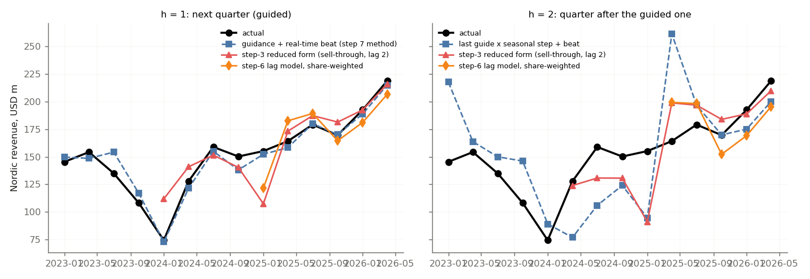
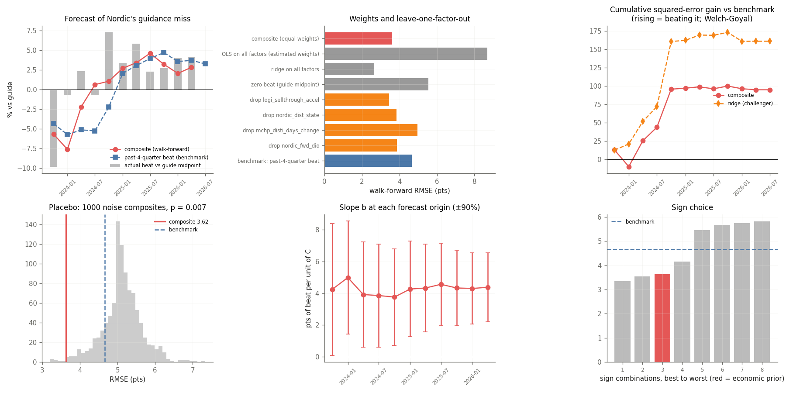
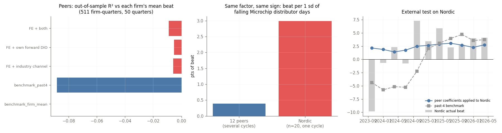

# Step 6 — Back-test (walk-forward, point-in-time)

> ### 💡 Key insights (computed from the data)
>
> **K1. The beat is management's forecast error, not demand.** Across 632 peer quarters revenue YoY has sd 29% but the beat only 3.9% (correlation 0.23). In the 20 quarters where a peer's revenue fell 30% or more YoY the mean beat was -0.2% and 95% stayed within +/-5%: management writes the cycle into the guide. *So what:* A factor can predict the beat only if management ignored public information; channel signals can at most help the revenue forecast beyond the guided quarter (K4).
>
> **K2. Nordic's 2023Q3 miss was not set up by a guide more optimistic than the peers'.** For 2023Q3 Nordic guided +0.5% q/q against a peer median of +0.4% (relative optimism +0.1 pts), then missed by 12.9%: the shortfall arose inside the quarter. Against the consumer-heavy peers only (exploratory, chosen after seeing the data) the gap was +18.8 pts. *So what:* Which comparator is 'the market' decides the reading; the pre-registered peer median does not flag the episode.
>
> **K3. No guide-setting factor predicts misses.** Relative guidance optimism on 671 peer firm-quarters (70 quarters): +0.005 per pt (t 0.3); walk-forward OOS R2 -0.005 vs each firm's mean; the most optimistic fifth of guides misses in 15% of quarters, the least optimistic in 24%. On Nordic without 2023Q3, 2023Q4: last_beat keep |t| >= 2; the channel factor keeps +0.86 (t 0.7, naive). *So what:* The large Nordic misses are rare intra-quarter surprises; about a dozen candidate factors have now been tried on 21 quarters, so any one that 'works' on Nordic alone is expected by chance.
>
> **K4. Beyond the guided quarter the channel factor adds little to revenue forecasts.** Forecasting revenue one quarter past the guide (g2 = actual t+1 / guide t) on 479 peer firm-quarters: seasonal benchmark + channel factor gives OOS R2 +1.6% vs the seasonal benchmark alone (t 1.4; RMSE 10.55 with the channel vs 10.64 seasonal vs 11.54 flat, pts); 102% of the gain comes from 2023Q3, 2023Q4, 2025Q4; without 2023Q3, 2023Q4 +0.3%. *So what:* Where the channel belongs (revenue beyond the guide, not the beat) is consistent with (not confirmed by) the data: its value there is small and turn-dependent: seasonality does more than the channel.

> ### ⚠ Risks the tests cannot rule out (R1-R6 the composite channel factor, a pre-registered challenger; R7-R8 Nordic's own guide-error record, F32)
>
> **R1. Against the 4-quarter benchmark the gain comes from one cycle turn.** (a) vs the past-4-quarter beat (the gate's benchmark): the three best quarters (2024Q4, 2024Q2, 2024Q3) carry 111% of the gain — above 100% because the other quarters together lose; the composite wins 7 of 11 quarters; over the last six quarters the composite is WORSE (RMSE 1.71 vs 1.67 pts). (b) vs the intercept-only model (mean of all past beats, no factors): the three best quarters (2023Q4, 2024Q4, 2025Q2) carry 106% of the gain — above 100% because the other quarters together lose; the composite wins 7 of 11 quarters (out-of-sample R² +0.46; last six quarters 1.71 vs 3.98). Reading: the composite wins more quarters against the intercept-only model (7 vs 7 of 11) and its top-3 share is lower (106% vs 111%), but against both baselines three quarters still carry most of the gain — the concentration is only partly an artefact of the slow 4-quarter benchmark. Either way the sample holds one cycle.
>
> **R2. Factors chosen after seeing the data.** The four factors were chosen after step 3 had already shown the 2021-2026 data (researcher degrees of freedom). No back-test removes this. The only clean test: Nordic Q3 2026 print, 22 Oct 2026 (pre-registered in steps/step6_backtest/outputs/composite_prereg_log.csv; the last row logged before the print is the forecast of record) — none scored yet.
>
> **R3. The composite and its ridge variant disagree on this quarter.** 2026Q3: composite (equal weights) beat +3.39% vs ridge challenger +1.69% (+1.71 pts = USD 3.9m on the USD 230m midpoint). Which specification is right is unknown until the print.
>
> **R4. Very few independent observations.** The composite has 20 quarterly values but lag-1 autocorrelation 0.75, so it holds about 2.8 independent observations (Bartlett n(1-ρ)/(1+ρ)); the beat itself holds about 8.0 of 19. Every cycle-dependent conclusion rests on roughly one downturn and one upturn; each extra fitted parameter (absolute value, separate +/- slopes, regime switches) would be fitted to those. More independent evidence has to come from more cycles or more companies (peer panel), not from the model's form.
>
> **R5. The channel mechanism itself fails external validation on 12 peers.** Pooled over 442 peer firm-quarters and several cycles, the same channel factors do not beat each firm's own mean beat out of sample (OOS R² -0.009, better in 52% of quarters). On the industry factor Nordic's slope is +2.99 pts per sd vs +0.39 for the peers. A Nordic-like peer set (11 firms, distribution share >= 35%) predicts Nordic's slope from its distribution share at +0.16 (90% PI -0.28 to +0.61); distribution share itself explains nothing (t = 0.2). The composite's Nordic result is most likely specific to one cycle of one company.
>
> **R6. The channel mechanism rests on one cycle turn, for Nordic and for the peers.** Peers' slope by window: 2008-10 -0.22, 2011-19 +0.19, Nordic's window +0.59 (se 0.92). Three quarters carry 92% of the peers' and 82% of Nordic's slope; 2023Q3, 2023Q4 are in both. Nordic vs peers in the same window: t = 0.9 after autocorrelation.

**Question.** Would the lag model have improved the forecast, using only what was known on each forecast date? Leave-one-out cannot answer that: it trains on later quarters, and the old regression used the distributor state of the quarter being predicted. Design, benchmark and reasons: `config/decisions.csv` (B1–B11).

## 1. Answer

- **Next quarter (h = 1, the October prints): no.** On the lag models' own quarters, guidance + real-time beat misses by USD 3.5–5.3m RMSE; the lag models as a tilt on guidance by USD 18–21m (3.9–5.9× worse). Encompassing: the real-time beat adds to guidance (t = 2.2); no lag model does (p ≥ 0.32). Nordic guides from its own order book, which already contains Logitech's orders.
- **Quarter after the guided one (h = 2): yes, suggestively.** Against the last guide carried by last year's seasonal step, the lag models cut RMSE to 0.54–0.61× on the same quarters; the step-3 reduced form's tilt predicts the miss (β = 1.31, t = 5.4, n = 9); Diebold-Mariano p = 0.09. With 5–9 forecasts this is evidence, not proof; and what they carry is the common consumer cycle, not the Logitech slice (section 5).
- **The leak mattered.** With the distributor state of the target quarter, the step-6 model's h = 1 RMSE is USD 16.3m; point-in-time it is USD 20.3m. The leaky version cannot even produce a live forecast (the state is not yet known).
- **In-sample vs out-of-sample.** The step-6 regression reports in-sample R² 0.92 and leave-one-out RMSE 13.5 pts; walk-forward RMSE on the same target is 25.0 pts.

**What changes:** the October point forecasts stay guidance-based (step 7 has no lag-model tilt; B11). The lag models are the outlook for the quarter after — Q4 2026 below. For the guided quarter the useful model is the composite channel factor on the guidance MISS (section 7).

## 2. Live forecasts from the 21 October origin

| quarter   |   horizon |   guide_total |   GB_total |   N_total |   L6_total |   L6tv_total |   L3_total |
|:----------|----------:|--------------:|-----------:|----------:|-----------:|-------------:|-----------:|
| 2026Q3    |         1 |         230   |      234.7 |     225.9 |      218.4 |        217.1 |      228.5 |
| 2026Q4    |         2 |         217.8 |      222   |     214.1 |      208.2 |        206.9 |      223.3 |

Q4 2026 (h = 2): lag models USD 207–223m vs the carried guide USD 218m — the models disagree on the direction, so the outlook is a range, not a call.

## 3. Metrics

### h = 1 (next quarter)

| model   |   n | first   | last   |   rmse_yoy_pts |   bias_yoy_pts |   rmse_total_usdm |   mae_total_usdm |   bias_total_usdm |   GB_rmse_same_quarters |   rmse_ratio_vs_GB |   beat_direction_hit |   dm_vs_GB |   dm_p_vs_GB |
|:--------|----:|:--------|:-------|---------------:|---------------:|------------------:|-----------------:|------------------:|------------------------:|-------------------:|---------------------:|-----------:|-------------:|
| G       |  14 | 2023Q1  | 2026Q2 |          17.6  |           1.29 |              8.31 |             6.72 |             -1.28 |                    7.43 |               1.12 |               nan    |       1.57 |         0.14 |
| GB      |  14 | 2023Q1  | 2026Q2 |          19.99 |           1.66 |              7.43 |             5.67 |             -0.88 |                    7.43 |               1    |                 0.79 |     nan    |       nan    |
| N       |  14 | 2023Q1  | 2026Q2 |          22.88 |          -2.15 |             17.69 |            14.55 |             -3.49 |                    7.43 |               2.38 |                 0.43 |       2.27 |         0.04 |
| L6      |   6 | 2025Q1  | 2026Q2 |          25.02 |          10.06 |             20.32 |            16.64 |             -1.5  |                    3.45 |               5.9  |                 0.5  |       2.05 |         0.1  |
| L6tv    |   6 | 2025Q1  | 2026Q2 |          20.06 |           6.11 |             17.57 |            15.06 |             -5.57 |                    3.45 |               5.1  |                 0.33 |       1.79 |         0.13 |
| L3      |  10 | 2024Q1  | 2026Q2 |          22.83 |           1.74 |             20.7  |            14.74 |              1.15 |                    5.27 |               3.93 |                 0.8  |       1.62 |         0.14 |
| GR      |  10 | 2024Q1  | 2026Q2 |          21.81 |           3.85 |             21.05 |            15.81 |              2.93 |                    5.27 |               4    |                 0.7  |       1.9  |         0.09 |
| L6leak  |   6 | 2025Q1  | 2026Q2 |          20.33 |          11.72 |             16.27 |            14.11 |             -0.63 |                    3.45 |               4.72 |                 0.67 |       2.09 |         0.09 |

Encompassing: (actual − guide) = a + b × tilt

| model   |   n |   alpha_usdm |   beta_on_tilt |   beta_se_hac |      t |     p | reading                    |
|:--------|----:|-------------:|---------------:|--------------:|-------:|------:|:---------------------------|
| GB      |  14 |        0.846 |          1.08  |         0.5   |  2.162 | 0.052 | adds to guidance           |
| N       |  14 |        1.415 |          0.062 |         0.09  |  0.684 | 0.507 | no incremental information |
| L6      |   6 |        6.316 |          0.027 |         0.031 |  0.883 | 0.427 | no incremental information |
| L6tv    |   6 |        6.417 |          0.037 |         0.033 |  1.143 | 0.317 | no incremental information |
| L3      |  10 |        5.159 |         -0.024 |         0.054 | -0.445 | 0.668 | no incremental information |
| GR      |  10 |        5.427 |         -0.052 |         0.049 | -1.067 | 0.317 | no incremental information |
| L6leak  |   6 |        6.429 |          0.004 |         0.06  |  0.059 | 0.956 | no incremental information |

### h = 2 (quarter after the guided one)

| model   |   n | first   | last   |   rmse_yoy_pts |   bias_yoy_pts |   rmse_total_usdm |   mae_total_usdm |   bias_total_usdm |   GB_rmse_same_quarters |   rmse_ratio_vs_GB |   beat_direction_hit |   dm_vs_GB |   dm_p_vs_GB |
|:--------|----:|:--------|:-------|---------------:|---------------:|------------------:|-----------------:|------------------:|------------------------:|-------------------:|---------------------:|-----------:|-------------:|
| G       |  14 | 2023Q1  | 2026Q2 |          38.21 |           0.49 |             42.65 |            34.58 |              2.11 |                   44.09 |               0.97 |               nan    |      -1.36 |         0.2  |
| GB      |  14 | 2023Q1  | 2026Q2 |          40.5  |           0.73 |             44.09 |            35    |              2.7  |                   44.09 |               1    |                 0.5  |     nan    |       nan    |
| N       |  14 | 2023Q1  | 2026Q2 |          36.8  |          -2.78 |             40.89 |            35.85 |             -0.34 |                   44.09 |               0.93 |                 0.43 |      -0.62 |         0.54 |
| L6      |   5 | 2025Q2  | 2026Q2 |          24.94 |          13.28 |             27.78 |            24.11 |              9.16 |                   45.55 |               0.61 |                 0.8  |      -0.76 |         0.49 |
| L6tv    |   5 | 2025Q2  | 2026Q2 |          18.03 |           2.24 |             24.38 |            23.58 |             -1.96 |                   45.55 |               0.54 |                 0.2  |      -0.7  |         0.52 |
| L3      |   9 | 2024Q2  | 2026Q2 |          23.46 |          -1.74 |             28.03 |            21.61 |             -6.85 |                   47.21 |               0.59 |                 0.78 |      -1.96 |         0.09 |
| GR      |   9 | 2024Q2  | 2026Q2 |          23.46 |          -1.74 |             28.03 |            21.61 |             -6.85 |                   47.21 |               0.59 |                 0.78 |      -1.96 |         0.09 |
| GRg     |   9 | 2024Q2  | 2026Q2 |          23.97 |          -1.67 |             28.44 |            22.36 |             -6.67 |                   47.21 |               0.6  |                 0.78 |      -1.99 |         0.08 |
| GRi     |   9 | 2024Q2  | 2026Q2 |          20    |           4.62 |             25.42 |            19.69 |             -1.99 |                   47.21 |               0.54 |                 0.78 |      -1.97 |         0.08 |

| model   |   n |   alpha_usdm |   beta_on_tilt |   beta_se_hac |      t |     p | reading                    |
|:--------|----:|-------------:|---------------:|--------------:|-------:|------:|:---------------------------|
| GB      |  14 |        1.186 |         -5.652 |         4.022 | -1.405 | 0.185 | no incremental information |
| N       |  14 |       -0.488 |          0.663 |         0.531 |  1.249 | 0.236 | no incremental information |
| L6      |   5 |       -8.615 |          1.224 |         0.356 |  3.44  | 0.041 | adds to guidance           |
| L6tv    |   5 |       11.032 |          1.668 |         0.299 |  5.586 | 0.011 | adds to guidance           |
| L3      |   9 |        4.841 |          1.308 |         0.243 |  5.387 | 0.001 | adds to guidance           |
| GR      |   9 |        4.841 |          1.308 |         0.243 |  5.387 | 0.001 | adds to guidance           |
| GRg     |   9 |        4.659 |          1.299 |         0.235 |  5.539 | 0.001 | adds to guidance           |
| GRi     |   9 |       -0.162 |          1.189 |         0.212 |  5.612 | 0.001 | adds to guidance           |

### By regime (h = 1)

| regime   | model   |   n | first   | last   |   rmse_yoy_pts |   bias_yoy_pts |   rmse_total_usdm |   mae_total_usdm |   bias_total_usdm |   GB_rmse_same_quarters |   rmse_ratio_vs_GB |   beat_direction_hit |   dm_vs_GB |   dm_p_vs_GB |
|:---------|:--------|----:|:--------|:-------|---------------:|---------------:|------------------:|-----------------:|------------------:|------------------------:|-------------------:|---------------------:|-----------:|-------------:|
| destock  | G       |   5 | 2023Q1  | 2024Q1 |          17.43 |           4.04 |             10.75 |             8.22 |              6.54 |                    9.97 |               1.08 |               nan    |       1.18 |         0.3  |
| destock  | GB      |   5 | 2023Q1  | 2024Q1 |          18.09 |           2.47 |              9.97 |             7.89 |              4.99 |                    9.97 |               1    |                 0.8  |     nan    |       nan    |
| destock  | N       |   5 | 2023Q1  | 2024Q1 |          18.79 |           3.41 |             16.83 |            15.1  |              4.42 |                    9.97 |               1.69 |                 0.2  |       1.1  |         0.33 |
| destock  | L3      |   1 | 2024Q1  | 2024Q1 |          26.81 |          26.81 |             37.41 |            37.41 |             37.41 |                    1.57 |              23.82 |                 0    |     nan    |       nan    |
| destock  | GR      |   1 | 2024Q1  | 2024Q1 |          29.23 |          29.23 |             39.1  |            39.1  |             39.1  |                    1.57 |              24.9  |                 0    |     nan    |       nan    |
| normal   | G       |   9 | 2024Q2  | 2026Q2 |          17.7  |          -0.24 |              6.56 |             5.89 |             -5.62 |                    5.53 |               1.19 |               nan    |       1.05 |         0.33 |
| normal   | GB      |   9 | 2024Q2  | 2026Q2 |          20.97 |           1.21 |              5.53 |             4.44 |             -4.14 |                    5.53 |               1    |                 0.78 |     nan    |       nan    |
| normal   | N       |   9 | 2024Q2  | 2026Q2 |          24.86 |          -5.24 |             18.16 |            14.25 |             -7.88 |                    5.53 |               3.28 |                 0.56 |       1.92 |         0.09 |
| normal   | L6      |   6 | 2025Q1  | 2026Q2 |          25.02 |          10.06 |             20.32 |            16.64 |             -1.5  |                    3.45 |               5.9  |                 0.5  |       2.05 |         0.1  |
| normal   | L6tv    |   6 | 2025Q1  | 2026Q2 |          20.06 |           6.11 |             17.57 |            15.06 |             -5.57 |                    3.45 |               5.1  |                 0.33 |       1.79 |         0.13 |
| normal   | L3      |   9 | 2024Q2  | 2026Q2 |          22.35 |          -1.05 |             17.91 |            12.22 |             -2.87 |                    5.53 |               3.24 |                 0.89 |       1.17 |         0.27 |
| normal   | GR      |   9 | 2024Q2  | 2026Q2 |          20.83 |           1.03 |             17.96 |            13.23 |             -1.09 |                    5.53 |               3.25 |                 0.78 |       1.45 |         0.19 |
| normal   | L6leak  |   6 | 2025Q1  | 2026Q2 |          20.33 |          11.72 |             16.27 |            14.11 |             -0.63 |                    3.45 |               4.72 |                 0.67 |       2.09 |         0.09 |

## 4. Every forecast (h = 1)

| quarter   | regime   |   actual_total |   guide_total |   GB_total |   N_total |   L6_total |   L6tv_total |   L6leak_total |   L3_total |   L6_ntrain |
|:----------|:---------|---------------:|--------------:|-----------:|----------:|-----------:|-------------:|---------------:|-----------:|------------:|
| 2023Q1    | destock  |          145.4 |           150 |      149.6 |     165.6 |      nan   |        nan   |          nan   |      nan   |           0 |
| 2023Q2    | destock  |          154.2 |           150 |      148.5 |     127.5 |      nan   |        nan   |          nan   |      nan   |           1 |
| 2023Q3    | destock  |          135   |           155 |      154.1 |     142.5 |      nan   |        nan   |          nan   |      nan   |           2 |
| 2023Q4    | destock  |          108.2 |           120 |      117   |     121.6 |      nan   |        nan   |          nan   |      nan   |           3 |
| 2024Q1    | destock  |           74.5 |            75 |       72.9 |      82.2 |      nan   |        nan   |          nan   |      111.9 |           4 |
| 2024Q2    | normal   |          127.9 |           125 |      121.5 |     122.1 |      nan   |        nan   |          nan   |      140.9 |           5 |
| 2024Q3    | normal   |          158.8 |           160 |      154.9 |     148   |      nan   |        nan   |          nan   |      151.5 |           6 |
| 2024Q4    | normal   |          150.2 |           140 |      138.1 |     145.4 |      nan   |        nan   |          nan   |      140.3 |           7 |
| 2025Q1    | normal   |          155.1 |           150 |      152.2 |     118.6 |      119.9 |        121.8 |          127.2 |      107.5 |           8 |
| 2025Q2    | normal   |          164.1 |           155 |      158.2 |     191.8 |      191   |        182.5 |          177.6 |      173.2 |           9 |
| 2025Q3    | normal   |          179   |           175 |      179.8 |     179.9 |      197.5 |        189.1 |          200.1 |      187.2 |          10 |
| 2025Q4    | normal   |          169.5 |           165 |      170   |     155.7 |      168.8 |        164.5 |          175.4 |      181.3 |          11 |
| 2026Q1    | normal   |          192.4 |           185 |      188.8 |     171.1 |      183.5 |        181.1 |          187.2 |      192.4 |          12 |
| 2026Q2    | normal   |          218.6 |           210 |      214.8 |     212.1 |      209   |        206.4 |          207.4 |      215.5 |          13 |

## 5. Limits

- 5–14 forecasts per model, one destock and one recovery: every conclusion is conditional on this cycle.
- Latest (restated) data, not first releases (B9): slightly flattering to the models.
- The h = 2 benchmark is weak by construction (no consensus); a sell-side consensus would be the right bar.
- **What the lag models measure.** L3, L6 and GR regress ALL of Nordic's consumer revenue on Logitech (sell-in, sell-through, or the graph's sell-out proxy), while Logitech + GN are a minority slice of Nordic (step 2). They work as a proxy for the common consumer cycle - Nordic lags semiconductor billings and US electronics sales by about the same as Logitech (step 4 L2, step 5 G21, P86) - not as the Logitech / GN slice. They fail when Logitech diverges from the rest of consumer electronics (e.g. the 2026 supplier incident).

## 6. Decisions

| id   | topic                                                      | decision                                                                                                                                                                                                                                                                                           | reason                                                                                                                                                                                                                                                                                                                                                                                                                                                               |
|:-----|:-----------------------------------------------------------|:---------------------------------------------------------------------------------------------------------------------------------------------------------------------------------------------------------------------------------------------------------------------------------------------------|:---------------------------------------------------------------------------------------------------------------------------------------------------------------------------------------------------------------------------------------------------------------------------------------------------------------------------------------------------------------------------------------------------------------------------------------------------------------------|
| B1   | back-test design                                           | Walk-forward, expanding window, one forecast per quarter at the real forecast date; leave-one-out kept only as an in-sample fit statistic                                                                                                                                                          | LOO and k-fold train on quarters after the one they predict. For a one-step expanding window every training target is already reported at the origin, so nothing needs purging or embargoing (López de Prado's purging applies when training data overlap the test label window)                                                                                                                                                                                     |
| B2   | information set                                            | Origin = the day before Nordic reports quarter t: Logitech and Nordic through t-1, Nordic guidance for t, distributor state through t-1                                                                                                                                                            | Logitech reports about a week after Nordic, so Logitech quarter t is not known; the step-6 regression used the distributor state of quarter t, which Nordic discloses only in the t report (a leak)                                                                                                                                                                                                                                                                  |
| B3   | no re-tuning                                               | Lags (1-3), ridge alpha and the step-3 lag (2) are fixed from the reasoned prior; each origin only re-estimates coefficients                                                                                                                                                                       | Choosing hyper-parameters on the full sample is look-ahead; re-tuning on 8-12 points would be noise                                                                                                                                                                                                                                                                                                                                                                  |
| B4   | benchmark                                                  | Benchmark = guidance midpoint x (1 + mean beat of the previous 4 quarters)                                                                                                                                                                                                                         | Regime labels are dated after the fact; a real-time analyst knows only the recent beats. This is the step-7 method in its real-time form                                                                                                                                                                                                                                                                                                                             |
| B5   | how a model is used                                        | A lag model is scored as a TILT on guidance: total = guide + (model consumer - guidance-implied consumer)                                                                                                                                                                                          | That is how the model would enter the forecast; guidance already covers Industrial & Health and the level                                                                                                                                                                                                                                                                                                                                                            |
| B6   | like-for-like                                              | Each model's RMSE is compared with the benchmark re-scored on exactly the same quarters                                                                                                                                                                                                            | Lag models start later (they need 8 training quarters); the destock quarters they skip were the hard ones for guidance too                                                                                                                                                                                                                                                                                                                                           |
| B7   | inference                                                  | Diebold-Mariano with the Harvey-Leybourne-Newbold small-sample correction (autocovariance to lag h-1) and the encompassing regression (actual - guide) = a + b x tilt with HAC s.e.; with n = 5-14 the results are called 'suggestive' unless p < 0.05                                             | RMSE differences on 10 quarters can be luck; the encompassing test asks the decision-relevant question: does the model's disagreement with guidance predict the miss?                                                                                                                                                                                                                                                                                                |
| B8   | horizon 2                                                  | Also test the quarter after the guided one (h=2) against the last guide carried by last year's seasonal step                                                                                                                                                                                       | At h=1 Nordic's guidance embeds its own order book, which already contains Logitech's orders; a lagged Logitech signal can only add information where no guidance exists. Consensus would be the better h=2 benchmark but is paywalled                                                                                                                                                                                                                               |
| B9   | data vintage                                               | Latest (restated) data, not first releases                                                                                                                                                                                                                                                         | First-release vintages are not systematically public for Nordic / Logitech segments; restatements (step 1) make the back-test slightly flattering to the models - stated as a limitation                                                                                                                                                                                                                                                                             |
| B10  | min training size                                          | 8 quarters before the first forecast                                                                                                                                                                                                                                                               | 4 regressors + intercept in L6 need at least ~2x as many points; 10 would leave almost no forecasts                                                                                                                                                                                                                                                                                                                                                                  |
| B11  | what the result changes                                    | h=1: no lag-model tilt on the October point forecasts (the step-7 design already has none). h=2: the step-3 reduced form and the share-weighted step-6 model are the Q4 2026 outlook; where they disagree the outlook is a range, not a point                                                      | The walk-forward says a tilt would have cost 4-6x the error at h=1 and saved ~40% at h=2                                                                                                                                                                                                                                                                                                                                                                             |
| B12  | composite target                                           | Model Nordic's guidance MISS (actual / guide midpoint - 1), not revenue growth                                                                                                                                                                                                                     | Guidance already embeds Nordic's order book (6b: lag models lose to guidance at h=1). Only the miss is information guidance does not have; any factor must be judged on it                                                                                                                                                                                                                                                                                           |
| B13  | factor list and signs fixed first                          | Four channel factors, signs from economics, lags so every factor is dated t-1 at the forecast date; written in config/model.yaml before the back-test ran; none dropped after seeing results                                                                                                       | Selection is the biggest over-fitting risk with 11-18 points. Stated honestly: the four were chosen after step 3 had shown the data, so researcher degrees of freedom remain; the pre-registered live forecast is the clean test                                                                                                                                                                                                                                     |
| B14  | equal weights                                              | C_t = mean(sign_k x expanding z_k,t); model beat = a + b C (2 parameters)                                                                                                                                                                                                                          | With ~15 points estimated weights are noise-prone (Dawes 1979; DeMiguel et al. 2009). In this sample ridge happened to do better - equal weights stay primary because they were fixed before the run, ridge is the logged challenger                                                                                                                                                                                                                                 |
| B15  | expanding z-scores                                         | Each z uses the mean and sd of the factor up to t-1 only                                                                                                                                                                                                                                           | Full-sample mean/sd leaks the future into every z                                                                                                                                                                                                                                                                                                                                                                                                                    |
| B16  | over-fitting tests                                         | Placebo with AR(1) noise factors through the identical pipeline (1000 draws); leave-one-factor-out; all distinct sign combinations; estimated-weight challengers; slope stability; OOS R2, Diebold-Mariano, cumulative squared-error gain                                                          | Each test targets one channel of over-fitting: chance, one factor carrying it, sign choice, weights, instability                                                                                                                                                                                                                                                                                                                                                     |
| B17  | adoption gate                                              | Step 7 uses the composite only if OOS R2 > 0, placebo p <= 0.10, >= 10 forecasts and >= 3/4 leave-one-out composites beat the benchmark - thresholds written in config before the run and applied by code                                                                                          | A rule fixed in advance cannot be bent to the result                                                                                                                                                                                                                                                                                                                                                                                                                 |
| B18  | no double counting; error band                             | When adopted, drop forecast lines the composite already captures (capacity_worry_pull_in = distributor-state signal) and use the composite's walk-forward RMSE as the beat error instead of historical dispersion + 3 pt extra                                                                     | The same signal counted twice biases the point; the walk-forward RMSE is the measured out-of-sample error, so the ad-hoc extra is no longer needed                                                                                                                                                                                                                                                                                                                   |
| B19  | pre-registration                                           | The live forecast (primary and ridge challenger) is appended once per (target, spec hash) to composite_prereg_log.csv and committed; a changed spec gets a new hash and a new row                                                                                                                  | After 22 Oct the print scores a forecast that could not be tuned to it; re-specifications stay visible                                                                                                                                                                                                                                                                                                                                                               |
| B20  | more independent evidence                                  | Build a peer panel (Pipeline D: Microchip, NXP, TI, ADI, onsemi, Silicon Labs; 2011-2026) instead of adding terms to the Nordic model                                                                                                                                                              | The Nordic composite holds ~2 independent observations (R4); extra terms would be fitted to them. Several cycles and firms are the only way to add independent information                                                                                                                                                                                                                                                                                           |
| B21  | point-in-time actuals                                      | Actual revenue = FIRST-reported XBRL value; guides = the INITIAL guide of each quarter (not mid-quarter updates)                                                                                                                                                                                   | Restated values and mid-quarter updates measure a different company or use information the guide did not have (Silicon Labs divestiture; TI mid-quarter updates)                                                                                                                                                                                                                                                                                                     |
| B22  | traps handled in the peer data                             | Unit typo corrected with a flag; months->weeks definition break not bridged; M&A / divestiture quarters excluded with reasons; GAAP one-off replaced by the release's comparable figure (quote checked); plausibility band 0.25-4x (0.5-2x dropped a real destock guide)                           | Every correction is a rule a reader can check; a filter that removes the destock extremes is selection bias                                                                                                                                                                                                                                                                                                                                                          |
| B23  | panel specification fixed first                            | beat = firm FE (mean past beat) + b1 own forward DIO + b2 Microchip distributor-days change; same signs as the Nordic composite; walk-forward by quarter; SE clustered by quarter; DM on the cross-sectional average loss per quarter                                                              | Testing the SAME mechanism on new data is the external test; changing it would re-open the search                                                                                                                                                                                                                                                                                                                                                                    |
| B24  | external test                                              | Estimate on the peers (12 from 2026-09-26) only; apply to Nordic, which never enters estimation                                                                                                                                                                                                    | Only a model that never saw Nordic can validate the Nordic result                                                                                                                                                                                                                                                                                                                                                                                                    |
| B25  | what the panel means for the forecast                      | Result: the channel factors do not beat each firm's own mean beat out of sample (R5). The adoption gate (B17) was fixed before this evidence existed; whether to keep the composite in the Q3 forecast is put to the analyst rather than changed by code                                           | Adding a failed external test to the gate now would be a rule written after seeing a result; the decision belongs to the analyst, with the evidence shown in R5                                                                                                                                                                                                                                                                                                      |
| B26  | composite role (analyst decision, 2026-09-25)              | Revert the Nordic Q3 forecast to the regime-conditioned historical beat; keep the composite as a pre-registered challenger scored after the print                                                                                                                                                  | Independent evidence (peer panel, R5) says the mechanism does not generalise; with weak external evidence the simpler model is the default, and the cost is small (about USD 0.8m on the point, inside the band)                                                                                                                                                                                                                                                     |
| B27  | per-cycle models                                           | No separate model per cycle phase; phase may enter only as an intercept or through the uncertainty band                                                                                                                                                                                            | On the peer panel, with 24 downturn quarters across six firms, phase-specific slopes worsen out-of-sample forecasts (downturns most); on Nordic's single cycle they would be fitted to one observation each                                                                                                                                                                                                                                                          |
| B28  | what is firm-specific                                      | Firm-specific behaviour is modelled by partial pooling (random-effects shrinkage towards the peer slope) and, as a next step, by observable firm characteristics (distribution share, end-market mix, lead times) — not by a free Nordic slope                                                     | Nordic's own slope is ~10 between-firm sd from the peers but rests on ~4 independent observations; shrinkage puts 3-14% weight on it                                                                                                                                                                                                                                                                                                                                 |
| B29  | who is a Nordic-like peer                                  | Criterion fixed in config before any candidate's slope was seen: distribution share >= 35% (Nordic 42-55%); candidates listed on business description (consumer / IoT / broad-market semiconductors guiding quarterly in their 8-K); characteristics read from each latest 10-K and quote-checked  | Choosing peers after seeing results would re-open the search; TI (distribution <20%) fails the criterion although it had the highest slope                                                                                                                                                                                                                                                                                                                           |
| B30  | consumer share                                             | Recorded with its definition; tried only as an exploratory one-covariate meta-regression, never used for the Nordic prediction                                                                                                                                                                     | Definitions differ by company (Consumer / High-End Consumer / Home & Life / Mobile / broadband) and 4 of 12 do not disclose it: a measurement-error-ridden variable on ~10 points                                                                                                                                                                                                                                                                                    |
| B31  | meta-regression                                            | Each peer's slope regressed on distribution share (WLS, weights 1/(se^2+tau_resid^2), residual tau by DerSimonian-Laird for meta-regression); Nordic's slope PREDICTED from its characteristics with a prediction interval that includes tau; Nordic never enters the fit                          | Makes 'Nordic is different' a testable statement about an observable characteristic rather than a free parameter                                                                                                                                                                                                                                                                                                                                                     |
| B32  | which extra cycles                                         | Add the 2008-09 cycle only (guides for 2008Q3-2010Q4); 2001-02 is not attempted                                                                                                                                                                                                                    | The industry factor (Microchip distributor days) starts in the June-2008 10-Q and 8-K earnings releases start in 2003-04: 2001-02 has neither the factor nor filed guides. A different industry would add a different mechanism, not an independent test of this one                                                                                                                                                                                                 |
| B33  | pre-XBRL actuals                                           | Actual = the release's own figure only when the narrative sentence equals an income-statement revenue row (0.5%); XBRL first-reported wherever it exists; quarters with no numeric guide are listed, never imputed                                                                                 | Single regex hits caught an outlook row (onsemi 'Revenue $570 to $585') and a comparative (TI $2.88bn); an internal plan is not guidance                                                                                                                                                                                                                                                                                                                             |
| B34  | cycle windows and scale                                    | Windows dated by the cycle before the result (2008-10, 2011-19, 2020-26, plus Nordic's own quarters); one fixed sd of the factor for all windows and Nordic                                                                                                                                        | A descriptive stability test needs one scale to compare slopes; the forecast keeps the point-in-time z                                                                                                                                                                                                                                                                                                                                                               |
| B35  | headline estimate                                          | Quarter-level regression with the se scaled for the factor's autocorrelation (Bartlett n_eff) is the headline; pooled with quarter-clustered SE is shown next to it                                                                                                                                | The factor is common to all firms and autocorrelated (rho 0.65 in Nordic's window): 236 firm-quarters hold ~4 independent observations                                                                                                                                                                                                                                                                                                                               |
| B36  | what the beat is                                           | Treat the beat as management's forecast error: candidate predictors describe how the guide was set (relative optimism, guided growth, guide width, last beat), not only the channel                                                                                                                | The four channel factors correlate 0.72-0.91 on Nordic (one cycle read four ways); peers' revenue YoY sd 29% vs beat sd 3.6% shows guidance absorbs the cycle                                                                                                                                                                                                                                                                                                        |
| B37  | relative optimism definition                               | guided q/q minus the median guided q/q of the OTHER peers for the same quarter (>= 5 peers), guides released before the quarter ends                                                                                                                                                               | point in time; leave-one-out so a firm is not compared with itself                                                                                                                                                                                                                                                                                                                                                                                                   |
| B38  | seasonal adjustment (changed after seeing data)            | Primary = raw relative optimism; the planned seasonal version (minus last year's same-quarter q/q) kept as robustness                                                                                                                                                                              | For a firm in a deep cycle last year's q/q is the cycle, not seasonality (Nordic 2025Q2 norm +71.7%). Changed AFTER seeing the data: a researcher degree of freedom, disclosed (P55); both versions give t < 1                                                                                                                                                                                                                                                       |
| B39  | test on the panel, not on Nordic                           | The headline test of relative optimism is the 12-peer panel 2008-2026 with walk-forward OOS R2; Nordic fits are shown with and without the 2023Q3-Q4 episode                                                                                                                                       | Nordic holds ~4 independent observations; the panel holds 70 quarters of firm-specific variation (relative optimism is not a common factor)                                                                                                                                                                                                                                                                                                                          |
| B40  | stop the factor search                                     | Stop adding Nordic factors; record the count tried (~12 on 21 quarters)                                                                                                                                                                                                                            | With ~4 independent observations, one 'significant' factor among a dozen is expected by chance; the panel tests are negative                                                                                                                                                                                                                                                                                                                                         |
| B41  | where the channel is tested next                           | Test the channel factor on revenue ONE QUARTER PAST THE GUIDE (g2 = actual t+1 / guide t) on the peer panel, walk-forward                                                                                                                                                                          | K1 implies the channel can only matter beyond the guide; one company's result is not enough to put that on the dashboard                                                                                                                                                                                                                                                                                                                                             |
| B42  | h=2 benchmark                                              | Benchmark = firm's mean past g2 for the same quarter of the year (>= 2 past years); flat (g2 = 0) shown too                                                                                                                                                                                        | Last year alone carries the cycle (P55)                                                                                                                                                                                                                                                                                                                                                                                                                              |
| B43  | h=2 timing                                                 | At origin T the slope is trained on rows with quarter <= T-2 (their target T-1 is reported by the end of T)                                                                                                                                                                                        | The target of row T-1 is quarter T, not yet reported at the origin: look-ahead                                                                                                                                                                                                                                                                                                                                                                                       |
| B44  | graph factor in the composite (step 6c-g)                  | Run the composite a second time with Logitech sell-through acceleration replaced by the acceleration of graph demand (sell-out proxy through the step-5 lag kernel, graph as of the forecast date, h=1); pre-register its Q3 2026 forecast as a challenger; never adopt it on its back-test        | Analyst request 2026-09-26: at least one forecast of the guided quarter should use the graph, so a change to a graph lag or share visibly moves a Q3 number. Swapping one factor keeps the model at two parameters. Added after the factor search was stopped (B40), so only a pre-registered print can test it                                                                                                                                                      |
| B45  | graph-driven forecast one quarter past the guide (step 7b) | Add a Nordic Q4 2026 line (h=2) with GR as the point and GRg (GR with the unreported demand quarter read from Logitech's own guide) as a lag-sensitive challenger; band from the h=2 walk-forward RMSE and the graph's low/high scenario; edge lags editable in the results page's Assumptions tab | Analyst request 2026-09-26: a changed edge lag must visibly re-populate a forecast. The back-test puts the chain's value at h=2 (GR 0.59x the benchmark's error, n 9). But GR fills the unreported quarter by persistence, so a lag that only shifts kernel weight between lags 1 and 2 cannot move it (P74); GRg can, but Logitech guides quarterly only since 2025Q2, so it differs from GR on 4 back-test quarters (2 better, 2 worse) - not enough to promote it |
| B46  | Logitech factor exploration (step 6i)                      | Screen 10 candidate series x 2 training windows (20 specifications) as one-factor walk-forward regressions of Logitech sales YoY, BEFORE fixing any specification (analyst request); adopt none                                                                                                    | Analyst chose to look first. The count of specifications is logged so the look is disclosed; any specification fixed after this can only be tested on later prints                                                                                                                                                                                                                                                                                                   |

## 7. Composite channel factor → Nordic's guidance miss (step 6c)

**Why this target.** Guidance already contains Nordic's order book, so a factor can only add what the guide does not know: the miss beat_t = actual / guide midpoint − 1. **Model.** C_t = mean_k(sign_k × z_k,t), each z from data up to t−1 only; beat_t = a + b·C_t, re-fit each quarter. Two parameters regardless of how many factors (B12–B18).

Factors, signs and lags (fixed in `config/model.yaml` → `composite` before the run):

| factor                 | column               | transform   |   lag |   sign | reason                                                                    |
|:-----------------------|:---------------------|:------------|------:|-------:|:--------------------------------------------------------------------------|
| logi_sellthrough_accel | logi_sellthrough_yoy | diff        |     1 |      1 | end demand accelerating -> downstream restock -> orders above the guide   |
| nordic_dist_state      | nordic_dist_state    | level       |     1 |      1 | distributors restocking -> shipments above the guide                      |
| mchp_disti_days_change | mchp_disti_days      | diff        |     1 |     -1 | MCU channel days falling -> lean channel -> replenishment orders          |
| nordic_fwd_dio         | nordic_fwd_dio       | level       |     1 |     -1 | own stock low vs guided cost of sales -> demand pulling ahead of the plan |

**Result.** Walk-forward RMSE 3.62 pts vs 4.66 for the past-beat benchmark on the same 11 quarters (out-of-sample R² +0.40; in revenue USD 4.4m vs 6.2m); beat direction right 82%. Diebold-Mariano p = 0.19 — not significant on its own with 11 points.

**Where the gain comes from** (walk-forward squared errors split by regime; reported, not part of the gate):

| regime   |   n |   sse_composite |   sse_benchmark |   rmse_composite |   rmse_benchmark |   share_of_total_gain |
|:---------|----:|----------------:|----------------:|-----------------:|-----------------:|----------------------:|
| destock  |   2 |          65.608 |          55.724 |            5.727 |            5.278 |                -0.104 |
| normal   |   9 |          78.718 |         183.59  |            2.957 |            4.517 |                 1.104 |

Where the gain comes from — (a) vs the past-4-quarter beat (the gate's benchmark): the three best quarters (2024Q4, 2024Q2, 2024Q3) carry 111% of the gain — above 100% because the other quarters together lose; the composite wins 7 of 11 quarters; over the last six quarters the composite is WORSE (RMSE 1.71 vs 1.67 pts). (b) vs the intercept-only model (mean of all past beats, no factors): the three best quarters (2023Q4, 2024Q4, 2025Q2) carry 106% of the gain — above 100% because the other quarters together lose; the composite wins 7 of 11 quarters (out-of-sample R² +0.46; last six quarters 1.71 vs 3.98). Reading: the composite wins more quarters against the intercept-only model (7 vs 7 of 11) and its top-3 share is lower (106% vs 111%), but against both baselines three quarters still carry most of the gain — the concentration is only partly an artefact of the slow 4-quarter benchmark. Either way the sample holds one cycle.

### Is it over-fit?

1. **Chance (placebo).** 1000 composites of random AR(1) noise through the identical pipeline: only 0.7% do as well. The pipeline does not manufacture this result.
2. **One factor carrying it (leave-one-out).** Dropping any single factor, 3 of 4 composites still beat the benchmark (OOS R² -0.13 to +0.45); dropping mchp_disti_days_change or nordic_fwd_dio hurts most.
3. **Weights.** Estimated weights did *not* over-fit here: OLS 8.68, ridge 2.66 vs equal 3.62 pts. Equal weights stay primary because they were fixed before the run; switching now, after seeing the result on 11 points, would be the look-ahead the test exists to prevent. Ridge is logged as the challenger.
4. **Signs.** Of the 8 distinct sign combinations the economic prior ranks 3; the best one flips nordic_dist_state, mchp_disti_days_change, nordic_fwd_dio relative to the prior. The prior signs are kept — choosing the back-test's best would be data-mining.
5. **Stability.** The slope b stays between 3.8 and 5.0 across origins; its standard error falls from 2.5 to 1.3.
6. **What no test can remove.** The four factors were chosen after step 3 had shown the data (researcher degrees of freedom). None was dropped after seeing the back-test (logi_sellthrough_accel stays although its signed correlation with the miss is negative). The honest test is the pre-registered forecast below, scored after 22 Oct.

### Uncertainty band: does |C| predict the size of the error?

|C| says how extreme the channel is, not which way the miss goes (the sign is C's job). A band scaled by (1+|C_t|)/(1+mean|C|) adds no fitted parameter; it keeps the average width over the window its base error is measured on and moves width towards extreme channel states. Walk-forward 80% bands:

| band          |   n |   coverage |   mean_width |   interval_score |   target_coverage |
|:--------------|----:|-----------:|-------------:|-----------------:|------------------:|
| constant      |  11 |      0.909 |       12.333 |           12.746 |               0.8 |
| scaled by |C| |  11 |      0.909 |       10.915 |           13.418 |               0.8 |

**Caveat.** Coverage differs by 0 of 11 quarters (10 vs 10 covered). The scaled band is narrower here partly because |C| in these test quarters (mean 0.53) is small next to the destock quarters that dominate the training mean — the same one-cycle composition behind R1 and R4.

Step 7 uses the **constant** band (rule in config: scaled only if its interval score is lower). Live scale factor for 2026Q3: 1.00.

### Adoption gate (stated in config before the run)

| check                                 |   value | passed   |
|:--------------------------------------|--------:|:---------|
| oos_r2_vs_benchmark                   |   0.397 | True     |
| placebo_p                             |   0.007 | True     |
| n_forecasts                           |  11     | True     |
| leave_one_out_share_beating_benchmark |   0.75  | True     |

**Gate passed; used in the forecast: NO.** Analyst decision B26: the peer panel (section 8, risk R5) shows the mechanism does not generalise, so the composite stays a pre-registered challenger and step 7 keeps the regime-conditioned historical beat.

### Live forecast, pre-registered (`outputs/composite_prereg_log.csv`)

Q3 2026: C = +0.27 → beat +3.39% (benchmark +3.28%) → revenue USD 237.8m on the USD 230m midpoint. Factor contributions (signed z): logi_sellthrough_accel +0.42, nordic_dist_state +0.75, mchp_disti_days_change +0.29, nordic_fwd_dio -0.40.

| target   | spec_hash   | data_hash   | logged_on   |   guide_mid_usdm |   beat_hat_pct |   revenue_hat_usdm |   benchmark_beat_pct |   ridge_challenger_beat_pct | status                      |   actual_usdm |   scored_on |
|:---------|:------------|:------------|:------------|-----------------:|---------------:|-------------------:|---------------------:|----------------------------:|:----------------------------|--------------:|------------:|
| 2026Q3   | 6fe85357a5  | e2df927e89  | 2026-09-25  |              230 |           4.26 |              239.8 |                 3.28 |                        1.76 | gate passed; not used (B26) |           nan |         nan |
| 2026Q3   | 6fe85357a5  | ce5f518f80  | 2026-09-28  |              230 |           3.39 |              237.8 |                 3.28 |                        1.69 | gate passed; not used (B26) |           nan |         nan |

### All models in the composite test

| model                                  |   n | first   | last   |   rmse_beat_pts |   bench_rmse_same_quarters |   oos_r2_vs_bench |   rmse_usdm |   direction_hit |   dm_hln |    dm_p |
|:---------------------------------------|----:|:--------|:-------|----------------:|---------------------------:|------------------:|------------:|----------------:|---------:|--------:|
| composite (equal weights)              |  11 | 2023Q4  | 2026Q2 |           3.622 |                      4.664 |             0.397 |       4.448 |           0.818 |   -1.401 |   0.191 |
| OLS on all factors (estimated weights) |  11 | 2023Q4  | 2026Q2 |           8.679 |                      4.664 |            -2.462 |       9.783 |           0.818 |    1.096 |   0.299 |
| ridge on all factors                   |  11 | 2023Q4  | 2026Q2 |           2.664 |                      4.664 |             0.674 |       3.46  |           0.909 |   -1.798 |   0.102 |
| zero beat (guide midpoint)             |  14 | 2023Q1  | 2026Q2 |           5.551 |                      5.413 |            -0.052 |       8.306 |           0     |    0.191 |   0.851 |
| single factor: logi_sellthrough_accel  |   7 | 2024Q4  | 2026Q2 |           4.302 |                      3.916 |            -0.207 |       6.47  |           0.571 |    0.591 |   0.576 |
| single factor: nordic_dist_state       |   6 | 2025Q1  | 2026Q2 |           1.668 |                      1.67  |             0.003 |       2.698 |           1     |   -0.008 |   0.994 |
| single factor: mchp_disti_days_change  |  11 | 2023Q4  | 2026Q2 |           2.972 |                      4.664 |             0.594 |       4.411 |           0.727 |   -1.424 |   0.185 |
| single factor: nordic_fwd_dio          |  11 | 2023Q4  | 2026Q2 |           5.28  |                      4.664 |            -0.281 |       6.063 |           0.818 |    0.443 |   0.667 |
| leave out: logi_sellthrough_accel      |  11 | 2023Q4  | 2026Q2 |           3.447 |                      4.664 |             0.454 |       4.151 |           0.818 |   -1.529 |   0.157 |
| leave out: nordic_dist_state           |  11 | 2023Q4  | 2026Q2 |           3.841 |                      4.664 |             0.322 |       4.467 |           0.818 |   -0.815 |   0.434 |
| leave out: mchp_disti_days_change      |  11 | 2023Q4  | 2026Q2 |           4.967 |                      4.664 |            -0.134 |       6.381 |           0.727 |    0.408 |   0.692 |
| leave out: nordic_fwd_dio              |  11 | 2023Q4  | 2026Q2 |           3.87  |                      4.664 |             0.312 |       5.225 |           0.909 |   -0.926 |   0.376 |
| benchmark: past-4-quarter beat         |  11 | 2023Q4  | 2026Q2 |           4.664 |                      4.664 |             0     |       6.166 |           0.818 |  nan     | nan     |

Sign combinations:

| signs                                                                              | is_economic_prior   |   rmse_beat_pts |   oos_r2_vs_bench |   rank |
|:-----------------------------------------------------------------------------------|:--------------------|----------------:|------------------:|-------:|
| +logi_sellthrough_accel -nordic_dist_state +mchp_disti_days_change +nordic_fwd_dio | False               |           3.341 |             0.487 |      1 |
| +logi_sellthrough_accel +nordic_dist_state +mchp_disti_days_change +nordic_fwd_dio | False               |           3.536 |             0.425 |      2 |
| +logi_sellthrough_accel +nordic_dist_state -mchp_disti_days_change -nordic_fwd_dio | True                |           3.622 |             0.397 |      3 |
| +logi_sellthrough_accel -nordic_dist_state -mchp_disti_days_change -nordic_fwd_dio | False               |           4.151 |             0.208 |      4 |
| +logi_sellthrough_accel -nordic_dist_state -mchp_disti_days_change +nordic_fwd_dio | False               |           5.452 |            -0.366 |      5 |
| +logi_sellthrough_accel +nordic_dist_state +mchp_disti_days_change -nordic_fwd_dio | False               |           5.679 |            -0.483 |      6 |
| +logi_sellthrough_accel -nordic_dist_state +mchp_disti_days_change -nordic_fwd_dio | False               |           5.74  |            -0.514 |      7 |
| +logi_sellthrough_accel +nordic_dist_state -mchp_disti_days_change +nordic_fwd_dio | False               |           5.813 |            -0.553 |      8 |

### Graph challenger (step 6c-g, decision B44)

One factor swapped: **logi_sellthrough_accel** (Logitech sell-through acceleration, one path, fixed lag 1) → **graph_demand_accel** (the same sell-out proxy pushed through the step-5 supply-graph lag kernel: every route's weight and lag, graph as known on the forecast date, lags below one quarter put on t−1). Other factors, signs, z-scores and gate unchanged. The graph supplies the *timing* (a weighted lag), not separate demand per route: there is one sell-out proxy.

| composite                            |   n |   rmse_beat_pts |   benchmark_rmse |   oos_r2_vs_bench |   rmse_usdm |   placebo_p | leave_one_out_beating_bench   | gate_passed   |   q3_2026_beat_pct |   q3_2026_revenue_usdm |
|:-------------------------------------|----:|----------------:|-----------------:|------------------:|------------:|------------:|:------------------------------|:--------------|-------------------:|-----------------------:|
| primary: logi_sellthrough_accel      |  11 |           3.622 |            4.664 |             0.397 |       4.448 |       0.007 | 3/4                           | True          |              3.394 |                237.807 |
| graph challenger: graph_demand_accel |  11 |           3.545 |            4.664 |             0.422 |       4.284 |       0.004 | 3/4                           | True          |              3.314 |                237.623 |

The swapped factor on its own:

| model                                 |   n |   rmse_beat_pts |   bench_rmse_same_quarters |   oos_r2_vs_bench |
|:--------------------------------------|----:|----------------:|---------------------------:|------------------:|
| single factor: logi_sellthrough_accel |   7 |           4.302 |                      3.916 |            -0.207 |
| single factor: graph_demand_accel     |   6 |           2.483 |                      1.67  |            -1.21  |

**Q3 2026, pre-registered** (`outputs/composite_graph_prereg_log.csv`): beat +3.31% → revenue USD 237.6m on the USD 230m midpoint. Signed z: graph_demand_accel +0.24, nordic_dist_state +0.75, mchp_disti_days_change +0.29, nordic_fwd_dio -0.40.

| target   | spec_hash   | data_hash   | logged_on   |   guide_mid_usdm |   beat_hat_pct |   revenue_hat_usdm |   benchmark_beat_pct |   ridge_challenger_beat_pct | status                                       |   actual_usdm |   scored_on |
|:---------|:------------|:------------|:------------|-----------------:|---------------:|-------------------:|---------------------:|----------------------------:|:---------------------------------------------|--------------:|------------:|
| 2026Q3   | 6f2b514d6e  | 9a61403735  | 2026-09-26  |              230 |           3.77 |              238.7 |                 3.28 |                        1.95 | gate passed; not used (challenger only, B44) |           nan |         nan |
| 2026Q3   | 6f2b514d6e  | 6271b977d3  | 2026-09-26  |              230 |           3.75 |              238.6 |                 3.28 |                        2.09 | gate passed; not used (challenger only, B44) |           nan |         nan |
| 2026Q3   | 6f2b514d6e  | 83d06ce7f6  | 2026-09-28  |              230 |           3.31 |              237.6 |                 3.28 |                        2.38 | gate passed; not used (challenger only, B44) |           nan |         nan |

**Status.** Challenger only (config `composite.graph_challenger.use_in_forecast: false`): it was added after the factor search was stopped (B40), so its back-test is not a clean test and the peer panel cannot test it (the graph is Nordic's). It is scored on the 22 Oct print next to the primary composite and the benchmark.

## 8. Peer panel: does the mechanism hold across companies and cycles? (step 6d)

The Nordic composite rests on ~2 independent observations. 12 peers (Pipeline D: adi, alpha_omega, lattice, maxlinear, microchip, monolithic_power, nxp, onsemi, power_integrations, semtech, silabs, ti; every guide quote-checked, structural breaks excluded) give several cycles. The panel is estimated on the peers only and then applied to Nordic, which it never saw. Pooling adds information for firm-specific factors; the industry factor is common to all firms, so its standard errors are clustered by quarter.

**Walk-forward (pooled, point in time):**

| model                 |   firm_quarters |   quarters |   firms |   rmse_pts |   oos_r2_vs_firm_mean |   oos_r2_vs_past4 |   dm_p_by_quarter |   quarters_won_share |   top3_quarters_gain_share | top3_quarters          |
|:----------------------|----------------:|-----------:|--------:|-----------:|----------------------:|------------------:|------------------:|---------------------:|---------------------------:|:-----------------------|
| benchmark_firm_mean   |             511 |         50 |      12 |      3.756 |                 0     |             0.081 |           nan     |                0     |                        nan | 2014Q1, 2014Q2, 2014Q3 |
| benchmark_past4       |             511 |         50 |      12 |      3.918 |                -0.088 |             0     |             0.117 |                0.36  |                        nan | 2020Q3, 2021Q1, 2020Q4 |
| FE + industry channel |             452 |         43 |      12 |      3.817 |                -0.006 |             0.067 |             0.716 |                0.535 |                        nan | 2020Q3, 2023Q4, 2024Q2 |
| FE + own forward DIO  |             442 |         42 |      12 |      3.813 |                -0.005 |             0.062 |             0.52  |                0.452 |                        nan | 2017Q1, 2017Q3, 2018Q4 |
| FE + both             |             442 |         42 |      12 |      3.82  |                -0.009 |             0.059 |             0.569 |                0.524 |                        nan | 2023Q4, 2017Q1, 2023Q3 |

**Full sample, standard errors clustered by quarter:**

| spec                  | factor        |   b_pts_per_sd |   se_clustered_by_quarter |     t |     p |   firm_quarters |   quarters |
|:----------------------|:--------------|---------------:|--------------------------:|------:|------:|----------------:|-----------:|
| FE + own forward DIO  | z_own_fwd_dio |          0.092 |                     0.066 | 1.382 | 0.173 |             515 |         54 |
| FE + industry channel | z_industry    |          0.39  |                     0.236 | 1.653 | 0.104 |             561 |         55 |
| FE + both             | z_own_fwd_dio |          0.04  |                     0.066 | 0.608 | 0.546 |             515 |         54 |
| FE + both             | z_industry    |          0.435 |                     0.234 | 1.858 | 0.069 |             515 |         54 |

**Answer.** Across 442 firm-quarters the channel factors do not beat each firm's own mean beat out of sample (OOS R² -0.009; better in 52% of quarters). Full sample: own forward DIO t = 0.6, industry channel t = 1.9. On the same industry factor Nordic's own slope is +2.99 pts per sd against +0.39 for the peers (8x).

**External test on Nordic** (same 11 quarters as the composite): peer coefficients RMSE 4.21 pts; past-4 benchmark 4.66; Nordic's own firm mean 4.59; Nordic-fitted composite 3.62.

**Reading.** The mechanism the composite encodes (lean channel → beat) does not generalise across companies and cycles. Nordic's strong in-sample relation is specific to one cycle of one company — the pattern the R1/R2/R4 flags warned about, now confirmed by independent data.

By firm (walk-forward, `FE + both`):

| company            |   n |   rmse_model |   rmse_firm_mean |   oos_r2 |
|:-------------------|----:|-------------:|-----------------:|---------:|
| adi                |  39 |        6.705 |            6.757 |    0.015 |
| alpha_omega        |  30 |        2.864 |            2.874 |    0.007 |
| lattice            |  37 |        2.683 |            2.677 |   -0.005 |
| maxlinear          |  36 |        3.487 |            3.58  |    0.051 |
| microchip          |  36 |        2.646 |            2.705 |    0.043 |
| monolithic_power   |  40 |        4.658 |            4.645 |   -0.006 |
| nxp                |  25 |        3.986 |            4.012 |    0.013 |
| onsemi             |  41 |        2.467 |            2.414 |   -0.044 |
| power_integrations |  39 |        4.125 |            4.05  |   -0.038 |
| semtech            |  41 |        2.92  |            2.839 |   -0.058 |
| silabs             |  37 |        2.165 |            2.056 |   -0.109 |
| ti                 |  42 |        4.639 |            4.511 |   -0.058 |

### What is unique to Nordic? Partial pooling (hierarchical / empirical Bayes)

Each firm's slope on the industry factor = peer mean + its own deviation. Nordic's slope is shrunk towards the peer mean in proportion to how much its own data can be trusted: weight = τ² / (τ² + se²).

| company            |   n |      b |    se |   x_rho1 |   n_eff_x |
|:-------------------|----:|-------:|------:|---------:|----------:|
| NORDIC             |  25 |  2.742 | 1.253 |    0.655 |     5.209 |
| adi                |  51 |  0.758 | 1.075 |    0.52  |    16.118 |
| alpha_omega        |  32 |  0.53  | 0.634 |    0.409 |    13.411 |
| lattice            |  47 |  0.804 | 0.722 |    0.499 |    15.693 |
| maxlinear          |  46 |  0.279 | 0.704 |    0.551 |    13.315 |
| microchip          |  46 |  0.742 | 0.488 |    0.515 |    14.718 |
| monolithic_power   |  53 |  0.141 | 0.697 |    0.538 |    15.927 |
| nxp                |  25 | -0.736 | 0.819 |    0.655 |     5.205 |
| onsemi             |  54 | -0.245 | 0.425 |    0.503 |    17.876 |
| power_integrations |  50 |  0.77  | 0.705 |    0.544 |    14.78  |
| semtech            |  54 |  0.565 | 0.508 |    0.515 |    17.297 |
| silabs             |  49 | -0.169 | 0.353 |    0.5   |    16.312 |
| ti                 |  54 |  0.966 | 0.684 |    0.501 |    17.942 |

Peer mean slope +0.26 (se 0.17); between-firm sd τ = 0.00 (Q = 8.3 on 11 df). Nordic's own slope +2.74 gets weight 0.00 (naive se) to 0.00 (se for its effective n) → shrunk slope +0.26 to +0.26. Nordic may differ from the peers, but its data hold too few independent observations to show by how much; firm-specific structure should come from observable characteristics (distribution share, end-market mix, lead times) rather than from a free slope.

### Is Nordic different because of what it is? Nordic-like peers and meta-regression (step 6e)

Peers chosen by a criterion fixed before any slope was seen (distribution share >= 35%, read from each 10-K and quote-checked; Nordic 42-55%). Each peer's slope is regressed on its characteristic, weights 1/(se² + τ²_resid); Nordic never enters the fit and its slope is **predicted** from its characteristic, with a 90% prediction interval that includes τ.

| company            |   n |      b |    se |   x_rho1 |   n_eff_x |   distribution_share | distribution_basis                       |   consumer_share | meets_criterion   |
|:-------------------|----:|-------:|------:|---------:|----------:|---------------------:|:-----------------------------------------|-----------------:|:------------------|
| adi                |  51 |  0.758 | 1.075 |    0.52  |    16.118 |                0.56  | total                                    |            0.13  | True              |
| alpha_omega        |  32 |  0.53  | 0.634 |    0.409 |    13.411 |                0.723 | lower bound (two distributors)           |            0.122 | True              |
| lattice            |  47 |  0.804 | 0.722 |    0.499 |    15.693 |                0.84  | total                                    |          nan     | True              |
| maxlinear          |  46 |  0.279 | 0.704 |    0.551 |    13.315 |                0.37  | total                                    |            0.44  | True              |
| microchip          |  46 |  0.742 | 0.488 |    0.515 |    14.718 |                0.47  | total                                    |          nan     | True              |
| monolithic_power   |  53 |  0.141 | 0.697 |    0.538 |    15.927 |                0.54  | lower bound (three largest distributors) |            0.091 | True              |
| nxp                |  25 | -0.736 | 0.819 |    0.655 |     5.205 |                0.581 | computed from amounts                    |            0.129 | True              |
| onsemi             |  54 | -0.245 | 0.425 |    0.503 |    17.876 |                0.54  | total                                    |            0.21  | True              |
| power_integrations |  50 |  0.77  | 0.705 |    0.544 |    14.78  |                0.69  | total                                    |            0.37  | True              |
| semtech            |  54 |  0.565 | 0.508 |    0.515 |    17.297 |                0.74  | total                                    |            0.15  | True              |
| silabs             |  49 | -0.169 | 0.353 |    0.5   |    16.312 |                0.71  | total                                    |            0.433 | True              |
| ti                 |  54 |  0.966 | 0.684 |    0.501 |    17.942 |                0.2   | upper bound                              |          nan     | False             |

| sample                          | covariate          |   n_firms |   gamma0 |   gamma1 |   gamma1_se |   gamma1_t |   tau_resid | peer_range   | nordic_scenario   |   nordic_x |   nordic_slope_pred |   pi90_low |   pi90_high | extrapolated   |
|:--------------------------------|:-------------------|----------:|---------:|---------:|------------:|-----------:|------------:|:-------------|:------------------|-----------:|--------------------:|-----------:|------------:|:---------------|
| all peers                       | distribution_share |        12 |    0.577 |   -0.53  |       1.062 |     -0.499 |           0 | 0.20-0.84    | low               |       0.42 |               0.354 |     -0.061 |       0.769 | False          |
| all peers                       | distribution_share |        12 |    0.577 |   -0.53  |       1.062 |     -0.499 |           0 | 0.20-0.84    | mid               |       0.47 |               0.328 |     -0.026 |       0.682 | False          |
| all peers                       | distribution_share |        12 |    0.577 |   -0.53  |       1.062 |     -0.499 |           0 | 0.20-0.84    | high              |       0.55 |               0.285 |     -0     |       0.571 | False          |
| Nordic-like peers               | distribution_share |        11 |    0.011 |    0.327 |       1.382 |      0.237 |           0 | 0.37-0.84    | low               |       0.42 |               0.148 |     -0.394 |       0.691 | False          |
| Nordic-like peers               | distribution_share |        11 |    0.011 |    0.327 |       1.382 |      0.237 |           0 | 0.37-0.84    | mid               |       0.47 |               0.165 |     -0.285 |       0.614 | False          |
| Nordic-like peers               | distribution_share |        11 |    0.011 |    0.327 |       1.382 |      0.237 |           0 | 0.37-0.84    | high              |       0.55 |               0.191 |     -0.137 |       0.518 | False          |
| Nordic-like peers (exploratory) | consumer_share     |         9 |    0.266 |   -0.627 |       1.367 |     -0.458 |           0 | 0.09-0.44    | nordic            |       0.6  |              -0.11  |     -0.915 |       0.695 | True           |

Among 11 Nordic-like peers the slope moves +0.33 per unit of distribution share (se 1.38, t = 0.2); at Nordic's share (0.47) the predicted slope is +0.16 (90% PI -0.28 to +0.61) against Nordic's own +2.74. With all 12 peers (incl. TI, share <= 20%) the coefficient is -0.53 (t = -0.5). Shrinkage within the Nordic-like peers: peer mean +0.22, τ = 0.00 (Q = 7.2 on 10 df), weight on Nordic 0.00 to 0.00 → slope +0.22 to +0.22. Exploratory only (B30): consumer share gives -0.63 (t = -0.5) on 9 firms whose shares span 0.09-0.44; Nordic's 0.60 lies outside that range, so any prediction is an extrapolation. **Reading.** Being Nordic-like on distribution share does not produce a Nordic-sized slope: Nordic's own slope lies above the 90% prediction interval of similar peers, and distribution share does not explain the between-firm spread (|t| < 2). The characteristic cannot account for Nordic's slope; the most likely explanation remains that it is fitted to one cycle.

### More cycles: is the slope a property of Nordic or of the cycle? (step 6f)

Same factor on one fixed scale (1 sd of the Microchip days change over 2008-2026), firm means removed window by window. The 2008-10 window comes from the release history (Pipeline D `history`, actuals double-sourced). The factor is common to all firms, so the honest n is the number of quarters; `se_q_level_neff` also corrects for the factor's autocorrelation (Bartlett n_eff). `top3_share` = share of the slope carried by its three biggest quarters.

| window         | from   | to     | who    |   firm_quarters |   firms |   quarters |   b_pooled |   se_clustered |   quarters_q_level |   b_quarter_level |   se_quarter_level |   x_rho1 |   n_eff |   se_q_level_neff |   top3_share | top3_quarters          |   x_sd_in_window |
|:---------------|:-------|:-------|:-------|----------------:|--------:|-----------:|-----------:|---------------:|-------------------:|------------------:|-------------------:|---------:|--------:|------------------:|-------------:|:-----------------------|-----------------:|
| gfc_2008_10    | 2008Q3 | 2010Q4 | peers  |              75 |       8 |         10 |     -0.146 |          1.619 |                 10 |            -0.215 |              1.652 |   -0.092 |  10     |             1.652 |      nan     | 2008Q4, 2009Q2, 2009Q4 |            1.261 |
| normal_2011_19 | 2011Q1 | 2019Q4 | peers  |             319 |      12 |         36 |      0.208 |          0.241 |                 36 |             0.192 |              0.279 |    0.139 |  27.234 |             0.321 |        1.982 | 2012Q1, 2011Q3, 2011Q4 |            0.995 |
| covid_2020_26  | 2020Q1 | 2026Q2 | peers  |             294 |      12 |         26 |      0.592 |          0.32  |                 26 |             0.594 |              0.433 |    0.637 |   5.766 |             0.919 |        0.918 | 2023Q4, 2023Q3, 2021Q1 |            0.967 |
| nordic_window  | 2020Q1 | 2026Q2 | peers  |             294 |      12 |         26 |      0.592 |          0.32  |                 26 |             0.594 |              0.433 |    0.637 |   5.766 |             0.919 |        0.918 | 2023Q4, 2023Q3, 2021Q1 |            0.967 |
| nordic_window  | 2020Q1 | 2026Q2 | NORDIC |              26 |       1 |         26 |      3.027 |          1.108 |                 26 |             3.036 |              1.142 |    0.637 |   5.766 |             2.425 |        0.823 | 2023Q3, 2023Q4, 2023Q1 |            0.967 |

Peers by cycle window: gfc_2008_10 -0.22 (se 1.65, 10 quarters); normal_2011_19 +0.19 (se 0.32, 36 quarters); covid_2020_26 +0.59 (se 0.92, 26 quarters). Inside Nordic's own window (2020Q1-2026Q2) the peers' slope is +0.59 (se 0.92 on n_eff 5.8), i.e. 20% of Nordic's +3.04. Nordic minus peers = +2.44: t = 2.0 naive, 0.9 with the factor's autocorrelation. The same quarters carry both slopes (2023Q3, 2023Q4: top-3 share 92% for the peers, 82% for Nordic). **Reading.** The slope is not a stable parameter: it is indistinguishable from zero in 2011-19 and not detectable in the 2008-10 crash; it appears only around the 2023 destock turn. Nordic's excess over the peers in the same window cannot be told apart from noise once autocorrelation is counted. More cycles did not add independent confirmation: the evidence for the mechanism, for Nordic and for the peers, is one turn.

### Should each cycle phase get its own model? (phase = sign of the firm's own revenue YoY at t−1, known in real time)

| model                    |   firm_quarters |   downturn_quarters |   oos_r2_vs_firm_mean |   oos_r2_in_downturns |   oos_r2_in_upturns |
|:-------------------------|----------------:|--------------------:|----------------------:|----------------------:|--------------------:|
| pooled (no phase)        |             443 |                  35 |                -0.009 |                 0.001 |              -0.013 |
| phase intercept          |             443 |                  35 |                -0.006 |                 0.019 |              -0.016 |
| phase-specific slopes    |             443 |                  35 |                -0.025 |                -0.067 |              -0.009 |
| phase intercept + slopes |             443 |                  35 |                -0.025 |                -0.066 |              -0.009 |

Across 443 firm-quarters with 35 distinct downturn quarters, phase-specific slopes give OOS R² -0.025 (downturns -0.067); best is 'phase intercept' at -0.006. Separate models per cycle phase do not help even with several cycles; on Nordic's single cycle they would be fitted to one downturn and one upturn.

## 9. What the beat is: guidance-setting factors (step 6g)

The beat is (actual / guide mid - 1): management's forecast error. Candidates therefore describe how the guide was set and are nearly uncorrelated with the channel factors: relative guidance optimism (guided q/q minus the median of the other peers' guided q/q for the same quarter), the same net of each firm's seasonal norm (robustness; the norm is contaminated by the cycle, P55), a consumer-heavy comparator (exploratory, P56), guided growth, guide width and last quarter's beat.

> ### 💡 Key insights (computed from the data)
>
> **K1. The beat is management's forecast error, not demand.** Across 632 peer quarters revenue YoY has sd 29% but the beat only 3.9% (correlation 0.23). In the 20 quarters where a peer's revenue fell 30% or more YoY the mean beat was -0.2% and 95% stayed within +/-5%: management writes the cycle into the guide. *So what:* A factor can predict the beat only if management ignored public information; channel signals can at most help the revenue forecast beyond the guided quarter (K4).
>
> **K2. Nordic's 2023Q3 miss was not set up by a guide more optimistic than the peers'.** For 2023Q3 Nordic guided +0.5% q/q against a peer median of +0.4% (relative optimism +0.1 pts), then missed by 12.9%: the shortfall arose inside the quarter. Against the consumer-heavy peers only (exploratory, chosen after seeing the data) the gap was +18.8 pts. *So what:* Which comparator is 'the market' decides the reading; the pre-registered peer median does not flag the episode.
>
> **K3. No guide-setting factor predicts misses.** Relative guidance optimism on 671 peer firm-quarters (70 quarters): +0.005 per pt (t 0.3); walk-forward OOS R2 -0.005 vs each firm's mean; the most optimistic fifth of guides misses in 15% of quarters, the least optimistic in 24%. On Nordic without 2023Q3, 2023Q4: last_beat keep |t| >= 2; the channel factor keeps +0.86 (t 0.7, naive). *So what:* The large Nordic misses are rare intra-quarter surprises; about a dozen candidate factors have now been tried on 21 quarters, so any one that 'works' on Nordic alone is expected by chance.
>
> **K4. Beyond the guided quarter the channel factor adds little to revenue forecasts.** Forecasting revenue one quarter past the guide (g2 = actual t+1 / guide t) on 479 peer firm-quarters: seasonal benchmark + channel factor gives OOS R2 +1.6% vs the seasonal benchmark alone (t 1.4; RMSE 10.55 with the channel vs 10.64 seasonal vs 11.54 flat, pts); 102% of the gain comes from 2023Q3, 2023Q4, 2025Q4; without 2023Q3, 2023Q4 +0.3%. *So what:* Where the channel belongs (revenue beyond the guide, not the beat) is consistent with (not confirmed by) the data: its value there is small and turn-dependent: seasonality does more than the channel.

**Peer panel** (the test with many firms and cycles; y = beat minus the firm's past mean, SE clustered by quarter):

| spec                   |   firm_quarters |   quarters |   b_rel_raw |   t_rel_raw |   b_rel_seasonal |   t_rel_seasonal |     b_g |     t_g |   b_x_channel |   t_x_channel |
|:-----------------------|----------------:|-----------:|------------:|------------:|-----------------:|-----------------:|--------:|--------:|--------------:|--------------:|
| rel_raw                |             671 |         70 |       0.005 |       0.306 |           nan    |          nan     | nan     | nan     |       nan     |        nan    |
| rel_seasonal           |             642 |         67 |     nan     |     nan     |             0.01 |            1.428 | nan     | nan     |       nan     |        nan    |
| g                      |             676 |         71 |     nan     |     nan     |           nan    |          nan     |   0.025 |   0.597 |       nan     |        nan    |
| rel_raw + x_channel    |             671 |         70 |       0.004 |       0.251 |           nan    |          nan     | nan     | nan     |         0.192 |          0.46 |
| rel_raw, 2008Q3-2010Q4 |              67 |          9 |      -0.075 |      -0.488 |           nan    |          nan     | nan     | nan     |       nan     |        nan    |
| rel_raw, 2011Q1-2019Q4 |             310 |         35 |      -0.012 |      -0.356 |           nan    |          nan     | nan     | nan     |       nan     |        nan    |
| rel_raw, 2020Q1-2026Q4 |             294 |         26 |       0.015 |       1.105 |           nan    |          nan     | nan     | nan     |       nan     |        nan    |

Walk-forward OOS R² of `firm mean + b x relative optimism` vs the firm mean: -0.005 on 512 firm-quarters. Correlation of relative optimism with the channel factor: +0.04.

By quintile of relative optimism:

|   quintile |   rel_optimism_pts |   beat_vs_firm_mean |   miss_rate |   n |
|-----------:|-------------------:|--------------------:|------------:|----:|
|          1 |             -9.354 |               0.464 |       0.244 | 135 |
|          2 |             -2.467 |               0.524 |       0.157 | 134 |
|          3 |             -0.059 |              -0.22  |       0.216 | 134 |
|          4 |              2.36  |              -0.145 |       0.216 | 134 |
|          5 |              9.432 |               0.571 |       0.149 | 134 |

**Nordic** (each fit also without the episode quarters):

| spec                  | sample          |   n |   r2 |   b_x_channel |   t_x_channel |   b_rel_raw |   t_rel_raw |   b_rel_seasonal |   t_rel_seasonal |   b_rel_consumer_heavy |   t_rel_consumer_heavy |    b_g |    t_g |   b_guide_width_pct |   t_guide_width_pct |   b_last_beat |   t_last_beat |
|:----------------------|:----------------|----:|-----:|--------------:|--------------:|------------:|------------:|-----------------:|-----------------:|-----------------------:|-----------------------:|-------:|-------:|--------------------:|--------------------:|--------------:|--------------:|
| x_channel             | all             |  30 | 0.21 |          2.92 |          2.74 |      nan    |      nan    |           nan    |           nan    |                 nan    |                  nan   | nan    | nan    |              nan    |              nan    |        nan    |        nan    |
| x_channel             | without episode |  28 | 0.02 |          0.86 |          0.74 |      nan    |      nan    |           nan    |           nan    |                 nan    |                  nan   | nan    | nan    |              nan    |              nan    |        nan    |        nan    |
| rel_raw               | all             |  29 | 0    |        nan    |        nan    |        0.02 |        0.25 |           nan    |           nan    |                 nan    |                  nan   | nan    | nan    |              nan    |              nan    |        nan    |        nan    |
| rel_raw               | without episode |  27 | 0    |        nan    |        nan    |       -0    |       -0.01 |           nan    |           nan    |                 nan    |                  nan   | nan    | nan    |              nan    |              nan    |        nan    |        nan    |
| rel_seasonal          | all             |  25 | 0.01 |        nan    |        nan    |      nan    |      nan    |            -0.03 |            -0.58 |                 nan    |                  nan   | nan    | nan    |              nan    |              nan    |        nan    |        nan    |
| rel_seasonal          | without episode |  23 | 0.02 |        nan    |        nan    |      nan    |      nan    |            -0.03 |            -0.64 |                 nan    |                  nan   | nan    | nan    |              nan    |              nan    |        nan    |        nan    |
| rel_consumer_heavy    | all             |  27 | 0.03 |        nan    |        nan    |      nan    |      nan    |           nan    |           nan    |                  -0.07 |                   -0.9 | nan    | nan    |              nan    |              nan    |        nan    |        nan    |
| rel_consumer_heavy    | without episode |  25 | 0    |        nan    |        nan    |      nan    |      nan    |           nan    |           nan    |                  -0    |                   -0   | nan    | nan    |              nan    |              nan    |        nan    |        nan    |
| g                     | all             |  29 | 0.01 |        nan    |        nan    |      nan    |      nan    |           nan    |           nan    |                 nan    |                  nan   |   0.04 |   0.61 |              nan    |              nan    |        nan    |        nan    |
| g                     | without episode |  27 | 0    |        nan    |        nan    |      nan    |      nan    |           nan    |           nan    |                 nan    |                  nan   |   0.01 |   0.21 |              nan    |              nan    |        nan    |        nan    |
| guide_width_pct       | all             |  30 | 0.05 |        nan    |        nan    |      nan    |      nan    |           nan    |           nan    |                 nan    |                  nan   | nan    | nan    |               -0.47 |               -1.23 |        nan    |        nan    |
| guide_width_pct       | without episode |  28 | 0    |        nan    |        nan    |      nan    |      nan    |           nan    |           nan    |                 nan    |                  nan   | nan    | nan    |               -0.03 |               -0.09 |        nan    |        nan    |
| last_beat             | all             |  29 | 0.27 |        nan    |        nan    |      nan    |      nan    |           nan    |           nan    |                 nan    |                  nan   | nan    | nan    |              nan    |              nan    |          0.52 |          3.14 |
| last_beat             | without episode |  27 | 0.23 |        nan    |        nan    |      nan    |      nan    |           nan    |           nan    |                 nan    |                  nan   | nan    | nan    |              nan    |              nan    |          0.42 |          2.73 |
| x_channel + rel_raw   | all             |  29 | 0.24 |          3.14 |          2.83 |        0.06 |        0.85 |           nan    |           nan    |                 nan    |                  nan   | nan    | nan    |              nan    |              nan    |        nan    |        nan    |
| x_channel + rel_raw   | without episode |  27 | 0.02 |          0.96 |          0.77 |        0.01 |        0.22 |           nan    |           nan    |                 nan    |                  nan   | nan    | nan    |              nan    |              nan    |        nan    |        nan    |
| x_channel + last_beat | all             |  29 | 0.34 |          1.87 |          1.66 |      nan    |      nan    |           nan    |           nan    |                 nan    |                  nan   | nan    | nan    |              nan    |              nan    |          0.39 |          2.19 |
| x_channel + last_beat | without episode |  27 | 0.23 |         -0    |         -0    |      nan    |      nan    |           nan    |           nan    |                 nan    |                  nan   | nan    | nan    |              nan    |              nan    |          0.42 |          2.54 |

Same-quarter peer mean beat vs Nordic's beat: correlation 0.66 (30 quarters), 0.64 without the episode; not usable as a nowcast in any case, since Nordic reports before most peers.

Nordic, quarter by quarter:

| quarter   |   guide_mid_usdm |      g |   peer_median_g |   rel_raw |   rel_seasonal |   rel_consumer_heavy |   guide_width_pct |   last_beat |   x_channel |   beat |
|:----------|-----------------:|-------:|----------------:|----------:|---------------:|---------------------:|------------------:|------------:|------------:|-------:|
| 2019Q1    |             52.5 | nan    |           -3.57 |    nan    |         nan    |               nan    |              9.52 |      nan    |        0.34 |   0.19 |
| 2019Q2    |             71.5 |  35.93 |            2.32 |     33.61 |         nan    |                25.89 |              6.99 |        0.19 |        0.34 |  -1.4  |
| 2019Q3    |             80.5 |  14.18 |            2.4  |     11.79 |         nan    |                 8.72 |              6.21 |       -1.4  |        1.01 |   2.11 |
| 2019Q4    |             77   |  -6.33 |           -3.4  |     -2.93 |         nan    |                -5.75 |              5.19 |        2.11 |        0.67 |   7.92 |
| 2020Q1    |             67.5 | -18.77 |           -2.73 |    -16.04 |         nan    |               -15.18 |             10.37 |        7.92 |        0.67 |   4    |
| 2020Q2    |             80   |  13.96 |           -1.69 |     15.65 |         -15.5  |                17.3  |             12.5  |        4    |       -0.34 |  10.62 |
| 2020Q3    |            100   |  12.99 |            4.41 |      8.58 |          -4.99 |                 7.85 |             10    |       10.62 |       -0.34 |  19.4  |
| 2020Q4    |            120   |   0.5  |            2.29 |     -1.79 |          -5.02 |                -6.82 |              8.33 |       19.4  |       -0    |   5.92 |
| 2021Q1    |            135   |   6.22 |            1.87 |      4.35 |          16.73 |                 6.22 |              7.41 |        5.92 |        1.34 |   6.07 |
| 2021Q2    |            145   |   1.26 |            2.32 |     -1.07 |         -25.15 |                 2.3  |              6.9  |        6.07 |        1.34 |   1.79 |
| 2021Q3    |            140   |  -5.15 |            2.4  |     -7.55 |         -25.08 |                -7.21 |             14.29 |        1.79 |        0.67 |   6.07 |
| 2021Q4    |            160   |   7.74 |            1.05 |      6.69 |           7.68 |                 6.35 |             12.5  |        6.07 |        0.34 |   7    |
| 2022Q1    |            180   |   5.14 |            3.88 |      1.26 |          -5.06 |                 0.25 |             11.11 |        7    |       -0    |   1.72 |
| 2022Q2    |            200   |   9.23 |            4.37 |      4.86 |           8.49 |                 3.14 |             10    |        1.72 |        0.67 |   0.1  |
| 2022Q3    |            200   |  -0.1  |            2.19 |     -2.29 |           4.52 |                -2.29 |             10    |        0.1  |       -0.67 |   1.05 |
| 2022Q4    |            200   |  -1.04 |           -5.91 |      4.87 |          -5.53 |                 6.31 |             10    |        1.05 |       -0    |  -4.3  |
| 2023Q1    |            150   | -21.63 |           -5.43 |    -16.2  |         -15.23 |                -7.66 |             13.33 |       -4.3  |       -1.01 |  -3.07 |
| 2023Q2    |            150   |   3.16 |            1.31 |      1.85 |          -1.58 |                 4.7  |             13.33 |       -3.07 |       -0.67 |   2.8  |
| 2023Q3    |            155   |   0.52 |            0.42 |      0.1  |           2.31 |                18.84 |             12.9  |        2.8  |       -1.68 | -12.9  |
| 2023Q4    |            120   | -11.11 |           -8.35 |     -2.76 |          -0.62 |                17.18 |             16.67 |      -12.9  |       -2.01 |  -9.83 |
| 2024Q1    |             75   | -30.68 |           -8.96 |    -21.72 |          -2.46 |               -31.23 |             13.33 |       -9.83 |       -0.67 |  -0.67 |
| 2024Q2    |            125   |  67.79 |            4.38 |     63.4  |          62.27 |                53.27 |             16    |       -0.67 |       -1.34 |   2.32 |
| 2024Q3    |            160   |  25.1  |            3.93 |     21.16 |          30.3  |                16.81 |             12.5  |        2.32 |       -0.67 |  -0.75 |
| 2024Q4    |            140   | -11.84 |           -4.22 |     -7.62 |           2.49 |               -11.6  |             14.29 |       -0.75 |        1.01 |   7.29 |
| 2025Q1    |            150   |  -0.13 |           -0.33 |      0.2  |          31.84 |                -3.21 |             13.33 |        7.29 |        1.01 |   3.4  |
| 2025Q2    |            155   |  -0.06 |            3.71 |     -3.78 |         -71.61 |                -9.04 |             12.9  |        3.4  |        1.34 |   5.87 |
| 2025Q3    |            175   |   6.64 |            5.07 |      1.57 |         -16.01 |                 0.34 |             11.43 |        5.87 |        1.34 |   2.29 |
| 2025Q4    |            165   |  -7.82 |            0.56 |     -8.38 |          -2.88 |                -8.55 |             12.12 |        2.29 |        0.67 |   2.73 |
| 2026Q1    |            185   |   9.14 |            2.45 |      6.7  |           2.66 |               nan    |             10.81 |        2.73 |       -0.34 |   4    |
| 2026Q2    |            210   |   9.15 |            8.35 |      0.79 |           1.68 |               nan    |              9.52 |        4    |        0.67 |   4.1  |
| 2026Q3    |            230   |   5.22 |            8    |     -2.79 |          -6.49 |               -11.42 |              8.7  |        4.1  |      nan    | nan    |

Correlations (Nordic):

|                        |   beat |   rel_raw |   rel_consumer_heavy |     g |   guide_width_pct |   last_beat |   x_channel |   logi_sellthrough_accel |   nordic_dist_state |   mchp_disti_days_change |   nordic_fwd_dio |
|:-----------------------|-------:|----------:|---------------------:|------:|------------------:|------------:|------------:|-------------------------:|--------------------:|-------------------------:|-----------------:|
| beat                   |   1    |      0.05 |                -0.18 |  0.12 |             -0.23 |        0.52 |        0.46 |                    -0.58 |                0.57 |                     0.7  |             0.51 |
| rel_raw                |   0.05 |      1    |                 0.91 |  0.97 |              0.02 |        0.05 |       -0.2  |                     0.31 |                0.03 |                    -0.12 |             0.11 |
| rel_consumer_heavy     |  -0.18 |      0.91 |                 1    |  0.86 |              0.13 |       -0.06 |       -0.4  |                     0.51 |               -0.23 |                    -0.41 |             0.02 |
| g                      |   0.12 |      0.97 |                 0.86 |  1    |             -0.06 |        0.17 |       -0.1  |                     0.24 |                0.18 |                    -0.01 |             0.25 |
| guide_width_pct        |  -0.23 |      0.02 |                 0.13 | -0.06 |              1    |       -0.42 |       -0.51 |                     0.17 |               -0.63 |                    -0.24 |            -0.52 |
| last_beat              |   0.52 |      0.05 |                -0.06 |  0.17 |             -0.42 |        1    |        0.44 |                    -0.14 |                0.62 |                     0.52 |             0.77 |
| x_channel              |   0.46 |     -0.2  |                -0.4  | -0.1  |             -0.51 |        0.44 |        1    |                    -0.61 |                0.73 |                     0.94 |             0.62 |
| logi_sellthrough_accel |  -0.58 |      0.31 |                 0.51 |  0.24 |              0.17 |       -0.14 |       -0.61 |                     1    |               -0.41 |                    -0.6  |            -0.32 |
| nordic_dist_state      |   0.57 |      0.03 |                -0.23 |  0.18 |             -0.63 |        0.62 |        0.73 |                    -0.41 |                1    |                     0.77 |             0.67 |
| mchp_disti_days_change |   0.7  |     -0.12 |                -0.41 | -0.01 |             -0.24 |        0.52 |        0.94 |                    -0.6  |                0.77 |                     1    |             0.39 |
| nordic_fwd_dio         |   0.51 |      0.11 |                 0.02 |  0.25 |             -0.52 |        0.77 |        0.62 |                    -0.32 |                0.67 |                     0.39 |             1    |

## 10. Where the channel belongs: revenue beyond the guided quarter (step 6h)

At the end of quarter t (guide for t known, actuals to t-1, Microchip days to t-1) forecast g2 = actual(t+1) / guide(t) - 1. Benchmark: the firm's mean past g2 for the same quarter of the year. Model: benchmark + b x channel factor, b re-estimated each quarter on rows whose target has been reported. Acquisitions landing in t+1 are removed (`h2_breaks`); every |g2 - seasonal| > 30 pts is read and listed (`h2_verified`).

| window    |   firm_quarters |   quarters |   firms |   rmse_model |   rmse_seasonal |   rmse_flat |   oos_r2_vs_seasonal |   quarters_won_share |   top3_gain_share | top3_quarters          |   b_last |
|:----------|----------------:|-----------:|--------:|-------------:|----------------:|------------:|---------------------:|---------------------:|------------------:|:-----------------------|---------:|
| all       |             479 |         49 |      12 |       10.554 |          10.64  |      11.537 |                0.016 |                0.49  |             1.017 | 2023Q3, 2023Q4, 2025Q4 |    1.8   |
| 2014-2019 |             206 |         24 |      11 |        7.823 |           7.813 |       8.295 |               -0.003 |                0.417 |           nan     | 2016Q2, 2015Q1, 2018Q3 |    0.848 |
| 2020-2026 |             273 |         25 |      12 |       12.216 |          12.352 |      13.476 |                0.022 |                0.56  |             0.98  | 2023Q3, 2023Q4, 2025Q4 |    1.8   |

Mean quarterly loss gain t = 1.4; OOS R² without the episode quarters +0.003; unexplained outliers: semtech 2022Q4 +54.0.
